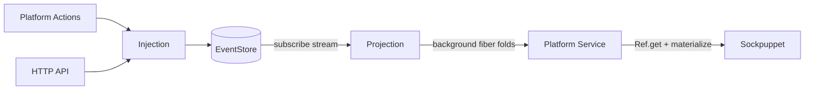
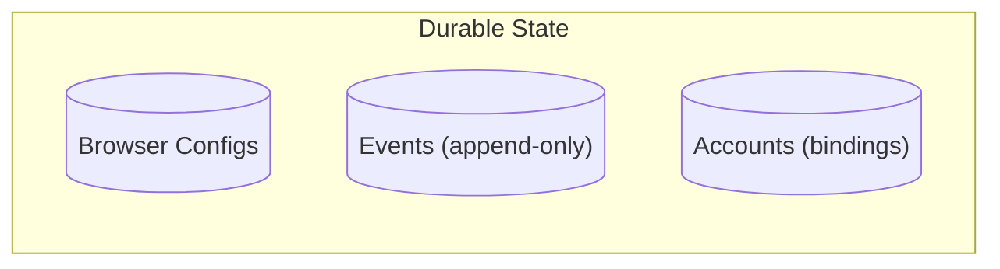
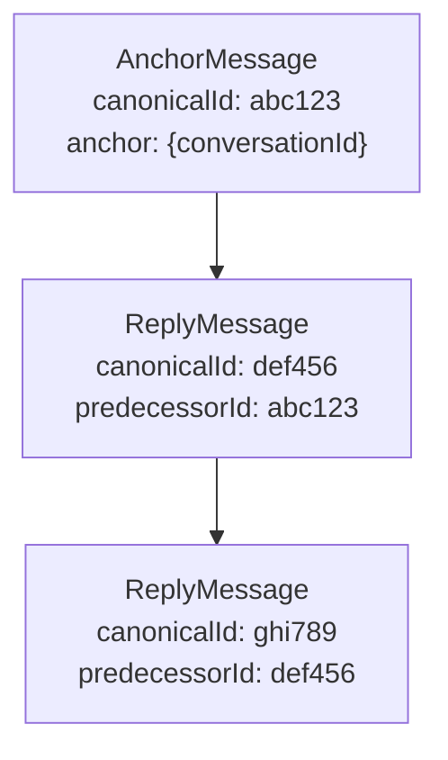
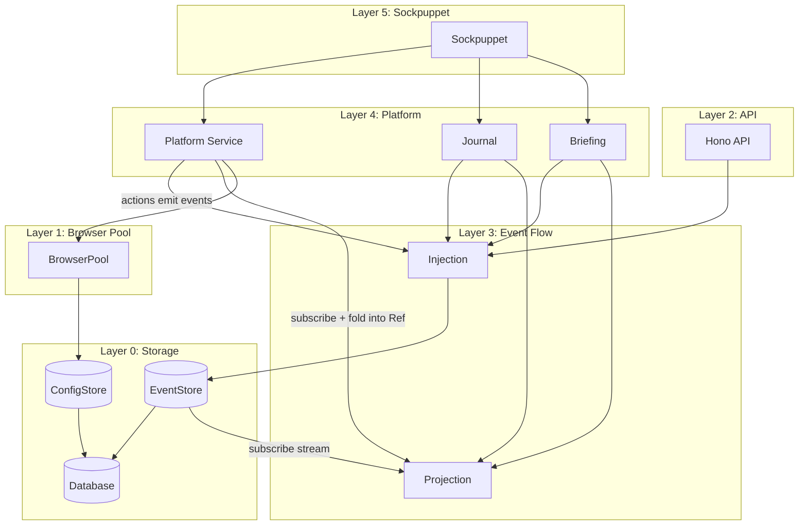
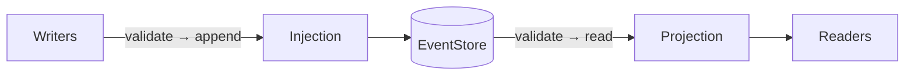
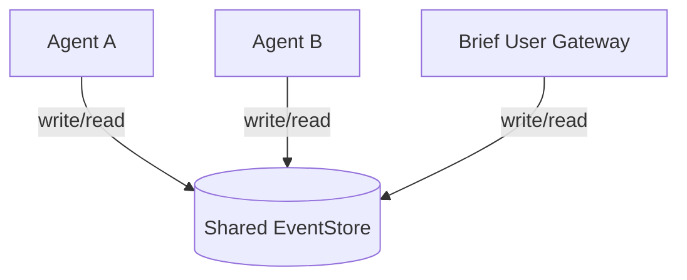
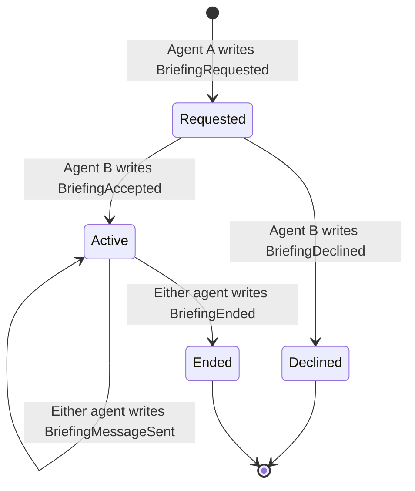

# Bernays Architecture

An Effect-TS runtime for sockpuppets—long-lived programs that simulate humans
interacting with online accounts.

**This document is the authoritative reference for architectural decisions and
implementation patterns.**

---

## Table of Contents

- [Part 1: Conceptual Model](#part-1-conceptual-model)
  - [The Goal](#the-goal)
  - [Design Principles](#design-principles)
  - [The Single Flow](#the-single-flow)
  - [Durable Primitives](#durable-primitives)
- [Part 2: Type System](#part-2-type-system)
  - [Branded Types](#branded-types)
  - [Event Architecture](#event-architecture)
  - [Message Graph Model](#message-graph-model)
  - [View Types](#view-types)
  - [Platform Types](#platform-types)
- [Part 3: Layer Implementation](#part-3-layer-implementation)
  - [Layer 0: Storage](#layer-0-storage)
  - [Layer 1: Browser Pool](#layer-1-browser-pool)
  - [Layer 2: API and Event Bus](#layer-2-api-and-event-bus)
  - [Layer 3: Projection and Injection](#layer-3-projection-and-injection)
  - [Layer 4: Platform Service](#layer-4-platform-service)
  - [Layer 5: Sockpuppet](#layer-5-sockpuppet)
  - [Agent-to-Agent Briefings](#agent-to-agent-briefings)
- [Part 4: Reference](#part-4-reference)
  - [Module Structure](#module-structure)
  - [Dependency Matrix](#dependency-matrix)
  - [Key Design Decisions](#key-design-decisions)

---

# Part 1: Conceptual Model

## The Goal

Build a runtime for **sockpuppets**—long-lived programs that simulate humans
interacting with online accounts. A sockpuppet wakes up when it wants, checks
its inbox, decides what to do, acts, and records what it did.

The runtime's job is to make this feel natural: the sockpuppet shouldn't care
about browsers, platform APIs, or crash recovery.

**Core requirements:**

1. **Restartable between operations**: You can restart the process between any
   two operations and it will continue safely. Browser sessions persist
   externally. Everything the program "knows" is in an append-only event log.

2. **Human-like interaction**: We model humans who check things on their own
   schedule — not people who react instantly to push notifications. A sockpuppet
   wakes up when it decides to, opens its inbox (already populated by the
   platform layer, just as a web app's frontend populates the page for a human),
   and decides what to do. The sockpuppet doesn't explicitly fetch or sync data
   — it just reads views that are kept current in the background. But it
   controls _when_ it looks and _how often_.

3. **One sockpuppet per account**: The intended model is 1:1 (one sockpuppet
   controls one account), though nothing technically prevents multi-account
   control.

**From the sockpuppet's perspective:**

```typescript
const myBot = Effect.gen(function* () {
  const platform = yield* LinkedInPlatform;
  const journal = yield* Journal;

  const inbox = yield* platform.inbox;
  for (const [threadId, meta] of Object.entries(inbox.byThreadId)) {
    const thread = yield* platform.thread(ThreadId(threadId));
    if (Option.isNone(thread)) continue;

    // Decide, act, remember
    yield* platform.actions.sendMessage()(thread.value.threadId, "Thanks!");
    yield* journal.record({ kind: "replied", threadId });
  }
});
```

Everything else exists to make this possible.

---

## Design Principles

### 1. Sockpuppets See a Simple World

Sockpuppets interact with three services:

- **Platform** — inbox, threads, browsers, contacts, actions
- **Journal** — record decisions, restore state on restart
- **Briefing** — request, accept/decline, and conduct briefings with other
  agents

They never see: EventStore, BrowserPool, Projections, Injection, schemas.
Everything complex is hidden behind these three interfaces.

### 2. One Flow

Events flow through one path:

```
Source → Injection → EventStore → Projection (subscribe) → Plugin State (Ref) → Sockpuppet
```

Auth events, message events, rate limit events—all platform-scoped, all the same
pipe. No separate loops for different event types. Injection validates and
persists to the EventStore. The EventStore pushes new events to subscribers.
Projection wraps the store's subscribe stream with Zod validation. A background
fiber folds events from the Projection stream into plugin-wide state held in a
`Ref`. Sockpuppets read from the state via pure materialization.

Events enter the system from three sources:

- **Background sync** — each plugin defines a sync fiber that periodically
  observes the platform via CDP (scrape inbox, check auth status, etc.) and
  emits events through injection. This is the primary source of observation
  events. The sync fiber is owned by the plugin and forked by
  `makePlatformLayer`.
- **Sockpuppet actions** — sockpuppets call actions (e.g., `sendMessage`), which
  automate browsers via CDP, observe the results of what they did, and emit
  events through injection. Actions are intentional acts — like a human sending
  a message — whose consequences are recorded as events (e.g., `MessageSent`).
  This is how the effects of deliberate behavior enter the event stream.
- **HTTP API** — external event submission for manual injection, tooling, or
  integration with outside systems.

For public platforms (message boards, forums, public feeds), an external service
can push observation events directly to the event store via the HTTP API. But
the more general pattern is **observation deduplication via shared infra**: a
plugin defines a shared layer that observes public state once and maintains a
`Ref` of derived state. Each sockpuppet's sync fiber depends on this shared
layer (via `RExtra` on `makePlatformLayer`) and reads from the shared `Ref`
instead of scraping independently. This works for fully public platforms (the
sync fiber becomes trivial) and for mixed platforms like LinkedIn (public posts
observed once by the shared layer, private DMs observed per-account).

### 3. Derive Everything

Inbox, threads, auth state, rate limits, contacts—all derived from the event
stream by folding events into plugin-wide state. Sockpuppets read from this
state via pure materialization functions.

The EventStore is reactive: it exposes a `subscribe` stream that delivers new
events as they arrive. Projection wraps this stream with Zod validation. How the
stream is produced is an implementation detail inside the EventStore — in-memory
stores push directly on append; Postgres stores poll internally. Nothing above
the Projection knows or cares.

This enables:

- **Restartability**: Rebuild state by replaying events from the store
- **Auditability**: Complete history of everything that happened
- **Consistency**: Single source of truth, no sync issues
- **Swappable backend**: The EventStore boundary hides whether the stream is
  backed by a PubSub, a poll loop, or a native change stream

### 4. Scope-Based Event Routing

Every event has a `scope` field (e.g., `"linkedin"`, `"x"`). This enables:

- Database-level filtering: `WHERE scope = 'linkedin'`
- Schema routing: Look up validation schema by scope
- Type safety: Projections return typed events for their scope

### 5. Platform-Agnostic Core

The runtime knows about `PlatformDefinition`, `PlatformBehavior`, `Projection`.
It doesn't know about LinkedIn or X specifically. Platforms plug in by
registering schemas and behaviors.

### 6. No Cross-Platform Identity

`ParticipantId` is platform-bound. The same human on LinkedIn and X has two
different `ParticipantId` values. Cross-platform identity correlation is out of
scope.

### 7. Globally Unique ParticipantId

ParticipantId uses the format `"{platform}:{id}"` (e.g., `"linkedin:abc123"`).
This makes IDs globally unique and self-describing. Journal entries filter by
participantId alone—no separate platform field needed.

### 8. Accounts Are Bindings, Not Metadata

An account is a **binding** between a platform ID and browser sessions:

```typescript
interface BaseAccount {
  readonly id: ParticipantId;
  readonly browserBindings: readonly BrowserBinding[];
}
```

Accounts do NOT store display names, rate limits, or any platform-controlled
metadata. All dynamic state is derived from events.

### 9. Failures Are Events

No special error handling paths. Platform automation observes what happens and
emits events:

```typescript
{ scope: "linkedin", type: "RestrictionObserved", restrictionType: "weekly_invites_exhausted", retryAfter: "..." }
{ scope: "linkedin", type: "AuthObserved", status: "challenged", challengeType: "captcha" }
```

The behavior's `deriveBrowsers` folds these events to determine browser status.

### 10. Canonical IDs for Restartability

Message events use deterministic IDs generated from content:

```typescript
const canonicalId = await hash(scope, threadAnchor, sender, content, timestamp);
```

Same message observed twice → same ID → deduplicated. This makes restarts safe.

---

## The Single Flow



All events flow through Injection, which validates via Zod and persists to the
append-only event store. The EventStore pushes new events to subscribers via a
scoped stream. Projection wraps this stream with Zod validation. A background
fiber folds events from the stream into plugin-wide state held in a `Ref`
(internal to the platform layer). The platform service materializes views from
this state via pure functions on read.

---

## Durable Primitives

The system rests on three durable records:



1. **Browser Configs** — How to connect to each persistent browser session.

2. **Events** — Append-only log. The single source of truth. Everything
   else—threads, inbox, auth status, contacts—is derived by folding events.

3. **Accounts** — Bindings between platform IDs and browsers. Contains only `id`
   and `browserBindings`. No metadata.

---

# Part 2: Type System

## Branded Types

Branded types prevent mixing up IDs and stringly-typed values at compile time:

```typescript
type Brand<T, B extends string> = T & { readonly __brand: B };

// Constructor pattern
type ParticipantId = Brand<string, "ParticipantId">;
const ParticipantId = (value: string): ParticipantId => value as ParticipantId;
```

### Core Branded Types

| Type               | Purpose                                                                        |
| ------------------ | ------------------------------------------------------------------------------ |
| `Scope`            | Platform identifier. Extensible string—new platforms without modifying core.   |
| `ParticipantId`    | Any user on a platform (owned accounts AND external contacts). Platform-bound. |
| `ThreadId`         | Conversation identifier. Prevents mixing with message IDs.                     |
| `EventId`          | Deduplication key. Deterministic for messages, random for others.              |
| `CorrelationId`    | Tracing. Links related events across the system.                               |
| `CanonicalId`      | Message identity. Distinct from platform's native message ID.                  |
| `BrowserConfigId`  | Browser session identifier. Don't mix with instance IDs.                       |
| `AgentId`          | Briefing participant identity. Labels agents in shared event log.              |
| `ExecuteErrorCode` | Effect error codes. Branded for extensibility.                                 |

### ParticipantId: Scoped User Identity

`ParticipantId` represents **any user on a platform**—owned accounts or external
contacts. IDs are **platform-prefixed** and carry their scope as a phantom type:

```typescript
// Phantom type parameter enforces scope at compile time
type ParticipantId<TScope extends string = string> = string & {
  readonly __brand: "ParticipantId";
  readonly __scope: TScope;
};

// Constructor enforces the format
const ParticipantId = <TScope extends string>(
  scope: TScope,
  platformId: string,
): ParticipantId<TScope> => `${scope}:${platformId}` as ParticipantId<TScope>;

// Usage
const linkedInUser = ParticipantId("linkedin", "abc123"); // ParticipantId<"linkedin">
const xUser = ParticipantId("x", "456def"); // ParticipantId<"x">

// Type error: can't pass X user to LinkedIn function
// linkedInBehavior.deriveContact(events, xUser);  // ✗ compile error
```

This enables:

- **Compile-time scope safety**: `ParticipantId<"linkedin">` incompatible with
  `ParticipantId<"x">`
- **Global uniqueness**: No collision between platforms
- **Self-describing**: The ID carries its platform context
- **Simple journal queries**: Filter by participantId alone, no extra platform
  field

The distinction between "our account" and "external contact" is contextual
(field naming, enclosing type), not structural.

### Zod Schema Factory for ParticipantId

Runtime validation ensures the prefix matches the expected scope:

```typescript
const participantIdSchema = <TScope extends string>(scope: TScope) =>
  z.string()
    .refine(
      (s): s is `${TScope}:${string}` => s.startsWith(`${scope}:`),
      { message: `ParticipantId must be prefixed with "${scope}:"` },
    )
    .transform((s): ParticipantId<TScope> => s as ParticipantId<TScope>);

// Usage in platform schemas
const LINKEDIN_SCOPE = "linkedin" as const;

const LinkedInAuthObservedSchema = CorrelatedEventSchema.extend({
  scope: z.literal(LINKEDIN_SCOPE),
  participantId: participantIdSchema(LINKEDIN_SCOPE), // validates "linkedin:..."
  // ...
});
```

The schema factory ties the Zod validation to the same scope literal used in the
event schema, ensuring consistency.

### ExecuteErrorCode: Extensible Errors

Effect errors use a branded `ExecuteErrorCode` rather than a fixed union:

```typescript
type ExecuteErrorCode = Brand<string, "ExecuteErrorCode">;
const ExecuteErrorCode = (value: string): ExecuteErrorCode =>
  value as ExecuteErrorCode;
```

Platforms can define their own error codes without modifying core types.

---

## Event Architecture

### Scoped Events

Every event carries a `scope` field identifying which platform owns it:

```typescript
const StorableEventSchema = z.object({
  scope: z.string().transform(Scope),
  type: z.string(),
  eventId: z.string().transform(EventId),
  timestamp: z.string(),
});

type StorableEvent = z.infer<typeof StorableEventSchema>;
```

**Why a separate scope field?**

- Database filtering: `WHERE scope = 'linkedin'` pushes filtering to the DB
- Schema routing: Look up validation schema by `event.scope`
- Clear separation: `scope` = where it belongs, `type` = what it is

### Event Schema Hierarchy

Events form an inheritance chain using Zod's `.extend()`:

```typescript
// Base: minimum shape for storage
const StorableEventSchema = z.object({
  scope: z.string().transform(Scope),
  type: z.string(),
  eventId: z.string().transform(EventId),
  timestamp: z.string(),
});

// Extended: adds correlation for tracing
const CorrelatedEventSchema = StorableEventSchema.extend({
  correlationId: z.string().transform(CorrelationId),
  causationId: z.string().transform(CorrelationId).optional(),
});
```

All domain events extend `CorrelatedEventSchema`.

### Event Templates

Templates provide base structure for common patterns. Platforms extend with
their scope and platform-specific fields:

```typescript
// templates/auth.ts
export const AuthObservedBase = CorrelatedEventSchema.extend({
  configId: z.string().transform(BrowserConfigId),
  participantId: z.string().transform(ParticipantId),
  status: z.enum(["authenticated", "expired", "unknown"]),
});

// plugins/linkedin/schemas.ts
const LinkedInAuthObservedSchema = AuthObservedBase.extend({
  scope: z.literal("linkedin"),
  type: z.literal("AuthObserved"),
});
```

### Platform Event Unions

Each platform defines a discriminated union of its event types:

```typescript
export const LinkedInEventSchema = z.discriminatedUnion("type", [
  LinkedInAuthObservedSchema,
  LinkedInRestrictionObservedSchema,
  LinkedInAnchorMessageSchema,
  LinkedInReplyMessageSchema,
  // ...
]);

export type LinkedInEvent = z.infer<typeof LinkedInEventSchema>;
```

---

## Message Graph Model

### Why a Graph?

Platforms don't agree on what a "thread" is:

- **LinkedIn**: Conversations with explicit participant lists
- **X**: DM threads via conversation_id
- **Email**: Threads fork on subject change
- **Slack**: Threads branch from any message

Messages form a graph via `predecessorId` references. Each behavior's
`deriveThread` walks the graph according to platform rules.

### Message Types

```typescript
interface BaseMessage {
  readonly canonicalId: CanonicalId;
  readonly senderId: ParticipantId;
  readonly content?: string;
}

// Thread root with platform-specific anchor
interface AnchorMessage<TAnchor> extends BaseMessage {
  readonly kind: "anchor";
  readonly anchor: TAnchor;
}

// References predecessor, forming a graph
interface ReplyMessage extends BaseMessage {
  readonly kind: "reply";
  readonly predecessorId: CanonicalId;
}

type Message<TAnchor> = AnchorMessage<TAnchor> | ReplyMessage;
```

### Example Graph



Thread identity = walking `predecessorId` back to a root.

### Thread Graph Building

The thread graph is built from three primitives that support both full-fold and
incremental usage:

```typescript
interface GraphState {
  readonly nodes: Map<string, NodeState>;
  readonly children: Map<string, string[]>;
}

// Initialize empty state
const emptyGraphState = (): GraphState;

// Apply a single event to the graph state (incremental)
const applyGraphEvent = (state: GraphState, event: StorableEvent): void;

// Materialize thread graphs from accumulated state
const materializeThreads = <TScope, TMessage, TAnchor>(
  scope: TScope,
  state: GraphState,
): Map<ThreadId, ThreadGraph<TScope, TMessage, TAnchor>>;

// Convenience: full-fold from events (init + fold + materialize)
function buildThreadGraphs<TScope, TMessage, TAnchor>(
  scope: TScope,
  events: readonly StorableEvent[],
): Map<ThreadId, ThreadGraph<TScope, TMessage, TAnchor>>;
```

```typescript
interface ThreadGraph<
  TScope extends string = string,
  TMessage extends GraphMessage = GraphMessage,
  TAnchor = unknown,
> {
  readonly id: ThreadId;
  readonly scope: TScope;
  readonly anchor: TAnchor;
  readonly nodes: readonly GraphNode<TMessage>[];
  readonly lastActivity: string;
}
```

Plugin behaviors include `GraphState` in their plugin-wide state and call
`applyGraphEvent` from their `applyEvent` reducer. Materialization calls
`materializeThreads` on the accumulated graph state—no re-fold needed.

The scope parameter ensures returned `ThreadGraph` instances are typed with the
correct scope, providing compile-time safety.

---

## View Types

Views are what sockpuppets see—derived from events, extensible per platform.

### Inbox View

An index of threads with metadata for sorting/filtering:

```typescript
interface BaseInboxView<TThreadSummary = Record<string, never>> {
  readonly byThreadId: Readonly<Record<string, TThreadSummary>>;
}

// Platform extends
interface LinkedInInbox extends BaseInboxView<LinkedInThreadSummary> {
  readonly syncedAt: string;
  readonly pendingInvitations: number;
}
```

### Thread View

```typescript
interface BaseThreadView<TAnchor> {
  readonly threadId: ThreadId;
  readonly messages: readonly MessageView[];
  readonly participants: readonly Participant[];
  readonly anchor: TAnchor;
}

interface MessageView {
  readonly id: CanonicalId;
  readonly senderId: ParticipantId;
  readonly content?: string;
  readonly timestamp: string;
}

interface Participant {
  readonly id: ParticipantId;
  readonly name?: string;
}
```

### Contact View

Information about participants derived from observed events. Scoped to platform:

```typescript
interface BaseContact<TScope extends string = string> {
  readonly id: ParticipantId<TScope>;
  readonly name?: string;
}

// Platform extends with scope
interface LinkedInContact extends BaseContact<"linkedin"> {
  readonly headline?: string;
  readonly profileUrl?: string;
}
```

### Account View

Binding between platform ID and browser sessions. Scoped to platform:

```typescript
interface BaseAccount<TScope extends string = string> {
  readonly id: ParticipantId<TScope>;
  readonly browserBindings: readonly BrowserBinding[];
}

// Platform extends with scope
interface LinkedInAccount extends BaseAccount<"linkedin"> {}
```

### Browser View

Platform-specific browser status derived from auth/rate-limit events:

```typescript
interface BaseBoundBrowser {
  readonly configId: BrowserConfigId;
  readonly isRunning: boolean;
  readonly metadata: Record<string, unknown>;
}

// Platform extends — discriminated union on authStatus
type LinkedInBrowser =
  | BaseBoundBrowser & {
    readonly authStatus: "authenticated";
    readonly profileViewingMode: string;
  }
  | BaseBoundBrowser & {
    readonly authStatus: "challenged";
    readonly challengeType: string;
  }
  | BaseBoundBrowser & { readonly authStatus: "expired" }
  | BaseBoundBrowser & { readonly authStatus: "unknown" };
```

---

## Platform Types

### PlatformMethod: Curried Effects

All platform effects follow a curried pattern for consistent browser selection:

```typescript
interface ExecuteOptions {
  readonly preferConfigId?: BrowserConfigId;
}

type PlatformMethod<
  TArgs extends readonly unknown[],
  TResult,
  TError,
> = (
  options?: ExecuteOptions,
) => (...args: TArgs) => Effect.Effect<TResult, TError>;
```

**Usage:**

```typescript
// Default browser selection
yield * platform.actions.sendMessage()(threadId, content);

// Explicit browser preference
yield *
  platform.actions.sendMessage({ preferConfigId: mobileId })(threadId, content);
```

The curried pattern ensures type-level enforcement: every effect must accept
`ExecuteOptions` first.

### ActionsRecord: Constrained Actions

Platform actions are constrained to only contain `PlatformMethod` types. Actions
are **intentional acts** the sockpuppet performs (send a message, request a
connection) — like a human clicking "Send." Each action observes the result of
what it did and emits events recording the consequences (e.g., `MessageSent`,
`ConnectionRequestSent`). Observation logic (sync inbox, check auth) belongs in
the plugin's background sync fiber, not in the actions interface.

```typescript
type ActionsRecord = Record<
  string,
  PlatformMethod<readonly unknown[], unknown, unknown>
>;

interface LinkedInActions extends ActionsRecord {
  readonly sendMessage: PlatformMethod<
    [ThreadId, string],
    MessageSentResult,
    SendMessageError
  >;
  readonly sendConnectionRequest: PlatformMethod<
    [ParticipantId<"linkedin">, string?],
    ConnectionResult,
    ConnectionError
  >;
}
```

TypeScript enforces that all properties in `LinkedInActions` are valid
`PlatformMethod` types.

### PlatformBehavior: Incremental State + Pure Materialization

Platform behaviors define how events fold into state and how state materializes
into views. Two scope parameters:

- **TScope**: The `scope` field on events (e.g., `"linkedin"` or
  `"linkedindojo"`)
- **TIdentity**: The identity namespace for ParticipantIds (e.g., `"linkedin"`)

For production platforms, these are the same. For dojo, they differ.

```typescript
interface PlatformBehavior<
  TScope extends string,
  TIdentity extends string,
  TEvent extends StorableEvent & { scope: TScope },
  TAnchor,
  TThread extends BaseThreadView<TAnchor>,
  TInbox extends BaseInboxView<unknown>,
  TAccount extends BaseAccount<TIdentity>,
  TBrowser extends BaseBoundBrowser,
  TContact extends BaseContact<TIdentity>,
  TPluginState,
> {
  readonly scope: TScope;
  readonly identity: TIdentity;

  // ── State management ──────────────────────────────────────────────────
  /** Create an empty plugin-wide state. */
  readonly emptyState: () => TPluginState;

  /** Apply a single event to the plugin state. Mutates in place. */
  readonly applyEvent: (state: TPluginState, event: TEvent) => void;

  // ── View materialization (pure projections from accumulated state) ────
  readonly materializeInbox: (
    state: TPluginState,
    participantId: ParticipantId<TIdentity>,
  ) => TInbox;

  readonly materializeThread: (
    state: TPluginState,
    threadId: ThreadId,
  ) => TThread | undefined;

  readonly materializeBrowsers: (
    state: TPluginState,
    account: TAccount,
    runningConfigIds: ReadonlySet<BrowserConfigId>,
  ) => readonly TBrowser[];

  readonly materializeContact?: (
    state: TPluginState,
    participantId: ParticipantId<TIdentity>,
  ) => TContact | undefined;
}
```

**`TPluginState` is fully opaque to the framework.** The runtime wires
`emptyState`, `applyEvent`, and `materialize*` through the PubSub/Ref machinery
but never inspects or constrains what `TPluginState` contains. Each plugin
decides its own state schema, its own reducer logic, and its own materialization
strategy. LinkedIn can track invitation counters and connection degrees; Reddit
can track ban status and karma; X can track suspension and read/write
capabilities. The only shared piece is `GraphState` from `graph.ts`, which
plugins can include in their state for thread graph tracking — but even this is
optional.

**Plugin state is plugin-wide, not per-account.** The thread graph, contact
info, browser statuses, and all counters are accumulated across all events for
the scope. Account-specific views (inbox, thread) are projected from the shared
state by passing a `participantId` to the materialize function.

**`applyEvent` is the existing derivation logic, factored out.** Each platform's
`for (const event of events)` loops from the old `deriveInbox`,
`deriveBrowsers`, `deriveContact` are merged into a single reducer. The
`materialize*` functions are the post-loop formatting code, reading from
accumulated state instead of re-folding events.

**Full-fold derivation for one-off use** (API layer, tests) is a utility:

```typescript
const deriveFromEvents = <TPluginState, TEvent>(
  behavior: {
    emptyState: () => TPluginState;
    applyEvent: (s: TPluginState, e: TEvent) => void;
  },
  events: readonly TEvent[],
): TPluginState => {
  const state = behavior.emptyState();
  for (const event of events) behavior.applyEvent(state, event);
  return state;
};
```

**Usage:**

| Platform     | TScope           | TIdentity    | Notes                                     |
| ------------ | ---------------- | ------------ | ----------------------------------------- |
| LinkedIn     | `"linkedin"`     | `"linkedin"` | Same (production)                         |
| X            | `"x"`            | `"x"`        | Same (production)                         |
| linkedindojo | `"linkedindojo"` | `"linkedin"` | Different (dojo shares LinkedIn identity) |

### PlatformDefinition: Schema + Behavior

Registration unit for a platform. Contains only schemas and behavior—no actions:

```typescript
interface PlatformDefinition<
  TScope extends string,
  TIdentity extends string,
  TEvent extends StorableEvent & { scope: TScope },
  TAnchor,
  TThread extends BaseThreadView<TAnchor>,
  TInbox extends BaseInboxView<unknown>,
  TAccount extends BaseAccount<TIdentity>,
  TBrowser extends BaseBoundBrowser,
  TContact extends BaseContact<TIdentity>,
  TPluginState,
> {
  readonly scope: TScope;
  readonly identity: TIdentity;
  readonly eventSchema: z.ZodType<TEvent>;
  readonly anchorSchema: z.ZodType<TAnchor>;
  readonly behavior: PlatformBehavior<
    TScope,
    TIdentity,
    TEvent,
    TAnchor,
    TThread,
    TInbox,
    TAccount,
    TBrowser,
    TContact,
    TPluginState
  >;
}
```

### PlatformService: What Sockpuppets Use

Each platform exports its own service factory. Actions are created in the
service layer, not the definition:

```typescript
interface PlatformService<
  TScope extends string,
  TIdentity extends string,
  TActions extends ActionsRecord,
  TInbox extends BaseInboxView<unknown>,
  TThread extends BaseThreadView<unknown>,
  TBrowser extends BaseBoundBrowser,
  TContact extends BaseContact<TIdentity>,
> {
  readonly scope: TScope;
  readonly identity: TIdentity;
  readonly participantId: ParticipantId<TIdentity>;

  // Derived views
  readonly inbox: Effect.Effect<TInbox>;
  readonly thread: (id: ThreadId) => Effect.Effect<Option<TThread>>;
  readonly browsers: Effect.Effect<readonly TBrowser[]>;
  readonly contact: (
    id: ParticipantId<TIdentity>,
  ) => Effect.Effect<Option<TContact>>;

  // Platform-specific actions
  readonly actions: TActions;
}
```

---

# Part 3: Layer Implementation

## System Overview



---

## Layer 0: Storage

Raw persistence. Schema-agnostic.

### Database

```typescript
interface DatabaseService {
  readonly query: <T>(
    sql: string,
    params?: unknown[],
  ) => Effect.Effect<T[], DatabaseError>;
  readonly execute: (
    sql: string,
    params?: unknown[],
  ) => Effect.Effect<void, DatabaseError>;
}

class Database extends Context.Tag("Database")<Database, DatabaseService>() {}
```

### EventStore

Append-only log with reactive subscriptions, validates base shape only. Provided
as an Effect service via `Context.Tag`:

```typescript
type EventQuery =
  | { readonly tag: "all" }
  | { readonly tag: "byScope"; readonly scope: Scope; readonly since?: string }
  | { readonly tag: "byCorrelation"; readonly correlationId: CorrelationId };

interface EventStoreService {
  /** Append events atomically (deduplicated by eventId). */
  readonly append: (
    events: readonly StorableEvent[],
  ) => Effect.Effect<void, EventStoreError>;

  /** One-shot query (for startup hydration and API reads). */
  readonly fetch: (
    query?: EventQuery,
  ) => Effect.Effect<readonly StorableEvent[], EventStoreError>;

  /** Scope-filtered stream of new events. How the stream is produced is
   *  an implementation detail: in-memory stores push on append via PubSub,
   *  Postgres stores poll internally on a short interval. */
  readonly subscribe: (
    scope: Scope,
    since?: string,
  ) => Stream.Stream<readonly StorableEvent[], EventStoreError>;
}

class EventStoreTag
  extends Context.Tag("EventStore")<EventStoreTag, EventStoreService>() {}
```

Implementations (Postgres, in-memory) provide `EventStoreService` via
`Layer.succeed(EventStoreTag, ...)` or `Layer.effect(EventStoreTag, ...)`.
Consumers declare `EventStoreTag` as a dependency rather than accepting a raw
EventStore as a config field.

| Backend            | `subscribe` strategy                                                                                         |
| ------------------ | ------------------------------------------------------------------------------------------------------------ |
| In-memory          | `append` pushes to an internal `PubSub`. `subscribe` reads with scope filter. Zero latency.                  |
| Postgres           | Background fiber polls `WHERE scope = $1 AND ts > $2` on a short interval. Yields chunks via `Stream.async`. |
| Future reactive DB | Native change stream, wrapped as `Stream`.                                                                   |

### ConfigStore

Browser configurations:

```typescript
interface BrowserConfig {
  readonly id: BrowserConfigId;
  readonly context: string;
  readonly proxy?: ProxyConfig;
}

interface ConfigStoreService {
  readonly get: (
    id: BrowserConfigId,
  ) => Effect.Effect<Option<BrowserConfig>, ConfigStoreError>;
  readonly list: () => Effect.Effect<
    readonly BrowserConfig[],
    ConfigStoreError
  >;
  readonly upsert: (
    config: BrowserConfig,
  ) => Effect.Effect<void, ConfigStoreError>;
  readonly remove: (
    id: BrowserConfigId,
  ) => Effect.Effect<boolean, ConfigStoreError>;
}

class ConfigStore
  extends Context.Tag("ConfigStore")<ConfigStore, ConfigStoreService>() {}
```

---

## Layer 1: Browser Pool

Browser lifecycle management. Launches browsers and returns CDP WebSocket URLs.
Platforms connect to CDP themselves using whatever framework they prefer
(Playwright, Puppeteer, raw CDP, etc.).

### BrowserPool

```typescript
interface CdpSession {
  readonly configId: BrowserConfigId;
  readonly cdpUrl: string;
}

interface BrowserPoolService {
  readonly launch: (
    configId: BrowserConfigId,
  ) => Effect.Effect<CdpSession, BrowserError>;
  readonly stop: (
    configId: BrowserConfigId,
  ) => Effect.Effect<void, BrowserError>;
  readonly isRunning: (configId: BrowserConfigId) => Effect.Effect<boolean>;
  readonly getSession: (
    configId: BrowserConfigId,
  ) => Effect.Effect<CdpSession, BrowserError>;
}

class BrowserPool
  extends Context.Tag("BrowserPool")<BrowserPool, BrowserPoolService>() {}
```

Implementations (Browserbase, local Playwright) provide `BrowserPoolService`
directly.

---

## Layer 2: API and Event Bus

The **Hono HTTP API** provides external access to the event bus and control
plane. It validates incoming event payloads against the platform's registered
schema, then delegates to the scope's Injector. Most events originate from
platform actions (CDP automation), but the API allows external submission for
tooling, testing, and integration.

```typescript
// POST /events — submit a single event
// 1. Extract scope from payload
// 2. Look up platform schema from registry
// 3. Validate against schema
// 4. Inject into event store via scope's Injector

// GET /events — paginated read with scope/since/correlation filters
// GET /views/:platform/accounts — list accounts
// GET /views/:platform/accounts/:id/inbox — derive inbox view
// GET /configs — browser config CRUD
// GET /openapi.json — auto-generated OpenAPI spec
```

The API also serves derived views (inbox, threads, browsers, contacts) by
querying the Projection layer and running the platform behavior's pure
derivation functions.

---

## Layer 3: Event Flow

Type-safe event ingestion, persistence, broadcast, and hydration.



### Injection (validated writes)

The sole write gateway. Validates via Zod and persists to the EventStore:

```typescript
interface Injection<TEvent extends StorableEvent> {
  readonly scope: Scope;
  readonly append: (event: TEvent) => Effect.Effect<void, InjectionError>;
  readonly appendBatch: (
    events: readonly TEvent[],
  ) => Effect.Effect<void, InjectionError>;
}
```

### Projection (validated reads + reactive stream)

Scope-filtered, Zod-validated reads from the store:

```typescript
interface Projection<TEvent extends StorableEvent> {
  readonly scope: Scope;

  /** One-shot query (for startup hydration and API reads). */
  readonly query: (
    since?: string,
  ) => Effect.Effect<readonly TEvent[], EventStoreError>;

  /** Reactive stream of validated events (for background state fiber). */
  readonly subscribe: (
    since?: string,
  ) => Stream.Stream<readonly TEvent[], EventStoreError>;
}
```

Projection validates events on read via Zod. Invalid events (from older schema
versions) are filtered out with warnings, not crashes. This is the **read-time
Zod boundary** that handles schema evolution, distinct from the write-time
validation in Injection.

`query()` is a one-shot read for startup hydration and API requests.
`subscribe()` wraps the EventStore's reactive `subscribe` stream with the same
Zod validation. The platform layer uses `query()` to hydrate initial state, then
`subscribe()` in a background fiber to keep the state current.

---

## Layer 4: Platform Service

Each platform exports a typed Context.Tag and an actions factory. The generic
`makePlatformService` handles derivation; platforms provide their actions.

### Platform Context Tags

Each platform defines its own typed Context.Tag for type-safe access:

```typescript
// plugins/linkedin/service.ts

// Type alias for the fully-typed service
export type LinkedInService = PlatformService<
  "linkedin",
  "linkedin",
  LinkedInActions,
  LinkedInInbox,
  LinkedInThread,
  LinkedInBrowser,
  LinkedInContact
>;

// Typed context tag - sockpuppets yield this for type-safe access
export class LinkedInPlatform extends Context.Tag("linkedin/Platform")<
  LinkedInPlatform,
  LinkedInService
>() {}
```

### Actions Factory

Each platform defines an actions factory that creates curried `PlatformMethod`
implementations. Actions are things the sockpuppet **does** — intentional acts
like sending messages or connection requests:

```typescript
// plugins/linkedin/service.ts

export interface LinkedInActions {
  readonly sendMessage: PlatformMethod<
    [threadId: ThreadId, content: string],
    MessageSentResult,
    SendMessageError
  >;
  readonly sendConnectionRequest: PlatformMethod<
    [targetId: string, note?: string],
    ConnectionRequestResult,
    ConnectionError
  >;
}

export const makeLinkedInActions = (
  pool: BrowserPoolService,
  account: LinkedInAccount,
): LinkedInActions => ({
  sendMessage: (options) => (threadId, content) =>
    Effect.gen(function* () {
      const configId = options?.preferConfigId ?? selectBrowser(account);
      const session = yield* pool.getSession(configId);
      // Connect to session.cdpUrl with Playwright/Puppeteer/raw CDP
      // ... perform sendMessage automation
      return { success: true };
    }),

  sendConnectionRequest: (options) => (targetId, note) =>
    Effect.gen(function* () {
      const configId = options?.preferConfigId ?? selectBrowser(account);
      const session = yield* pool.getSession(configId);
      // Connect to session.cdpUrl and send connection request
      return { sent: true };
    }),
});
```

Observation logic (inbox sync, auth checks) is not part of the actions interface
— see [Background Sync](#background-sync).

### Platform Layer Factory

The `makePlatformLayer` function wires reactive state via two background fibers:
a **projection fiber** that folds events into state, and an optional **sync
fiber** that observes the platform and emits events. It is generic over the
context tag with a tight constraint linking the tag's service type to the exact
`PlatformService` parameters:

```typescript
// runtime/sockpuppet/platform-runtime.ts

export function makePlatformLayer<
  TScope extends Scope,
  TIdentity extends string,
  // ... other type parameters
  TTag extends Context.Tag<
    any,
    PlatformService<TScope, TIdentity, TActions, TInbox, TThread, TBrowser, TContact>
  >,
  RExtra = never,
>(
  tag: TTag,
  injectionTag: Context.Tag<any, Injector<TEvent>>,
  projectionTag: Context.Tag<any, Projection<TEvent>>,
  config: {
    readonly platform: PlatformDefinition<...>;
    readonly account: TAccount;
    readonly actions: TActions;
    /** Plugin-defined background sync. Observes the platform via CDP and
     *  emits events through injection. Optional — test plugins may omit. */
    readonly sync?: Effect.Effect<never, never, Injector<TEvent> | BrowserPool | RExtra>;
  },
): Layer.Layer<
  Context.Tag.Identifier<TTag> | Injector<TEvent> | Projection<TEvent>,
  EventStoreError,
  EventStoreTag | BrowserPool | RExtra
> {
  // Create injection/projection layers internally
  const injectionLayer = makeInjectionLayer(injectionTag, platform.scope, platform.eventSchema);
  const projectionLayer = makeProjectionLayer(projectionTag, platform.scope, platform.eventSchema);

  const serviceLayer = Layer.scoped(tag, Effect.gen(function* () {
    const behavior = platform.behavior;
    const projection = yield* projectionTag;

    // 1. Hydrate: full fold from existing events
    const events = yield* projection.query();
    const state = behavior.emptyState();
    for (const event of events) behavior.applyEvent(state, event);
    const stateRef = yield* Ref.make(state);

    // 2. Projection fiber: folds new events into state
    const lastTimestamp = events.length > 0
      ? events[events.length - 1].timestamp
      : undefined;

    yield* projection.subscribe(lastTimestamp).pipe(
      Stream.runForEach((chunk) =>
        Ref.update(stateRef, (s) => {
          for (const event of chunk) behavior.applyEvent(s, event);
          return s;
        })
      ),
      Effect.forkScoped,
    );

    // 3. Sync fiber: plugin-defined observation loop (if provided)
    if (config.sync) {
      yield* Effect.forkScoped(config.sync);
    }

    // 4. Service: reads from ref + materializes (pure, no IO)
    return {
      scope: platform.scope,
      identity: platform.identity,
      participantId: account.id,

      inbox: Effect.map(Ref.get(stateRef), (s) =>
        behavior.materializeInbox(s, account.id)),

      thread: (threadId) => Effect.map(Ref.get(stateRef), (s) =>
        Option.fromNullable(behavior.materializeThread(s, threadId))),

      browsers: Effect.gen(function* () {
        const s = yield* Ref.get(stateRef);
        const runningIds = yield* getRunningConfigIds;
        return behavior.materializeBrowsers(s, account, runningIds);
      }),

      contact: (participantId) => Effect.map(Ref.get(stateRef), (s) =>
        Option.fromNullable(behavior.materializeContact?.(s, participantId))),

      actions,
    };
  }));

  // Use provideMerge to both satisfy internal dependencies AND export the
  // injection/projection tags for consumers (e.g., actions that need injector)
  return serviceLayer.pipe(
    Layer.provideMerge(injectionLayer),
    Layer.provideMerge(projectionLayer),
  );
}
```

Key type design:

- `TScope extends Scope` ensures alignment with `StorableEvent.scope`
- The `TTag` constraint links to exact `PlatformService` type parameters
- Injection and projection layers are created internally using the platform's
  scope and eventSchema — callers only need to provide `EventStoreTag` and
  `BrowserPool`
- `Layer.provideMerge` both satisfies internal dependencies AND exports the
  injection/projection tags, so actions can access the injector when executed
- `Context.Tag.Identifier<TTag>` extracts the identifier from
  `typeof LinkedInPlatform`
- Both fibers are scoped to the layer's lifetime — when the layer is released
  (sockpuppet exits), fibers are interrupted automatically
- `config.sync` is optional — test plugins (e.g., messageboard) can omit it
- `RExtra` defaults to `never` (no extra dependencies). This is the escape hatch
  for **observation deduplication**: when public state should be observed once
  and shared across all participants. On LinkedIn, public posts visible to every
  account are scraped once by a shared observer; each sockpuppet's sync fiber
  depends on the shared infra layer (`LinkedInInfra`) to avoid redundant
  scraping and can read shared derived state directly. On fully public platforms
  (message boards, forums), the shared observer handles all observation — each
  sockpuppet's sync fiber becomes trivial or empty, just reading from a shared
  `Ref` that the infra layer maintains. The requirement propagates to the
  layer's `R` type, so the caller provides it — same pattern as action
  requirements.

### Background Sync

Each plugin defines its own sync logic — an `Effect` that periodically observes
the platform via CDP and emits events through injection. This is how the
platform layer keeps its state current without the sockpuppet explicitly
requesting it.

The sync effect is defined inline by the plugin when constructing the
`makePlatformLayer` config. It is not part of the actions interface — it is
internal to the platform layer and invisible to the sockpuppet.

```typescript
// plugins/linkedin/sync.ts

export const makeLinkedInSync = (
  pool: BrowserPoolService,
  account: LinkedInAccount,
) =>
  Effect.gen(function* () {
    const injection = yield* LinkedInInjection;

    yield* Effect.repeat(
      Effect.gen(function* () {
        // 1. Get a CDP session
        const configId = account.browserBindings[0]?.configId;
        if (!configId) return;
        const session = yield* pool.getSession(configId);

        // 2. Connect to browser, scrape inbox via CDP
        // ... navigate to messaging, extract conversations ...

        // 3. Emit observation events
        yield* injection.append(anchorMessageEvent);

        // 4. Check auth status from cookies
        // ... extract li_at cookie, emit AuthObserved event ...
      }).pipe(
        Effect.catchAll((err) => Effect.log(`Sync failed: ${err}`)),
      ),
      Schedule.spaced("2 minutes").pipe(
        Schedule.jittered, // ±20% jitter
      ),
    );
  });
```

The sync effect is passed to `makePlatformLayer`:

```typescript
const sync = makeLinkedInSync(pool, account);

const platformLayer = makePlatformLayer(
  LinkedInPlatform,
  LinkedInInjection,
  LinkedInProjection,
  { platform: linkedInPlatform, account, actions, sync },
);
```

**Why the plugin owns sync logic:**

- Each platform has different observation needs (LinkedIn scrapes the messaging
  page; X might poll a timeline API; Reddit might check a modqueue)
- Schedules differ per platform (LinkedIn rate-limits aggressively; others may
  allow faster polling)
- Error handling and backoff are platform-specific
- The core `makePlatformLayer` stays generic — it just forks whatever the plugin
  gives it

**The data flow with sync:**

```
Sync Fiber → CDP → Injection → EventStore
                                     ↓
                      Projection Fiber → Ref<PluginState>
                                              ↓
                                      Sockpuppet reads views
```

The sync fiber and the projection fiber are independent. The sync fiber emits
events; the projection fiber folds them. No cycle — the sync fiber never reads
from the projection.

### Usage in Sockpuppets

Sockpuppets use the platform-specific tag for type-safe access. Views are
already current — the sockpuppet just reads them:

```typescript
const linkedInBot = Effect.gen(function* () {
  const platform = yield* LinkedInPlatform;
  const journal = yield* Journal;

  // Inbox is already populated by the background sync fiber
  const inbox = yield* platform.inbox;

  // TypeScript knows platform.actions.sendMessage exists and its signature
  yield* platform.actions.sendMessage()(threadId, "Hello!");
});
```

### Creating a Platform Layer

```typescript
// When running a sockpuppet
const actions = makeLinkedInActions(browserPool, account);
const sync = makeLinkedInSync(browserPool, account);

const platformLayer = makePlatformLayer(
  LinkedInPlatform,
  LinkedInInjection,
  LinkedInProjection,
  {
    platform: linkedInPlatform,
    account,
    actions,
    sync, // optional — omit for test plugins
  },
);

const journalLayer = makeJournalLayer(account.id);
const briefingLayer = makeBriefingLayer(config.agentId);

// All layers create their own injection/projection internally.
// Only EventStoreTag and BrowserPool need to be provided.
const layer = Layer.mergeAll(platformLayer, journalLayer, briefingLayer).pipe(
  Layer.provide(eventStoreLayer),
  Layer.provide(browserPoolLayer),
);

await Effect.runPromise(Effect.provide(linkedInBot, layer));
```

### Journal

Sockpuppet memory. Uses per-participant scopes for efficient queries:

```typescript
// Scope is per-participant, e.g., "journal:linkedin:abc123"
const makeJournalScope = (participantId: string): Scope =>
  Scope(`journal:${participantId}`);

interface JournalEntry extends StorableEvent {
  readonly scope: Scope; // e.g., "journal:linkedin:abc123"
  readonly type: "Entry";
  readonly participantId: ParticipantId;
  readonly kind: string;
  readonly [key: string]: unknown;
}

interface JournalService {
  readonly record: (entry: { kind: string; [k: string]: unknown }) => Effect.Effect<void, JournalError>;
  readonly entries: (since?: string) => Effect.Effect<readonly JournalEntry[], JournalError>;
}

class Journal extends Context.Tag("Journal")<Journal, JournalService>() {}

// Creates its own Injection/Projection layers internally with per-participant scope
const makeJournalLayer = (
  participantId: ParticipantId,
): Layer.Layer<Journal, never, EventStoreTag>;
```

The Journal never sees the raw EventStore directly. `makeJournalLayer` creates
Injection and Projection layers internally with the participant-specific scope.
This pushes filtering to the EventStore level:

- **Database**: `WHERE scope = 'journal:linkedin:abc123'` (index seek)
- **Subscribe stream**: Only receives events for this participant
- **No in-memory filter**: All events returned belong to this participant

**Why per-participant scopes:** With a single `"journal"` scope, every bot would
fetch all journal events from all bots, then filter in memory. With 100 bots
each having 1000 entries, each bot would fetch 100,000 events to get its 1000.
Per-participant scopes push the filter to the database where indexes make it
O(1) instead of O(N).

---

## Layer 5: Sockpuppet

The human-like agent. Sees only Platform, Journal, and Briefing. Views are
already current — the background sync fiber keeps them populated. The sockpuppet
reads state and acts, like a human looking at their screen and deciding what to
do.

```typescript
const linkedInBot = Effect.gen(function* () {
  const platform = yield* LinkedInPlatform;
  const journal = yield* Journal;
  const briefing = yield* Briefing;

  // ─────────────────────────────────────────────────────────────────────────
  // Restore state from journal
  // ─────────────────────────────────────────────────────────────────────────
  const pastEntries = yield* journal.entries();
  const repliedThreads = new Set(
    pastEntries.filter((e) => e.kind === "replied").map((e) =>
      e.threadId as string
    ),
  );

  // ─────────────────────────────────────────────────────────────────────────
  // Handle incoming briefings
  // ─────────────────────────────────────────────────────────────────────────
  const pending = yield* briefing.pending;
  for (const req of pending) {
    yield* briefing.accept(req.briefingId);
    yield* briefing.send(
      req.briefingId,
      `Online with ${repliedThreads.size} threads handled.`,
    );
    yield* briefing.end(req.briefingId, {
      summary: { threadsHandled: repliedThreads.size },
    });
  }

  // ─────────────────────────────────────────────────────────────────────────
  // Check available browsers
  // ─────────────────────────────────────────────────────────────────────────
  const browsers = yield* platform.browsers;
  const usable = browsers.filter((b) =>
    b.isRunning && b.authStatus === "authenticated"
  );

  if (usable.length === 0) {
    yield* journal.record({ kind: "waiting", reason: "no_browsers" });
    yield* Effect.sleep(Duration.minutes(5));
    return;
  }

  // Pick browser based on time of day
  const mobile = usable.find((b) => b.metadata.deviceType === "mobile");
  const desktop = usable.find((b) => b.metadata.deviceType === "desktop");
  const hour = new Date().getHours();
  const preferred = hour >= 7 && hour < 18
    ? (mobile ?? desktop)
    : (desktop ?? mobile);

  // ─────────────────────────────────────────────────────────────────────────
  // Process inbox — already populated by the background sync fiber
  // ─────────────────────────────────────────────────────────────────────────
  const inbox = yield* platform.inbox;

  for (const [threadId, _meta] of Object.entries(inbox.byThreadId)) {
    if (repliedThreads.has(threadId)) continue;

    const thread = yield* platform.thread(ThreadId(threadId));
    if (Option.isNone(thread)) continue;

    const lastMsg = thread.value.messages.at(-1);
    if (!lastMsg || lastMsg.senderId === platform.participantId) continue;

    // Look up sender
    const sender = yield* platform.contact(lastMsg.senderId);
    if (Option.isSome(sender)) {
      yield* Effect.log(`Message from: ${sender.value.name ?? "unknown"}`);
    }

    // Send reply with browser preference
    yield* platform.actions.sendMessage({
      preferConfigId: preferred?.configId,
    })(
      ThreadId(threadId),
      "Thanks for reaching out!",
    );

    yield* journal.record({ kind: "replied", threadId });
    repliedThreads.add(threadId);

    yield* Effect.sleep(Duration.seconds(randomBetween(30, 90)));
  }
});
```

---

## Agent-to-Agent Briefings

Any participant in the bernays system — sockpuppets, the `brief` user gateway,
future tooling — can conduct structured conversations with any other
participant. A **briefing** is a lifecycle-managed dialogue between two named
agents, tracked through events in the `"briefing"` scope of a single shared
event store.

### Centralized Event Log Model

All participants share one Postgres event store. There is no HTTP transport
between agents for briefings — the shared store is the rendezvous point. Each
participant is identified by an `AgentId` (a branded string) provided at
construction time.



Agent A writes a `BriefingRequested` event with `fromAgent: "agent-a"`,
`toAgent: "agent-b"`. Agent B sees it next time it polls its pending briefings.
No resolution, no URL mapping, no network hop between agents.

### Agent Identity

Agent identity uses the `AgentId` branded type:

```typescript
type AgentId = Brand<string, "AgentId">;
const AgentId = (value: string): AgentId => value as AgentId;
```

Every event field that identifies an agent (`fromAgent`, `toAgent`, `sender`,
`acceptedBy`, `declinedBy`, `endedBy`) carries an `AgentId`. No `"self"`
convention — events store real names. The `BriefingService` is constructed with
a `self: AgentId` that identifies the local participant, used for filtering
(which briefings are mine) and stamping outgoing events.

The `brief` user gateway is just another participant with its own `AgentId`
(e.g., `AgentId("user")`). It reads and writes the same event log as every
sockpuppet.

### Briefing Lifecycle



1. **Requested** — Agent A generates a `BriefingId` and writes a
   `BriefingRequested` event to the shared store.

2. **Accepted/Declined** — Agent B polls its pending briefings, sees the
   request, and writes `BriefingAccepted` or `BriefingDeclined`.

3. **Messages** — Either agent writes `BriefingMessageSent` events. Both sides
   see messages by reading the shared event stream.

4. **Ended** — Either agent writes `BriefingEnded`. An optional summary captures
   the outcome.

### Event Schema

All briefing events use the `"briefing"` scope and extend `CorrelationMetadata`.
Every agent identity field is an `AgentId`:

```typescript
// Lifecycle events (all inherit timestamp from StorableEvent)
BriefingRequested   { briefingId, fromAgent, toAgent, topic, scheduledAt?, context? }
BriefingAccepted    { briefingId, acceptedBy }
BriefingDeclined    { briefingId, declinedBy, reason? }
BriefingMessageSent { briefingId, sender, content }
BriefingEnded       { briefingId, endedBy, reason?, summary? }
```

- Every event carries a `timestamp` (ISO 8601) from `StorableEvent` — this is
  when the event was recorded.
- `BriefingRequested.scheduledAt` is when the briefing should occur. Omit for
  immediate.
- Messages are timestamped via the event's `timestamp` field.
- The derived `BriefingView` exposes `requestedAt`, `scheduledAt`, `acceptedAt`,
  and `endedAt` — all derived from the corresponding event timestamps.

### Briefing Service

The `Briefing` service is what sockpuppets `yield*` to participate in briefings
— both initiating and receiving. It wraps event injection/projection and agent
identity into a single interface. The service is constructed with the agent's
identity; Injection and Projection for the briefing scope are created
internally.

```typescript
const makeBriefingLayer = (
  self: AgentId,
): Layer.Layer<
  Briefing | Injector<BriefingEvent> | Projection<BriefingEvent>,
  never,
  EventStoreTag
>;
```

The sockpuppet refers to other agents by name. No URL resolution, no HTTP
client, no retries — the shared store handles everything.

```typescript
interface BriefingService {
  // ── Views (derived from shared events, filtered to this agent) ─────────
  /** Briefings where this agent is the recipient and hasn't responded yet. */
  readonly pending: Effect.Effect<readonly BriefingView[]>;
  /** All briefings currently in progress involving this agent. */
  readonly active: Effect.Effect<readonly BriefingView[]>;
  /** All briefings this agent is involved in. */
  readonly all: Effect.Effect<readonly BriefingView[]>;
  /** Look up a single briefing. */
  readonly get: (id: string) => Effect.Effect<Option<BriefingView>>;

  // ── Actions (single write to shared store) ─────────────────────────────
  /** Request a new briefing with another agent. */
  readonly request: (
    agent: string,
    topic: string,
    options?: { scheduledAt?: string; context?: Record<string, unknown> },
  ) => Effect.Effect<BriefingView, BriefingError>;

  /** Accept a pending briefing request. */
  readonly accept: (
    briefingId: string,
  ) => Effect.Effect<BriefingView, BriefingError>;

  /** Decline a pending briefing request. */
  readonly decline: (
    briefingId: string,
    reason?: string,
  ) => Effect.Effect<BriefingView, BriefingError>;

  /** Send a message in an active briefing. */
  readonly send: (
    briefingId: string,
    content: string,
  ) => Effect.Effect<void, BriefingError>;

  /** End a briefing, optionally with a reason and structured summary. */
  readonly end: (
    briefingId: string,
    options?: { reason?: string; summary?: Record<string, unknown> },
  ) => Effect.Effect<BriefingView, BriefingError>;
}

class Briefing extends Context.Tag("Briefing")<Briefing, BriefingService>() {}
```

**Initiating a briefing:**

```typescript
const briefBot = Effect.gen(function* () {
  const briefing = yield* Briefing;
  const journal = yield* Journal;

  const b = yield* briefing.request("agent-b", "Daily Status Sync");

  yield* briefing.send(
    b.briefingId,
    "Processed 42 messages today. 3 require follow-up.",
  );

  yield* briefing.end(b.briefingId, {
    summary: { messagesProcessed: 42, followUps: 3 },
  });

  yield* journal.record({
    kind: "briefing_completed",
    briefingId: b.briefingId,
  });
});
```

**Responding to incoming briefings:**

```typescript
const responderBot = Effect.gen(function* () {
  const briefing = yield* Briefing;
  const journal = yield* Journal;

  // Check what's waiting for us
  const pending = yield* briefing.pending;

  for (const req of pending) {
    if (req.topic.includes("Status Sync")) {
      yield* briefing.accept(req.briefingId);
    } else {
      yield* briefing.decline(req.briefingId, "Not relevant right now");
      continue;
    }

    // Read messages and respond
    const current = yield* briefing.get(req.briefingId);
    if (Option.isNone(current)) continue;

    const lastMsg = current.value.messages.at(-1);
    if (lastMsg) {
      yield* briefing.send(req.briefingId, `Acknowledged: ${lastMsg.content}`);
    }

    yield* briefing.end(req.briefingId, {
      summary: { status: "synced" },
    });
  }
});
```

### API Routes

The API exposes read-only access to briefing state for dashboards and tooling.
Agents write directly to the shared store via `BriefingService` — no POST
endpoints are needed.

| Method | Path                          | Description                                    |
| ------ | ----------------------------- | ---------------------------------------------- |
| GET    | `/briefings?agentId=...`      | List briefings for an agent (optional &status) |
| GET    | `/briefings/{id}?agentId=...` | Get a specific briefing                        |

### The `brief` Package

The `brief` package is a user-facing HTTP gateway into the briefing system. It
allows external callers (dashboards, LLM orchestrators) to open conversations
with agents and exchange messages.

`brief` is just another `BriefingService` participant with its own `AgentId`
(e.g., `AgentId("user")`). It has no database of its own — it reads and writes
the same shared Postgres event log. Its routes are thin wrappers:

- `POST /conversations` calls `briefing.request(agentId, topic)`
- `POST /conversations/:id/messages` calls `briefing.send(id, content)`
- `GET /conversations/:id/messages` reads `briefing.get(id).messages`
- `DELETE /conversations/:id` calls `briefing.end(id)`

### Views

Briefing state is derived from events by pure functions, following the same
pattern as platform views. `BriefingView` is a discriminated union on `status` —
each state carries exactly the fields that exist in that state.

Events store real `AgentId` values — no normalization. `fromAgent` is who
initiated, `toAgent` is who was asked. The view derivation function takes a
`self: AgentId` parameter for **filtering** (which briefings involve me), not
for transforming field values.

```typescript
interface BriefingBase {
  readonly briefingId: string;
  readonly fromAgent: AgentId;
  readonly toAgent: AgentId;
  readonly topic: string;
  readonly requestedAt: string;
  readonly scheduledAt?: string;
  readonly context?: Record<string, unknown>;
  readonly messages: readonly {
    readonly sender: AgentId;
    readonly content: string;
    readonly timestamp: string;
  }[];
}

type BriefingView =
  | (BriefingBase & { status: "requested" })
  | (BriefingBase & { status: "declined"; reason?: string })
  | (BriefingBase & { status: "active"; acceptedAt: string })
  | (BriefingBase & {
    status: "ended";
    acceptedAt: string;
    endedBy: AgentId;
    endedAt: string;
    reason?: string;
    summary?: Record<string, unknown>;
  });
```

---

# Part 4: Reference

## Module Structure

```
plugins/                         # Platform plugins
├── linkedin/
│   ├── mod.ts                   # Platform definition export
│   ├── schemas.ts               # Event schemas
│   ├── state.ts                 # Plugin state type, emptyState, applyEvent
│   ├── behavior.ts              # materialize* functions, behavior export
│   ├── actions.ts               # Platform actions (sendMessage, etc.)
│   ├── contact.ts               # LinkedInContact type
│   └── account.ts               # LinkedInAccount, store
├── x/
│   └── ...                      # Same structure
└── reddit/
    └── ...                      # Same structure

server/
├── core/                        # Branded types, utilities
├── events/                      # StorableEvent, CorrelatedEvent, templates, briefing
├── views/                       # Base view types (inbox, thread, contact, browser)
├── store/                       # EventStore, ConfigStore
├── browsers/                    # BrowserPool, CDP session management
├── briefing/                    # Agent-to-agent briefing service and views
├── projections/                 # Projection, Injection
├── platforms/                   # PlatformDefinition, PlatformService, PlatformBehavior
└── runtime/                     # Journal, platform layer factories

api/src/
├── context.ts                   # Server context (stores, registry, projections)
├── schemas.ts                   # Shared Zod schemas for OpenAPI
├── bus.ts                       # Event validation + injection
├── server.ts                    # Hono app, middleware, OpenAPI spec
├── main.ts                      # Entry point (Deno.serve)
└── routes/
    ├── events.ts                # POST /events, GET /events
    ├── views.ts                 # Derived views (inbox, threads, browsers, contacts)
    ├── configs.ts               # Browser config CRUD
    └── briefings.ts             # Read-only briefing views for dashboards

brief/
├── context.ts                   # Server context (shared event store + BriefingService)
├── schemas.ts                   # Wire-format Zod schemas for OpenAPI
├── server.ts                    # Hono app, middleware, OpenAPI spec
├── main.ts                      # Entry point (Deno.serve)
└── routes/
    ├── conversations.ts         # Create, list, get, end conversations
    └── messages.ts              # Send and list messages
```

---

## Dependency Matrix

| Layer | Service       | Depends On                  | Responsibility                                                                           |
| ----- | ------------- | --------------------------- | ---------------------------------------------------------------------------------------- |
| 0     | `Database`    | —                           | Raw SQL access                                                                           |
| 0     | `EventStore`  | Database                    | Append-only event log (Effect service)                                                   |
| 0     | `ConfigStore` | Database                    | Browser configs                                                                          |
| 1     | `BrowserPool` | ConfigStore                 | Launch browsers, return CDP URLs                                                         |
| 2     | `API`         | Injection, Projection       | HTTP event bus + control plane                                                           |
| 3     | `Injection`   | EventStore                  | Validated writes                                                                         |
| 3     | `Projection`  | EventStore                  | Validated reads                                                                          |
| 4     | `Platform`    | EventStore, BrowserPool     | State fold + materialization + actions (creates injection/projection internally)         |
| 4     | `Journal`     | EventStore                  | Sockpuppet decision log (creates injection/projection internally, per-participant scope) |
| 4     | `Briefing`    | EventStore                  | Agent-to-agent structured conversations (creates injection/projection internally)        |
| 5     | `Sockpuppet`  | Platform, Journal, Briefing | Human-like agent                                                                         |

---

## Key Design Decisions

### Why `Scope` is a Branded String

Extensibility. New platforms can be added without modifying core types. A union
would require core changes for each platform.

### Why Projections and Injections Exist

Type safety at boundaries. Platform services get typed events from Projection—
guaranteed. Writers go through Injection—validated. No path to read wrong events
or write malformed ones.

Projections also handle scope filtering at the database level (via
`WHERE scope = 'linkedin'`). This means behaviors receive pre-filtered events
and never need to check `event.scope` manually. The filtering responsibility
lives in one place (projection layer), not scattered across behavior functions.

### Why Browser Bindings Are on Accounts

An account can be logged into multiple browsers (mobile, desktop). The
sockpuppet decides which to use based on its own logic. Browser bindings connect
accounts to their available browsers.

### Why Behaviors Are Incremental Folds + Pure Materialization

Behaviors define two things: how events fold into state (`applyEvent`) and how
state materializes into views (`materialize*`). The fold mutates in place for
efficiency; the materialization is a pure read. Both are testable, predictable,
and easy to reason about. State is plugin-wide (shared across accounts), and
account-specific views are pure projections from that state.

### Why ParticipantId Is Platform-Prefixed

The format `"{platform}:{id}"` makes IDs globally unique and self-describing.
Journal entries filter by participantId alone—no extra platform field. IDs from
different platforms never collide (`"linkedin:123"` vs `"x:123"`).

### Why Events Have Both `eventId` and `correlationId`

- `eventId`: Deduplication key, deterministic for messages
- `correlationId`: Tracing, links related events

Different purposes, must not be confused.

### Why Actions Are Curried

The pattern `(options?) => (...args) => Effect` ensures type-level enforcement
that all actions accept `ExecuteOptions`. No forgetting the parameter.

### Why Actions Live in `actions` Property

The constraint `TActions extends ActionsRecord` ensures all properties are valid
`PlatformMethod` types. TypeScript enforces the shape at definition time.

### Why TScope and TIdentity Are Separate

`PlatformBehavior` has two scope parameters:

- **TScope**: The `scope` field on events (e.g., `"linkedin"`, `"linkedindojo"`)
- **TIdentity**: The scope for `ParticipantId` types (e.g., `"linkedin"`)

For production platforms, these are identical (`"linkedin"` / `"linkedin"`). For
dojo (training environment), they differ: events use `"linkedindojo"` scope but
share `"linkedin"` identity for ParticipantIds.

This separation allows dojo to reuse the same participant identity system while
keeping its events distinct in the store.
