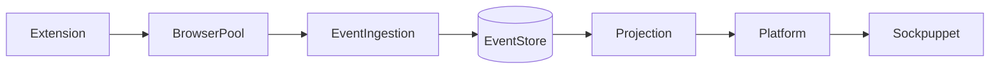
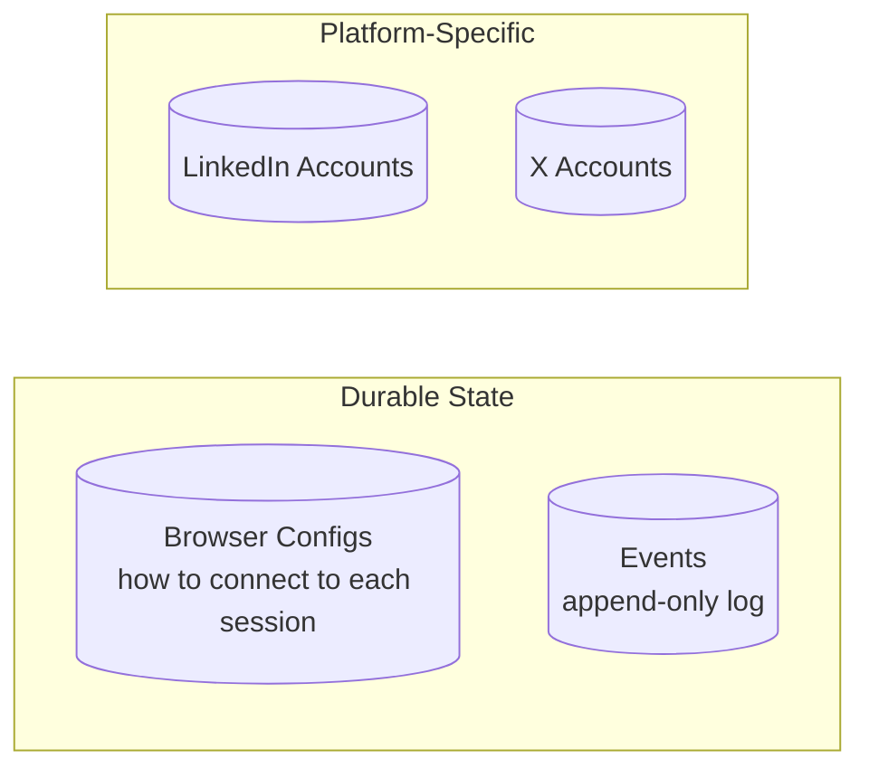
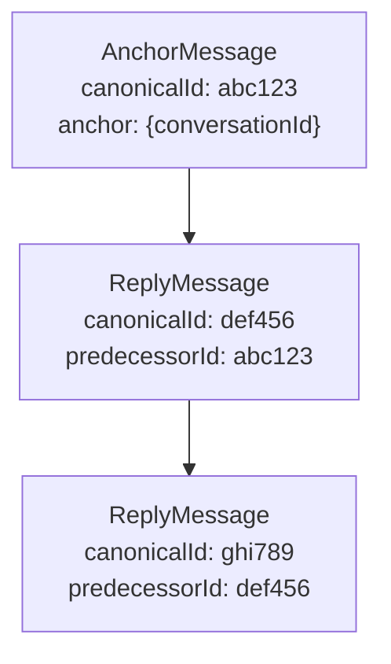
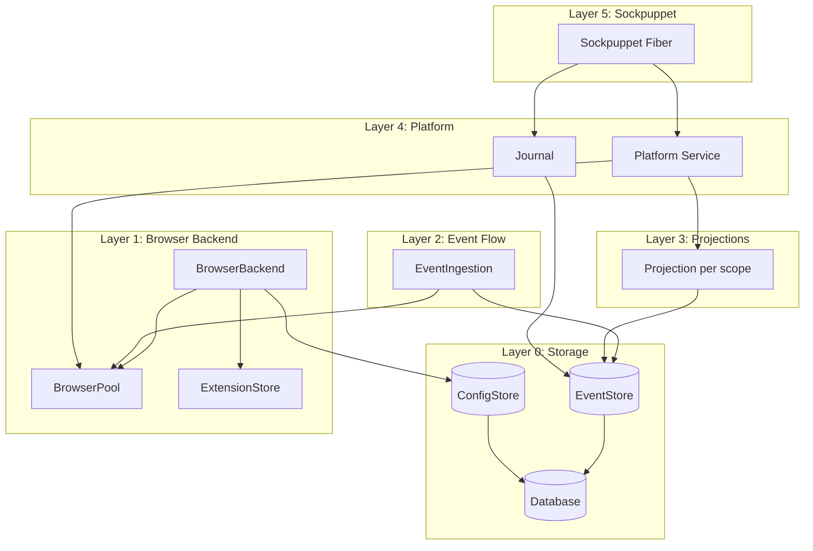
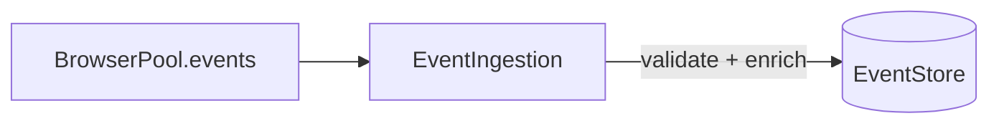

# Effect-Based Architecture

A comprehensive Effect-TS architecture for the sockpuppet runtime.

---

## The Goal

Build a runtime for **sockpuppets**—long-lived programs that simulate humans
interacting with online accounts. A sockpuppet wakes up when it wants, checks
its inbox, decides what to do, acts, and records what it did. The runtime's job
is to make this feel natural: the sockpuppet shouldn't care about browsers,
platform APIs, or crash recovery.

**Core requirement**: You can restart the process at any time and it will
continue safely. Browser sessions persist externally. Everything the program
"knows" is in an append-only event log. Anything derivable from the log is not
stored as mutable state.

**From the sockpuppet's perspective:**

```typescript
const myBot = Effect.gen(function* () {
  const platform = yield* Platform; // the world I can see and act in
  const journal = yield* Journal; // my memory

  const inbox = yield* platform.inbox;
  for (const [threadId, meta] of Object.entries(inbox.byThreadId)) {
    // decide, act, remember
  }
});
```

Everything else exists to make this possible.

---

## Design Principles

1. **Sockpuppets see a simple world**: Just `Platform` (what's happening, how to
   act) and `Journal` (memory). No databases, no browsers, no streams.

2. **One flow**: Events flow from extensions through one path to sockpuppets. No
   separate loops for different event types.

3. **Active services own their lifecycle**: Services that need background work
   (like consuming streams) start that work when their layer initializes.

4. **Unified event model**: Bridge events use `scope` + `type`, same as stored
   events. Auth, messages, rate limits—all platform-scoped, all one flow.

5. **Derive everything**: Inbox, threads, auth state, rate limits—all derived
   from the same event stream by pure functions.

6. **Platform-agnostic core**: The runtime doesn't know about LinkedIn or X. It
   knows about scopes, events, projections, and platform definitions. Platforms
   plug in.

---

## The Single Flow

```
Extension → BrowserPool → EventIngestion → EventStore → Projection → Platform → Sockpuppet
```

That's it. One path. Auth events, message events, rate limit events—they all
flow through the same pipe. The projection guarantees typed events; the platform
service derives everything from that.



---

## The Durable Primitives

The system rests on two core durable records, plus provider-specific storage:



1. **Browser Configs** — How to connect to each persistent browser session.
   Shared infrastructure, not platform-specific.

2. **Events** — Append-only log. The **single source of truth**. Everything
   else—threads, inbox state, auth status—is derived by folding events.

3. **Platform-specific account storage** — Each platform defines its own account
   type and storage. LinkedIn accounts have different fields than X accounts.
   The core runtime doesn't impose a structure.

```typescript
// Each provider defines its own account type
interface LinkedInAccount {
  readonly id: AccountId;
  readonly displayName: string;
  readonly browserBindings: readonly BrowserBinding[];
  readonly weeklyInviteLimit: number;
  // ... LinkedIn-specific fields
}

interface XAccount {
  readonly id: AccountId;
  readonly handle: string;
  readonly browserBindings: readonly BrowserBinding[];
  readonly isVerified: boolean;
  // ... X-specific fields
}

// Browser bindings are shared structure
interface BrowserBinding {
  readonly configId: BrowserConfigId;
  readonly metadata: Record<string, unknown>; // e.g., { deviceType: "mobile" }
}
```

---

## Branded Types

Use branded types to prevent mixing up IDs and other stringly-typed values:

```typescript
type Brand<T, B extends string> = T & { readonly __brand: B };

type Scope = Brand<string, "Scope">;
type AccountId = Brand<string, "AccountId">;
type ThreadId = Brand<string, "ThreadId">;
type EventId = Brand<string, "EventId">;
type CorrelationId = Brand<string, "CorrelationId">;
type CanonicalId = Brand<string, "CanonicalId">;
type BrowserConfigId = Brand<string, "BrowserConfigId">;
type ExtensionId = Brand<string, "ExtensionId">;

// Constructor functions
const Scope = (value: string): Scope => value as Scope;
const AccountId = (value: string): AccountId => value as AccountId;
const ExtensionId = (value: string): ExtensionId => value as ExtensionId;
// ... etc
```

**Why branded types matter:**

| Type              | Why                                                                |
| ----------------- | ------------------------------------------------------------------ |
| `Scope`           | Extensible string—new platforms added without modifying core types |
| `AccountId`       | Don't mix with user IDs or other identifiers                       |
| `ThreadId`        | Prevent passing a message ID where thread ID expected              |
| `EventId`         | Deduplication key—must not collide with correlation ID             |
| `CorrelationId`   | Tracing—links related events across the system                     |
| `CanonicalId`     | Message identity—distinct from platform's native ID                |
| `BrowserConfigId` | Don't mix with browser instance IDs                                |
| `ExtensionId`     | Don't mix extension IDs with other string identifiers              |

`Scope` is a branded string, not a literal union, because the system must be
extensible. New scopes (platforms, journal, core) can be added without modifying
core types.

---

## Event Architecture

### Scoped Events

Every event carries a **scope** field that identifies which subsystem owns it.
The scope is a first-class field on the base event type, enabling efficient
database-level filtering and simple schema routing.

```typescript
// Well-known scopes
const JOURNAL_SCOPE = Scope("journal");
// Platform scopes: Scope("linkedin"), Scope("x"), etc.
```

**Why a separate scope field?**

- **Database-level filtering**: `WHERE scope = 'linkedin'` pushes filtering to
  the database instead of fetching all events and filtering in memory
- **Simpler indexing**: A dedicated `scope` column with `(scope, ts)` index is
  cleaner than prefix matching on the `type` field
- **Direct schema routing**: Look up schema by `event.scope`, no string parsing
- **Clear separation**: `scope` says where it belongs, `type` says what it is

### The Event Schema Hierarchy

Events form an inheritance chain using Zod's `.extend()`:

```typescript
// Base: minimum shape for storage
const StorableEventSchema = z.object({
  scope: z.string().transform(Scope),
  type: z.string(),
  eventId: z.string().transform(EventId),
  timestamp: z.string(),
});

type StorableEvent = z.infer<typeof StorableEventSchema>;

// Extended: adds correlation/causation for tracing
const CorrelatedEventSchema = StorableEventSchema.extend({
  correlationId: z.string().transform(CorrelationId),
  causationId: z.string().transform(CorrelationId).optional(),
});

type CorrelatedEvent = z.infer<typeof CorrelatedEventSchema>;
```

**Convention**: All domain events extend `CorrelatedEventSchema`. The store only
enforces `StorableEvent`—correlation fields are a convention for tracing, not a
storage requirement.

### Event Templates

Templates provide the **base structure** for common event patterns. Platforms
extend templates with their scope and platform-specific fields:

```typescript
// templates/anchor-message.ts
export const AnchorMessageObservedBase = CorrelatedEventSchema.extend({
  kind: z.literal("anchor"),
  canonicalId: z.string().transform(CanonicalId),
  senderId: z.string(),
  content: z.string().optional(),
  // scope, type, anchor: platforms add these
});

// templates/reply-message.ts
export const ReplyMessageObservedBase = CorrelatedEventSchema.extend({
  kind: z.literal("reply"),
  canonicalId: z.string().transform(CanonicalId),
  senderId: z.string(),
  predecessorId: z.string().transform(CanonicalId),
  content: z.string().optional(),
  // scope, type: platforms add these
});

// templates/auth.ts
export const AuthObservedBase = CorrelatedEventSchema.extend({
  configId: z.string().transform(BrowserConfigId),
  accountId: z.string().transform(AccountId),
  status: z.enum(["authenticated", "expired", "unknown"]),
});

// templates/rate-limit.ts
export const RateLimitObservedBase = CorrelatedEventSchema.extend({
  configId: z.string().transform(BrowserConfigId),
  accountId: z.string().transform(AccountId),
  retryAfter: z.string().optional(),
});
```

Platforms extend these templates:

```typescript
// plugins/linkedin/schemas.ts
const LinkedInAuthObservedSchema = AuthObservedBase.extend({
  scope: z.literal("linkedin"),
  type: z.literal("AuthObserved"),
});

const LinkedInAnchorMessageSchema = AnchorMessageObservedBase.extend({
  scope: z.literal("linkedin"),
  type: z.literal("AnchorMessageObserved"),
  anchor: LinkedInAnchorSchema, // platform-specific anchor shape
});
```

### Intent Templates

Just like events, intents have templates that platforms extend. Common intent
patterns share structure across platforms:

```typescript
// templates/send-message.ts
export const SendMessageBase = z.object({
  threadId: z.string().transform(ThreadId),
  content: z.string(),
});

// templates/sync.ts
export const SyncConversationsBase = z.object({
  since: z.string().optional(),
  limit: z.number().optional(),
});
```

Platforms extend with their scope and type:

```typescript
// plugins/linkedin/schemas.ts
const LinkedInSendMessageSchema = SendMessageBase.extend({
  scope: z.literal("linkedin"),
  type: z.literal("SendMessage"),
});

type LinkedInSendMessage = z.infer<typeof LinkedInSendMessageSchema>;
```

### Platform Event Unions

Each platform defines a discriminated union of all its event types:

```typescript
// plugins/linkedin/schemas.ts
export const LinkedInEventSchema = z.discriminatedUnion("type", [
  LinkedInAuthObservedSchema,
  LinkedInRateLimitObservedSchema,
  LinkedInAnchorMessageSchema,
  LinkedInReplyMessageSchema,
  LinkedInConnectionRequestSentSchema,
  // ... all LinkedIn event types
]);

export type LinkedInEvent = z.infer<typeof LinkedInEventSchema>;

export const LinkedInIntentSchema = z.discriminatedUnion("type", [
  LinkedInSendMessageSchema,
  LinkedInSyncConversationsSchema,
  LinkedInSendConnectionRequestSchema,
  // ... all LinkedIn intent types
]);

export type LinkedInIntent = z.infer<typeof LinkedInIntentSchema>;
```

Each platform's anchor type differs—the discriminated union captures each
platform's exact shape. The `scope` field is always the same literal within a
platform's schema, so `type` remains the effective discriminator.

---

## Message Graph Model

### Why a Graph, Not a List?

Platforms don't agree on what a "thread" is:

- **LinkedIn**: Conversations have explicit participant lists in metadata
- **X/Twitter**: DM threads inferred from conversation_id
- **Email**: Threads can fork when subject line changes (In-Reply-To headers)
- **Slack**: Threads can branch from any message

Rather than impose a structure, messages form a graph via `predecessorId`
references, and each behavior's `deriveThread` walks the graph according to
platform rules.

### Base Message Contract

All messages, regardless of platform, must satisfy a minimal shape:

```typescript
interface BaseMessage {
  readonly canonicalId: CanonicalId;
  readonly senderId: string;
  readonly content?: string;
}
```

### Anchor Messages (Thread Roots)

An **anchor message** establishes a thread. It's generic over the anchor type,
allowing each platform to define its own anchor shape:

```typescript
interface AnchorMessage<TAnchor> extends BaseMessage {
  readonly kind: "anchor";
  readonly anchor: TAnchor;
}
```

### Reply Messages

Non-root messages reference their predecessor, forming a graph:

```typescript
interface ReplyMessage extends BaseMessage {
  readonly kind: "reply";
  readonly predecessorId: CanonicalId;
}
```

### Unified Message Type

```typescript
type Message<TAnchor> = AnchorMessage<TAnchor> | ReplyMessage;
```

### Thread Graph Example

```typescript
// Root message — carries platform-specific anchor
{
  scope: "linkedin",
  type: "AnchorMessageObserved",
  kind: "anchor",
  canonicalId: "abc123",
  anchor: { conversationId: "conv-1", participants: ["alice", "bob"] },
  senderId: "alice",
  content: "Hey!",
}

// Reply — references its predecessor
{
  scope: "linkedin",
  type: "ReplyMessageObserved",
  kind: "reply",
  canonicalId: "def456",
  predecessorId: "abc123",
  senderId: "bob",
  content: "Hi there!",
}
```



Thread identity = walking `predecessorId` back to a root. The behavior's
`deriveThread` implements this walk with platform-specific rules.

---

## Canonical IDs

Events are deduplicated by `eventId`. For message events, IDs are generated
**deterministically** from content, so the same message observed twice produces
the same ID:

```typescript
const hash = async (...parts: string[]): Promise<string> => {
  const data = new TextEncoder().encode(parts.join("\0"));
  const digest = await crypto.subtle.digest("SHA-256", data);
  return btoa(String.fromCharCode(...new Uint8Array(digest))).slice(0, 22);
};

// Same message → same ID, even across restarts
const canonicalMessageId = (
  scope: string,
  threadAnchor: string,
  sender: string,
  content: string,
  platformTimestamp: string,
): Promise<CanonicalId> =>
  hash(scope, threadAnchor, sender, content, platformTimestamp)
    .then((h) => h as CanonicalId);
```

**Why this matters for restartability**: Refreshing a page re-observes the same
messages, but they produce the same canonical IDs and are deduplicated. The
sockpuppet can restart at any time and the event log remains consistent.

---

## Base View Types

Views are what sockpuppets see. They're extensible so platforms can add
platform-specific fields.

### Inbox View

The inbox view is an extensible index—shows which threads exist with metadata
for sorting/filtering, but doesn't contain the threads themselves:

```typescript
interface BaseInboxView<TThreadSummary = Record<string, never>> {
  readonly byThreadId: Readonly<Record<string, TThreadSummary>>;
}

// Platform extends with specific thread summary
interface LinkedInThreadSummary {
  readonly lastActivityAt: string;
  readonly unreadCount: number;
  readonly isSponsored: boolean;
}

interface LinkedInInbox extends BaseInboxView<LinkedInThreadSummary> {
  readonly syncedAt: string;
  readonly pendingInvitations: number;
  readonly weeklyInvitesRemaining: number;
}
```

### Thread View

```typescript
interface Participant {
  readonly id: string;
  readonly name?: string;
}

interface MessageView {
  readonly id: CanonicalId;
  readonly senderId: string;
  readonly content?: string;
  readonly timestamp: string;
}

interface BaseThreadView<TAnchor> {
  readonly threadId: ThreadId;
  readonly messages: readonly MessageView[];
  readonly participants: readonly Participant[];
  readonly anchor: TAnchor;
}

// Platform extends with specific fields
interface LinkedInAnchor {
  readonly conversationId: string;
  readonly participants: readonly string[];
}

interface LinkedInThread extends BaseThreadView<LinkedInAnchor> {
  readonly unreadCount: number;
  readonly isSponsored: boolean;
}
```

Threads are fetched via `deriveThread(threadId)` when the sockpuppet views a
conversation. Platform-specific fields (like `isSponsored`) influence sockpuppet
decisions.

---

## PlatformBehavior

The behavior is **pure logic**—no schemas. It operates on types provided by the
PlatformDefinition that owns it. Different platforms have different semantics;
the behavior encapsulates this so sockpuppets just see generic views.

```typescript
// Base types - platforms extend these with their own fields
interface BaseIntent<TScope extends Scope = Scope> {
  readonly scope: TScope;
  readonly type: string;
}

interface BaseAccount {
  readonly id: AccountId;
  readonly browserBindings: readonly BrowserBinding[];
}

interface BaseBoundBrowser {
  readonly configId: BrowserConfigId;
  readonly isRunning: boolean;
  readonly metadata: Record<string, unknown>;
}

interface PlatformBehavior<
  TScope extends Scope,
  TEvent extends StorableEvent & { scope: TScope },
  TIntent extends BaseIntent<TScope>,
  TAnchor,
  TThread extends BaseThreadView<TAnchor>,
  TInbox extends BaseInboxView<unknown>,
  // Account provides: id (who to derive for), browserBindings (which browsers
  // this account can use, with metadata like device type, geo, etc.)
  TAccount extends BaseAccount,
  TBrowser extends BaseBoundBrowser = BaseBoundBrowser,
> {
  readonly scope: TScope;

  // ─────────────────────────────────────────────────────────────────────────
  // Derivation — fold events into views (pure functions)
  // ─────────────────────────────────────────────────────────────────────────

  readonly deriveInbox: (
    events: readonly TEvent[],
    accountId: AccountId,
  ) => TInbox;

  readonly deriveThread: (
    events: readonly TEvent[],
    threadId: ThreadId,
  ) => TThread | undefined;

  readonly deriveBrowsers: (
    events: readonly TEvent[],
    account: TAccount,
    runningConfigIds: ReadonlySet<BrowserConfigId>,
  ) => readonly TBrowser[];

  // ─────────────────────────────────────────────────────────────────────────
  // Execution — run intents via browser (behavior owns browser selection)
  // ─────────────────────────────────────────────────────────────────────────

  readonly execute: (
    intent: TIntent,
    browsers: readonly TBrowser[],
    preferConfigId?: BrowserConfigId,
  ) => Effect.Effect<
    { usedConfigId: BrowserConfigId },
    ExecuteError,
    BrowserPool
  >;
}
```

**Why the behavior owns browser selection**: Different platforms have different
criteria for what makes a browser "usable"—auth status, rate limits, geo,
session freshness, etc. The behavior's `deriveBrowsers` attaches
platform-specific status to each browser, and `execute` picks the best one based
on platform logic. No hardcoded universal assumptions about auth or rate limits.

---

## PlatformDefinition

A **PlatformDefinition** is the registration unit for a platform. It bundles:

- **Schemas** — the contract (what events/intents look like)
- **Behavior** — how to derive views from events, select browsers, execute
  intents
- **Account type** — platform-specific account structure
- **Browser type** — platform-specific browser view (extends BaseBoundBrowser)

The type parameters enforce that the behavior operates on events matching the
declared scope.

```typescript
interface PlatformDefinition<
  TScope extends Scope,
  TEvent extends StorableEvent & { scope: TScope },
  TIntent extends BaseIntent<TScope>,
  TAnchor,
  TThread extends BaseThreadView<TAnchor>,
  TInbox extends BaseInboxView<unknown>,
  TAccount extends BaseAccount,
  TBrowser extends BaseBoundBrowser = BaseBoundBrowser,
> {
  readonly scope: TScope;

  // Schemas — the contract for this scope
  readonly eventSchema: z.ZodType<TEvent>;
  readonly intentSchema: z.ZodType<TIntent>;
  readonly anchorSchema: z.ZodType<TAnchor>;

  // Behavior — how to derive views, select browsers, and execute intents
  readonly behavior: PlatformBehavior<
    TScope,
    TEvent,
    TIntent,
    TAnchor,
    TThread,
    TInbox,
    TAccount,
    TBrowser
  >;
}

// Type-erased definition for schema collection (doesn't need full type info)
type AnyPlatform = PlatformDefinition<
  Scope,
  StorableEvent,
  BaseIntent,
  unknown,
  BaseThreadView<unknown>,
  BaseInboxView<unknown>,
  BaseAccount,
  BaseBoundBrowser
>;
```

The constraint `TEvent extends StorableEvent & { scope: TScope }` ensures
compile-time safety: you cannot register a schema containing events with the
wrong scope literal.

The `TAccount` constraint requires `id` and `browserBindings` (shared structure
needed by the platform service), but allows platform-specific fields. The
`TBrowser` constraint ensures browsers have at least `configId` and `isRunning`.

### Example Definition

```typescript
// plugins/linkedin/mod.ts
export const linkedInPlatform: PlatformDefinition<
  typeof LINKEDIN_SCOPE,
  LinkedInEvent,
  LinkedInIntent,
  LinkedInAnchor,
  LinkedInThread,
  LinkedInInbox,
  LinkedInAccount,
  LinkedInBrowser
> = {
  scope: LINKEDIN_SCOPE,
  eventSchema: LinkedInEventSchema,
  intentSchema: LinkedInIntentSchema,
  anchorSchema: LinkedInAnchorSchema,
  behavior: linkedInBehavior,
};

// plugins/linkedin/browser.ts
interface LinkedInBrowser extends BaseBoundBrowser {
  readonly authStatus: "authenticated" | "expired" | "unknown";
  readonly rateLimitedUntil: string | undefined;
  readonly weeklyInvitesRemaining: number | undefined;
}

// plugins/linkedin/account.ts
interface LinkedInAccount {
  readonly id: AccountId;
  readonly displayName: string;
  readonly browserBindings: readonly BrowserBinding[];
  readonly weeklyInviteLimit: number;
  readonly profileUrl: string;
}

// Each platform has its own account store
interface LinkedInAccountStoreService {
  readonly get: (id: AccountId) => Effect.Effect<Option<LinkedInAccount>>;
  readonly list: () => Effect.Effect<readonly LinkedInAccount[]>;
  readonly upsert: (account: LinkedInAccount) => Effect.Effect<void>;
}
class LinkedInAccountStore extends Context.Tag("LinkedInAccountStore")<
  LinkedInAccountStore,
  LinkedInAccountStoreService
>() {}
```

---

## System Architecture



Note: Account storage is provider-specific and not shown here. Each provider
(LinkedIn, X) defines its own account type and storage mechanism. BrowserBackend
bundles BrowserPool and ExtensionStore together to ensure compatibility between
implementations (e.g., Browserbase, local Playwright).

---

## Layer 0: Storage

Raw persistence. Schema-agnostic. The foundation everything else builds on.

```typescript
// Database - raw SQL access
interface DatabaseService {
  readonly query: <T>(
    sql: string,
    params?: unknown[],
  ) => Effect.Effect<T[], DatabaseError>;
  readonly execute: (
    sql: string,
    params?: unknown[],
  ) => Effect.Effect<void, DatabaseError>;
}
class Database extends Context.Tag("Database")<Database, DatabaseService>() {}

// EventStore - append-only log, schema-agnostic
type EventQuery =
  | { readonly tag: "all" }
  | { readonly tag: "byScope"; readonly scope: Scope; readonly since?: string }
  | { readonly tag: "byCorrelation"; readonly correlationId: CorrelationId };

interface EventStoreService {
  readonly append: (
    events: readonly StorableEvent[],
  ) => Effect.Effect<void, EventStoreError>;
  readonly query: (
    q: EventQuery,
  ) => Effect.Effect<readonly StorableEvent[], EventStoreError>;
}
class EventStore
  extends Context.Tag("EventStore")<EventStore, EventStoreService>() {}

// ConfigStore - browser configs (shared infrastructure)
interface BrowserConfig {
  readonly id: BrowserConfigId;
  readonly context: string; // Browserbase session ID
  readonly extensionIds: readonly ExtensionId[]; // extensions loaded in this browser
  readonly proxy?: ProxyConfig;
}

// ExtensionStore - extension metadata (admin/setup, not used by runtime)
interface ExtensionMeta {
  readonly id: ExtensionId;
  readonly name: string;
  readonly version: string;
  readonly uri: string; // where to load from
}

interface ExtensionStoreService {
  readonly list: () => Effect.Effect<readonly ExtensionMeta[]>;
  readonly get: (id: ExtensionId) => Effect.Effect<Option<ExtensionMeta>>;
  readonly upsert: (meta: ExtensionMeta) => Effect.Effect<void>;
  readonly remove: (id: ExtensionId) => Effect.Effect<void>;
}
class ExtensionStore extends Context.Tag("ExtensionStore")<
  ExtensionStore,
  ExtensionStoreService
>() {}

interface ConfigStoreService {
  readonly get: (
    id: BrowserConfigId,
  ) => Effect.Effect<Option<BrowserConfig>, ConfigStoreError>;
  readonly list: () => Effect.Effect<
    readonly BrowserConfig[],
    ConfigStoreError
  >;
  readonly upsert: (
    config: BrowserConfig,
  ) => Effect.Effect<void, ConfigStoreError>;
}
class ConfigStore
  extends Context.Tag("ConfigStore")<ConfigStore, ConfigStoreService>() {}
```

The store validates base shape on append (has `scope`, `type`, `eventId`,
`timestamp`) but doesn't care about platform-specific fields. The `byScope`
queries push filtering to the database layer for efficiency.

**Note**: Account storage is provider-specific. Each provider defines its own
account service (e.g., `LinkedInAccountStore`, `XAccountStore`) with
platform-appropriate fields and storage.

---

## Layer 1: Connectivity (Browser Backend)

Browser lifecycle, bridge communication, and extension management are bundled
into a single **BrowserBackend**. This ensures compatibility—different backends
(Browserbase, local Playwright, etc.) handle extensions differently, so both
services must come from the same implementation.

```typescript
interface BridgeEvent {
  readonly scope: string;
  readonly type: string;
  readonly [key: string]: unknown;
}

interface TaggedBridgeEvent {
  readonly configId: BrowserConfigId;
  readonly event: BridgeEvent;
}

interface BrowserPoolService {
  // Lifecycle
  readonly launch: (
    configId: BrowserConfigId,
  ) => Effect.Effect<void, BrowserError>;
  readonly stop: (
    configId: BrowserConfigId,
  ) => Effect.Effect<void, BrowserError>;

  // State
  readonly isRunning: (configId: BrowserConfigId) => Effect.Effect<boolean>;

  // Commands
  readonly send: (
    configId: BrowserConfigId,
    command: { type: string; payload: unknown },
  ) => Effect.Effect<unknown, BrowserError | BridgeError>;

  // Event stream - all events from all running browsers
  readonly events: Stream.Stream<TaggedBridgeEvent, BrowserError>;
}
class BrowserPool
  extends Context.Tag("BrowserPool")<BrowserPool, BrowserPoolService>() {}
```

### BrowserBackend

The backend bundles pool and extension store together, ensuring they're
compatible:

```typescript
// Backend bundles both services - pick a backend, get both
interface BrowserBackend {
  readonly pool: BrowserPoolService;
  readonly extensions: ExtensionStoreService;
}

// Browserbase implementation
const makeBrowserbaseBackend = (
  apiKey: string,
): Effect.Effect<BrowserBackend, never, ConfigStore> =>
  Effect.gen(function* () {
    const configStore = yield* ConfigStore;
    return {
      pool: createBrowserbasePool(apiKey, configStore),
      extensions: createBrowserbaseExtensionStore(apiKey),
    };
  });

// Local Playwright implementation (extensions loaded from filesystem)
const makeLocalBackend = (
  extensionsDir: string,
): Effect.Effect<BrowserBackend, never, ConfigStore> =>
  Effect.gen(function* () {
    const configStore = yield* ConfigStore;
    return {
      pool: createLocalPool(configStore),
      extensions: createLocalExtensionStore(extensionsDir),
    };
  });

// Layer that provides both services from a backend
const BrowserBackendLive = (backend: BrowserBackend) =>
  Layer.mergeAll(
    Layer.succeed(BrowserPool, backend.pool),
    Layer.succeed(ExtensionStore, backend.extensions),
  );
```

The pool doesn't know about platforms—it just manages browsers and exposes what
they emit. The extension store is for admin workflows (querying/uploading
extensions); the runtime uses `BrowserConfig.extensionIds` which is set during
browser setup.

---

## Layer 2: Event Flow

The **EventIngestion** bridges connectivity and storage. It's an _active_
service—when its layer initializes, it starts consuming the event stream.



```typescript
interface EventIngestionService {
  // The router is active - consuming happens on construction
}
class EventIngestion extends Context.Tag("EventIngestion")<
  EventIngestion,
  EventIngestionService
>() {}

// Schemas come from providers - they're static values, not services
const makeEventIngestion = (
  schemas: ReadonlyMap<Scope, z.ZodType<StorableEvent>>,
) =>
  Layer.scoped(
    EventIngestion,
    Effect.gen(function* () {
      const pool = yield* BrowserPool;
      const store = yield* EventStore;

      yield* Effect.forkScoped(
        pool.events.pipe(
          Stream.runForEach(({ configId, event }) =>
            Effect.gen(function* () {
              const scope = Scope(event.scope);
              const schema = schemas.get(scope);
              if (!schema) {
                yield* Effect.logWarning("Unknown scope, dropping event", {
                  scope,
                });
                return;
              }

              const enriched = {
                ...event,
                eventId: EventId(crypto.randomUUID()),
                timestamp: new Date().toISOString(),
                configId,
              };

              const result = schema.safeParse(enriched);
              if (!result.success) {
                yield* Effect.logWarning("Validation failed", {
                  scope,
                  type: event.type,
                  errors: result.error.issues,
                });
                return;
              }

              yield* store.append([result.data]);
            })
          ),
        ),
      );

      return {};
    }),
  );
```

**Schema ownership**: Schemas are defined by platforms, but they're static
values—just Zod types. They flow up via static imports at layer composition
time, not service dependencies.

---

## Layer 3: Projections

Projections provide **type-safe, filtered access** to the event store. The
platform service doesn't filter or validate—the projection guarantees it.

```typescript
interface Projection<TEvent extends StorableEvent> {
  readonly scope: Scope;
  readonly query: (
    since?: string,
  ) => Effect.Effect<readonly TEvent[], EventStoreError>;
}

const makeProjection = <TEvent extends StorableEvent>(
  scope: Scope,
  schema: z.ZodType<TEvent>,
): Effect.Effect<Projection<TEvent>, never, EventStore> =>
  Effect.gen(function* () {
    const store = yield* EventStore;

    return {
      scope,
      query: (since) =>
        Effect.gen(function* () {
          const raw = yield* store.query({ tag: "byScope", scope, since });
          return raw.flatMap((e) => {
            const result = schema.safeParse(e);
            return result.success ? [result.data] : [];
          });
        }),
    };
  });
```

**Why projections exist**: Type safety at the service boundary. The platform
service yields a projection and gets typed events—guaranteed. No filtering, no
validation, no "what if the wrong events leak through."

Projections guarantee:

1. Filtering by scope at the database level
2. Zod validation against the scope's schema
3. Type narrowing to the scope's event union

Events that fail validation are filtered out with a warning.

---

## Layer 4: Platform Service

The platform service combines projection, behavior, and browser pool into what
sockpuppets actually use. It's **generic over the platform definition's types**,
including the platform-specific browser type.

```typescript
interface PlatformService<
  TEvent extends StorableEvent,
  TIntent extends BaseIntent,
  TAnchor,
  TThread extends BaseThreadView<TAnchor>,
  TInbox extends BaseInboxView<unknown>,
  TAccount extends BaseAccount,
  TBrowser extends BaseBoundBrowser,
> {
  readonly scope: Scope;
  readonly accountId: AccountId;
  readonly account: TAccount;

  // The world - all derived from one event stream
  readonly inbox: Effect.Effect<TInbox>;
  readonly thread: (id: ThreadId) => Effect.Effect<Option<TThread>>;
  readonly browsers: Effect.Effect<readonly TBrowser[]>; // platform-specific browser type

  // How I act - behavior owns browser selection
  readonly execute: (
    intent: TIntent,
    options?: { preferConfigId?: BrowserConfigId },
  ) => Effect.Effect<{ usedConfigId: BrowserConfigId }, ExecuteError>;
}
```

### Implementation

The platform service delegates browser derivation and selection entirely to the
behavior. No hardcoded assumptions about auth or rate limits.

```typescript
const makePlatformService = <
  TScope extends Scope,
  TEvent extends StorableEvent & { scope: TScope },
  TIntent extends BaseIntent<TScope>,
  TAnchor,
  TThread extends BaseThreadView<TAnchor>,
  TInbox extends BaseInboxView<unknown>,
  TAccount extends BaseAccount,
  TBrowser extends BaseBoundBrowser,
>(
  platform: PlatformDefinition<
    TScope,
    TEvent,
    TIntent,
    TAnchor,
    TThread,
    TInbox,
    TAccount,
    TBrowser
  >,
  account: TAccount,
  projection: Projection<TEvent>,
): Effect.Effect<
  PlatformService<
    TEvent,
    TIntent,
    TAnchor,
    TThread,
    TInbox,
    TAccount,
    TBrowser
  >,
  never,
  BrowserPool
> =>
  Effect.gen(function* () {
    const pool = yield* BrowserPool;
    const behavior = platform.behavior;

    const queryEvents = projection.query();

    // Get which browsers are currently running
    const getRunningConfigIds = Effect.gen(function* () {
      const results = yield* Effect.forEach(
        account.browserBindings,
        (binding) =>
          Effect.gen(function* () {
            const running = yield* pool.isRunning(binding.configId);
            return running ? binding.configId : null;
          }),
      );
      return new Set(
        results.filter((id): id is BrowserConfigId => id !== null),
      );
    });

    // Behavior derives browsers with platform-specific status
    const getBrowsers = Effect.gen(function* () {
      const events = yield* queryEvents;
      const runningIds = yield* getRunningConfigIds;
      return behavior.deriveBrowsers(events, account, runningIds);
    });

    return {
      scope: platform.scope,
      accountId: account.id,
      account,

      browsers: getBrowsers,

      inbox: Effect.gen(function* () {
        const events = yield* queryEvents;
        return behavior.deriveInbox(events, account.id);
      }),

      thread: (threadId) =>
        Effect.gen(function* () {
          const events = yield* queryEvents;
          return Option.fromNullable(behavior.deriveThread(events, threadId));
        }),

      // Behavior owns browser selection and execution
      execute: (intent, options) =>
        Effect.gen(function* () {
          const browsers = yield* getBrowsers;
          return yield* behavior.execute(
            intent,
            browsers,
            options?.preferConfigId,
          );
        }),
    };
  });
```

### Journal

The sockpuppet's memory. Writes directly to EventStore (journal entries don't
come from bridges).

```typescript
interface JournalEntry extends StorableEvent {
  readonly scope: typeof JOURNAL_SCOPE;
  readonly type: "Entry";
  readonly accountId: AccountId;
  readonly kind: string;
  readonly [key: string]: unknown;
}

interface JournalService {
  readonly record: (
    entry: { kind: string; [k: string]: unknown },
  ) => Effect.Effect<void, JournalError>;
  readonly entries: (
    since?: string,
  ) => Effect.Effect<readonly JournalEntry[], JournalError>;
}
class Journal extends Context.Tag("Journal")<Journal, JournalService>() {}

const makeJournalLive = (accountId: AccountId) =>
  Layer.effect(
    Journal,
    Effect.gen(function* () {
      const store = yield* EventStore;

      return {
        record: (entry) =>
          store.append([
            {
              ...entry,
              scope: JOURNAL_SCOPE,
              type: "Entry",
              eventId: EventId(crypto.randomUUID()),
              timestamp: new Date().toISOString(),
              accountId,
            },
          ]),

        entries: (since) =>
          Effect.gen(function* () {
            const all = yield* store.query({
              tag: "byScope",
              scope: JOURNAL_SCOPE,
              since,
            });
            return all.filter(
              (e): e is JournalEntry =>
                e.scope === JOURNAL_SCOPE &&
                (e as JournalEntry).accountId === accountId,
            );
          }),
      };
    }),
  );
```

**Why a separate journal?** The global event log records what happened in the
world. The journal records what the _sockpuppet_ decided and did. On restart,
the sockpuppet folds its journal to reconstruct its own state.

---

## Layer 5: Sockpuppet

The human-like agent. Sees only its platform service and journal.

```typescript
const myBot = Effect.gen(function* () {
  const platform = yield* Platform;
  const journal = yield* Journal;

  // ─────────────────────────────────────────────────────────────────────────
  // Restore state from journal
  // ─────────────────────────────────────────────────────────────────────────
  const pastEntries = yield* journal.entries();
  const repliedThreads = new Set(
    pastEntries.filter((e) => e.kind === "replied").map((e) =>
      e.threadId as string
    ),
  );

  // ─────────────────────────────────────────────────────────────────────────
  // Check what devices are available (browser status is platform-specific)
  // ─────────────────────────────────────────────────────────────────────────
  const browsers = yield* platform.browsers; // LinkedInBrowser[]

  // Platform-specific status fields (e.g., authStatus, rateLimitedUntil)
  // are attached by the behavior's deriveBrowsers function
  const usable = browsers.filter((b) =>
    b.isRunning && b.authStatus === "authenticated"
  );

  if (usable.length === 0) {
    yield* journal.record({ kind: "waiting", reason: "no_browsers_available" });
    yield* Effect.sleep(Duration.minutes(5));
    return;
  }

  // Sockpuppet can use browser bindings metadata for its own decisions
  const mobile = usable.find((b) => b.metadata.deviceType === "mobile");
  const desktop = usable.find((b) => b.metadata.deviceType === "desktop");

  const hour = new Date().getHours();
  const preferred = hour >= 7 && hour < 18
    ? (mobile ?? desktop)
    : (desktop ?? mobile);

  // ─────────────────────────────────────────────────────────────────────────
  // Process inbox
  // ─────────────────────────────────────────────────────────────────────────
  const inbox = yield* platform.inbox;

  for (const [threadId, _meta] of Object.entries(inbox.byThreadId)) {
    if (repliedThreads.has(threadId)) continue;

    const thread = yield* platform.thread(ThreadId(threadId));
    if (Option.isNone(thread)) continue;

    const lastMsg = thread.value.messages.at(-1);
    if (!lastMsg || lastMsg.senderId === platform.accountId) continue;

    yield* platform.execute(
      {
        scope: platform.scope,
        type: "SendMessage",
        threadId: ThreadId(threadId),
        content: "Thanks!",
      },
      { preferConfigId: preferred?.configId },
    );

    yield* journal.record({ kind: "replied", threadId });
    repliedThreads.add(threadId);

    yield* Effect.sleep(Duration.seconds(randomBetween(30, 90)));
  }
});
```

---

## Layer Composition

```typescript
// ─────────────────────────────────────────────────────────────────────────────
// Collect schemas from all platform definitions (static imports)
// ─────────────────────────────────────────────────────────────────────────────
import { linkedInPlatform } from "@plugins/linkedin/mod.ts";
import { xPlatform } from "@plugins/x/mod.ts";
import { JournalEntrySchema, JOURNAL_SCOPE } from "./journal/schemas.ts";

const PLATFORMS: readonly AnyPlatform[] = [linkedInPlatform, xPlatform];

const SCHEMAS: ReadonlyMap<Scope, z.ZodType<StorableEvent>> = new Map([
  ...PLATFORMS.map((p) => [p.scope, p.eventSchema] as const),
  [JOURNAL_SCOPE, JournalEntrySchema],
]);

// ─────────────────────────────────────────────────────────────────────────────
// Layer 0: Storage (core infrastructure)
// ─────────────────────────────────────────────────────────────────────────────
const StorageLive = Layer.mergeAll(
  DatabaseLive,
  EventStoreLive.pipe(Layer.provide(DatabaseLive)),
  ConfigStoreLive.pipe(Layer.provide(DatabaseLive)),
);

// Platform-specific account stores (each platform defines its own)
const LinkedInAccountStoreLive = /* ... */;
const XAccountStoreLive = /* ... */;

// ─────────────────────────────────────────────────────────────────────────────
// Layer 1: Browser Backend (provides BrowserPool + ExtensionStore)
// ─────────────────────────────────────────────────────────────────────────────
const backend = await Effect.runPromise(
  makeBrowserbaseBackend(process.env.BROWSERBASE_API_KEY!).pipe(
    Effect.provide(ConfigStoreLive),
  ),
);
const BrowserBackendLive = Layer.mergeAll(
  Layer.succeed(BrowserPool, backend.pool),
  Layer.succeed(ExtensionStore, backend.extensions),
);

// ─────────────────────────────────────────────────────────────────────────────
// Layer 2: Event Flow (schemas from providers)
// ─────────────────────────────────────────────────────────────────────────────
const EventFlowLive = makeEventIngestion(SCHEMAS).pipe(
  Layer.provide(BrowserBackendLive),
  Layer.provide(StorageLive),
);

// ─────────────────────────────────────────────────────────────────────────────
// Compose infrastructure
// ─────────────────────────────────────────────────────────────────────────────
const InfrastructureLive = Layer.mergeAll(
  StorageLive,
  BrowserBackendLive,
  EventFlowLive,
  // Platform-specific account stores
  LinkedInAccountStoreLive,
  XAccountStoreLive,
);
```

**Schema flow**: Schemas are static values defined by providers, imported at the
top level, and passed to EventIngestion for write validation. Projections use
the same schemas for read validation. No circular dependencies—schemas are just
values.

---

## Main Entry Point

Each provider has its own account store. The main entry point loads accounts
from each provider and spawns sockpuppets accordingly.

```typescript
const main = Effect.gen(function* () {
  // Each provider loads its own accounts
  const linkedInAccounts = yield* LinkedInAccountStore.pipe(
    Effect.flatMap((store) => store.list()),
  );
  const xAccounts = yield* XAccountStore.pipe(
    Effect.flatMap((store) => store.list()),
  );

  yield* Effect.log(`Found ${linkedInAccounts.length} LinkedIn accounts`);
  yield* Effect.log(`Found ${xAccounts.length} X accounts`);

  // Spawn LinkedIn sockpuppets
  yield* Effect.forEach(
    linkedInAccounts,
    (account) => spawnSockpuppet(linkedInPlatform, account),
    { concurrency: "unbounded" },
  );

  // Spawn X sockpuppets
  yield* Effect.forEach(
    xAccounts,
    (account) => spawnSockpuppet(xPlatform, account),
    { concurrency: "unbounded" },
  );

  yield* Effect.log("All sockpuppets started");
  yield* Effect.never;
});

// Generic sockpuppet spawner
const spawnSockpuppet = <
  TScope extends Scope,
  TEvent extends StorableEvent & { scope: TScope },
  TIntent extends BaseIntent<TScope>,
  TAnchor,
  TThread extends BaseThreadView<TAnchor>,
  TInbox extends BaseInboxView<unknown>,
  TAccount extends BaseAccount,
>(
  platform: PlatformDefinition<
    TScope,
    TEvent,
    TIntent,
    TAnchor,
    TThread,
    TInbox,
    TAccount
  >,
  account: TAccount,
) =>
  Effect.gen(function* () {
    yield* Effect.log(`Starting sockpuppet`, {
      scope: platform.scope,
      accountId: account.id,
    });

    // Create projection for this scope
    const projection = yield* makeProjection(
      platform.scope,
      platform.eventSchema,
    );

    // Create platform service
    const platformService = yield* makePlatformService(
      platform,
      account,
      projection,
    );

    // Create layers
    const PlatformLive = Layer.succeed(Platform, platformService);
    const JournalLive = makeJournalLive(account.id);
    const layers = Layer.merge(PlatformLive, JournalLive);

    // Run sockpuppet
    yield* myBot.pipe(
      Effect.forever,
      Effect.retry(Schedule.exponential("1 second").pipe(Schedule.jittered)),
      Effect.catchAll((e) =>
        Effect.logError("Sockpuppet crashed", {
          accountId: account.id,
          error: e,
        })
      ),
      Effect.provide(layers),
      Effect.forkDaemon,
    );
  });

// Run
Effect.runPromise(
  main.pipe(Effect.provide(InfrastructureLive)),
).catch(console.error);
```

---

## Information Flow

```
┌─────────────────────────────────────────────────────────────────────────┐
│                                                                         │
│  Extension observes something (auth, message, rate limit, anything)     │
│       │                                                                 │
│       │  { scope: "linkedin", type: "AuthObserved", ... }               │
│       │  { scope: "linkedin", type: "AnchorMessageObserved", ... }      │
│       │  { scope: "x", type: "RateLimitObserved", ... }                 │
│       ↓                                                                 │
│  BrowserPool receives, tags with configId                               │
│       ↓                                                                 │
│  EventIngestion looks up schema by scope, validates, stores                │
│       ↓                                                                 │
│  EventStore                                                             │
│       ↓                                                                 │
│  Projection filters by scope, validates, returns typed events           │
│       ↓                                                                 │
│  Platform service uses behavior to derive EVERYTHING:                   │
│       ├── behavior.deriveInbox(events)      → inbox view                │
│       ├── behavior.deriveThread(events)     → thread view               │
│       └── behavior.deriveBrowsers(events)   → browser status (platform-specific) │
│       ↓                                                                 │
│  behavior.execute() owns browser selection and execution                │
│       ↓                                                                 │
│  Sockpuppet sees unified view                                           │
│                                                                         │
└─────────────────────────────────────────────────────────────────────────┘
```

---

## Module Structure

```
# Project root
plugins/                         # Platform plugins (separate package)
├── linkedin/
│   ├── mod.ts                   # linkedInPlatform export
│   ├── schemas.ts               # LinkedInEventSchema, LinkedInIntentSchema
│   ├── behavior.ts              # linkedInBehavior implementation
│   ├── views.ts                 # LinkedInInbox, LinkedInThread, LinkedInAnchor
│   ├── browser.ts               # LinkedInBrowser (extends BaseBoundBrowser)
│   └── account.ts               # LinkedInAccount, LinkedInAccountStore
└── x/
    ├── mod.ts                   # xPlatform export
    ├── schemas.ts               # XEventSchema, XIntentSchema
    ├── behavior.ts              # xBehavior implementation
    ├── views.ts                 # XInbox, XThread, XAnchor
    ├── browser.ts               # XBrowser (extends BaseBoundBrowser)
    └── account.ts               # XAccount, XAccountStore

backend/server/src/
├── core/                        # Core utilities
│   ├── mod.ts                   # Barrel exports
│   ├── branded.ts               # Brand<T,B>, all branded type constructors
│   └── hashing.ts               # Deterministic ID generation
│
├── events/                      # Event definitions
│   ├── mod.ts                   # StorableEvent, CorrelatedEvent schemas
│   └── templates/               # Base schemas for platforms to extend
│       ├── mod.ts
│       ├── anchor-message.ts    # AnchorMessageObservedBase
│       ├── reply-message.ts     # ReplyMessageObservedBase
│       ├── auth.ts              # AuthObservedBase
│       └── rate-limit.ts        # RateLimitObservedBase
│
├── intents/                     # Intent definitions
│   ├── mod.ts                   # BaseIntent
│   └── templates/               # Base schemas for platforms to extend
│       ├── mod.ts
│       ├── send-message.ts      # SendMessageBase
│       └── sync.ts              # SyncConversationsBase
│
├── views/                       # View type definitions
│   ├── mod.ts                   # Barrel exports
│   ├── inbox.ts                 # BaseInboxView<TThreadSummary>
│   ├── thread.ts                # BaseThreadView<TAnchor>, MessageView
│   └── browser.ts               # BaseBoundBrowser (platforms extend this)
│
├── store/                       # Storage layer (core infrastructure)
│   ├── mod.ts                   # EventStore, ConfigStore interfaces
│   ├── event-store.ts           # EventStoreService, EventStoreLive
│   ├── config-store.ts          # ConfigStoreService, ConfigStoreLive
│   └── database.ts              # DatabaseService, DatabaseLive
│
├── backend/                     # Browser backend (bundles pool + extensions)
│   ├── mod.ts                   # BrowserBackend, BrowserPoolService, ExtensionStoreService
│   ├── types.ts                 # BridgeEvent, BridgeError, ExtensionMeta
│   ├── browserbase/             # Browserbase implementation
│   │   ├── mod.ts               # makeBrowserbaseBackend
│   │   ├── pool.ts              # Browserbase pool implementation
│   │   └── extensions.ts        # Browserbase extension store
│   └── local/                   # Local Playwright implementation (LEAVE BLANK FOR NOW)
│       ├── mod.ts               # makeLocalBackend
│       ├── pool.ts              # Local pool implementation
│       └── extensions.ts        # Filesystem-based extension store
│
├── routing/                     # Event routing
│   ├── mod.ts                   # Barrel exports
│   └── router.ts                # EventIngestionService, makeEventIngestion
│
├── projections/                 # Typed store access
│   ├── mod.ts                   # Barrel exports
│   └── projection.ts            # Projection<TEvent>, makeProjection
│
├── platforms/                   # Platform service & core types
│   ├── mod.ts                   # PlatformDefinition, AnyPlatform, PlatformBehavior
│   └── service.ts               # PlatformService, makePlatformService
│
├── journal/                     # Sockpuppet memory
│   ├── mod.ts                   # Barrel exports
│   ├── schemas.ts               # JournalEntrySchema, JOURNAL_SCOPE
│   └── service.ts               # JournalService, makeJournalLive
│
└── main.ts                      # Entry point, layer composition
```

---

## Dependency Matrix

| Layer | Service                | Depends On              | Responsibility                            |
| ----- | ---------------------- | ----------------------- | ----------------------------------------- |
| 0     | `Database`             | —                       | Raw SQL access                            |
| 0     | `EventStore`           | Database                | Append-only event log                     |
| 0     | `ConfigStore`          | Database                | Browser configs (includes extensionIds)   |
| —     | `LinkedInAccountStore` | Database                | LinkedIn accounts (provider-specific)     |
| —     | `XAccountStore`        | Database                | X accounts (provider-specific)            |
| 1     | `BrowserBackend`       | ConfigStore             | Bundles BrowserPool + ExtensionStore      |
| 1     | `BrowserPool`          | (via backend)           | Browser lifecycle, commands, event stream |
| 1     | `ExtensionStore`       | (via backend)           | Extension metadata (admin/setup)          |
| 2     | `EventIngestion`       | BrowserPool, EventStore | Consumes stream, validates, stores        |
| 3     | `Projection`           | EventStore              | Type-safe filtered view per scope         |
| 4     | `Platform`             | Projection, BrowserPool | What sockpuppets use                      |
| 4     | `Journal`              | EventStore              | Sockpuppet decision log                   |

Platform-specific account stores are not part of the core layer hierarchy—each
platform defines and manages its own.

---

## Key Design Points

1. **One flow**: Events flow from extension to sockpuppet through one path.
   Auth, messages, rate limits—all platform-scoped, all the same pipe.

2. **Platform-agnostic core**: The runtime knows about `PlatformDefinition`,
   `PlatformBehavior`, `Projection`. It doesn't know about LinkedIn or X.

3. **Platform definitions bundle schemas + behavior**: Each platform defines its
   types (events, intents, anchor, views) and behavior (derivation, execution).

4. **Platform-specific account storage**: Each platform defines its own account
   type and store. LinkedIn accounts have different fields than X accounts. The
   core doesn't impose a monolithic `OwnedAccount` type.

5. **Projections for type safety**: Platform service gets typed events from the
   projection—guaranteed. No manual filtering or validation.

6. **Templates for consistency**: Event and intent templates ensure platforms
   follow common patterns while allowing platform-specific extensions.

7. **Message graph for flexibility**: `predecessorId` links form a graph; each
   behavior walks it according to platform-specific threading rules.

8. **Canonical IDs for restartability**: Deterministic hashing means the same
   message observed twice produces the same ID—safe to restart anytime.

9. **Active services own lifecycle**: EventIngestion starts consuming when its
   layer initializes. No manual daemon forking in main.

10. **Sockpuppets are isolated**: They see `Platform` and `Journal`. Everything
    else is hidden.
