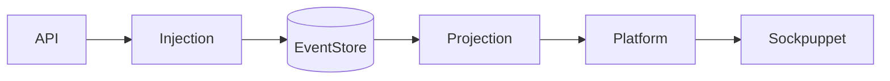
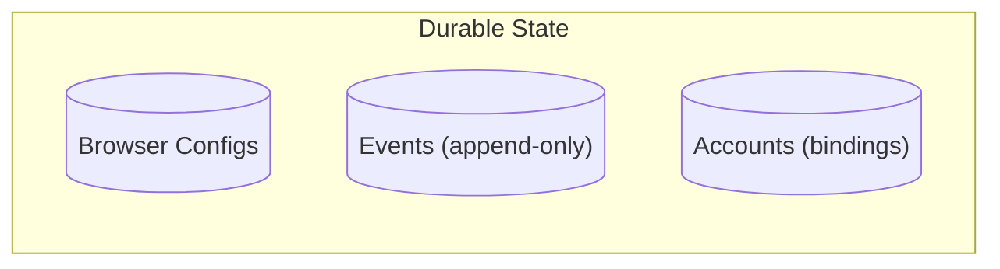
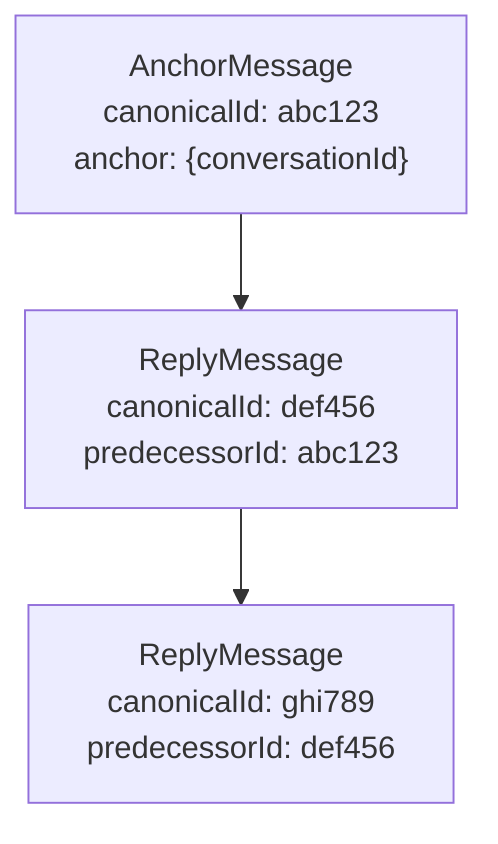
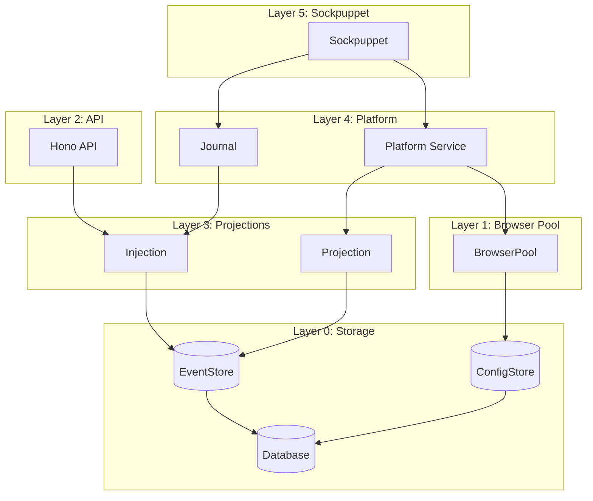
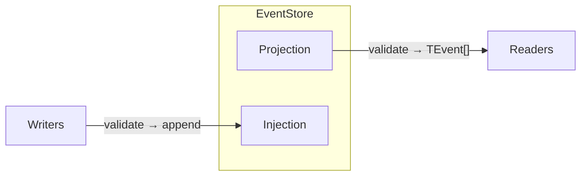

# Bernays Architecture

An Effect-TS runtime for sockpuppets—long-lived programs that simulate humans
interacting with online accounts.

**This document is the authoritative reference for architectural decisions and
implementation patterns.**

---

## Table of Contents

- [Part 1: Conceptual Model](#part-1-conceptual-model)
  - [The Goal](#the-goal)
  - [Design Principles](#design-principles)
  - [The Single Flow](#the-single-flow)
  - [Durable Primitives](#durable-primitives)
- [Part 2: Type System](#part-2-type-system)
  - [Branded Types](#branded-types)
  - [Event Architecture](#event-architecture)
  - [Message Graph Model](#message-graph-model)
  - [View Types](#view-types)
  - [Platform Types](#platform-types)
- [Part 3: Layer Implementation](#part-3-layer-implementation)
  - [Layer 0: Storage](#layer-0-storage)
  - [Layer 1: Browser Pool](#layer-1-browser-pool)
  - [Layer 2: API and Event Bus](#layer-2-api-and-event-bus)
  - [Layer 3: Projection and Injection](#layer-3-projection-and-injection)
  - [Layer 4: Platform Service](#layer-4-platform-service)
  - [Layer 5: Sockpuppet](#layer-5-sockpuppet)
- [Part 4: Reference](#part-4-reference)
  - [Module Structure](#module-structure)
  - [Dependency Matrix](#dependency-matrix)
  - [Key Design Decisions](#key-design-decisions)

---

# Part 1: Conceptual Model

## The Goal

Build a runtime for **sockpuppets**—long-lived programs that simulate humans
interacting with online accounts. A sockpuppet wakes up when it wants, checks
its inbox, decides what to do, acts, and records what it did.

The runtime's job is to make this feel natural: the sockpuppet shouldn't care
about browsers, platform APIs, or crash recovery.

**Core requirements:**

1. **Restartable between operations**: You can restart the process between any
   two operations and it will continue safely. Browser sessions persist
   externally. Everything the program "knows" is in an append-only event log.

2. **Human-like polling**: Sockpuppets poll for updates like humans checking
   their inbox—no real-time subscriptions. We model humans at desktops, not
   mobile push notifications.

3. **One sockpuppet per account**: The intended model is 1:1 (one sockpuppet
   controls one account), though nothing technically prevents multi-account
   control.

**From the sockpuppet's perspective:**

```typescript
const myBot = Effect.gen(function* () {
  const platform = yield* LinkedInPlatform;
  const journal = yield* Journal;

  const inbox = yield* platform.inbox;
  for (const [threadId, meta] of Object.entries(inbox.byThreadId)) {
    const thread = yield* platform.thread(ThreadId(threadId));
    if (Option.isNone(thread)) continue;

    // Decide, act, remember
    yield* platform.actions.sendMessage()(thread.value.threadId, "Thanks!");
    yield* journal.record({ kind: "replied", threadId });
  }
});
```

Everything else exists to make this possible.

---

## Design Principles

### 1. Sockpuppets See a Simple World

Sockpuppets interact with two services:

- **Platform** — inbox, threads, browsers, contacts, actions
- **Journal** — record decisions, restore state on restart

They never see: EventStore, BrowserPool, Projections, Injection, schemas.
Everything complex is hidden behind these two interfaces.

### 2. One Flow

Events flow through one path:

```
API → Injection → EventStore → Projection → Platform → Sockpuppet
```

Auth events, message events, rate limit events—all platform-scoped, all the same
pipe. No separate loops for different event types. The HTTP API is the single
ingestion point for all events.

### 3. Derive Everything

Inbox, threads, auth state, rate limits, contacts—all derived from the event
stream by pure functions. Nothing is stored except the append-only event log.

This enables:

- **Restartability**: Rebuild state by replaying events
- **Auditability**: Complete history of everything that happened
- **Consistency**: Single source of truth, no sync issues

### 4. Scope-Based Event Routing

Every event has a `scope` field (e.g., `"linkedin"`, `"x"`). This enables:

- Database-level filtering: `WHERE scope = 'linkedin'`
- Schema routing: Look up validation schema by scope
- Type safety: Projections return typed events for their scope

### 5. Platform-Agnostic Core

The runtime knows about `PlatformDefinition`, `PlatformBehavior`, `Projection`.
It doesn't know about LinkedIn or X specifically. Platforms plug in by
registering schemas and behaviors.

### 6. No Cross-Platform Identity

`ParticipantId` is platform-bound. The same human on LinkedIn and X has two
different `ParticipantId` values. Cross-platform identity correlation is out of
scope.

### 7. Globally Unique ParticipantId

ParticipantId uses the format `"{platform}:{id}"` (e.g., `"linkedin:abc123"`).
This makes IDs globally unique and self-describing. Journal entries filter by
participantId alone—no separate platform field needed.

### 8. Accounts Are Bindings, Not Metadata

An account is a **binding** between a platform ID and browser sessions:

```typescript
interface BaseAccount {
  readonly id: ParticipantId;
  readonly browserBindings: readonly BrowserBinding[];
}
```

Accounts do NOT store display names, rate limits, or any platform-controlled
metadata. All dynamic state is derived from events.

### 9. Failures Are Events

No special error handling paths. Platform automation observes what happens and
emits events:

```typescript
{ scope: "linkedin", type: "RateLimitObserved", retryAfter: "..." }
{ scope: "linkedin", type: "AuthExpiredObserved", configId: "..." }
```

The behavior's `deriveBrowsers` folds these events to determine browser status.

### 10. Canonical IDs for Restartability

Message events use deterministic IDs generated from content:

```typescript
const canonicalId = await hash(scope, threadAnchor, sender, content, timestamp);
```

Same message observed twice → same ID → deduplicated. This makes restarts safe.

---

## The Single Flow



One path. Auth events, message events, rate limit events—all flow through the
same pipe. The API validates events against the platform's schema and delegates
to Injection. Projection provides typed access; the platform service derives
everything from that.

---

## Durable Primitives

The system rests on three durable records:



1. **Browser Configs** — How to connect to each persistent browser session.

2. **Events** — Append-only log. The single source of truth. Everything
   else—threads, inbox, auth status, contacts—is derived by folding events.

3. **Accounts** — Bindings between platform IDs and browsers. Contains only `id`
   and `browserBindings`. No metadata.

---

# Part 2: Type System

## Branded Types

Branded types prevent mixing up IDs and stringly-typed values at compile time:

```typescript
type Brand<T, B extends string> = T & { readonly __brand: B };

// Constructor pattern
type ParticipantId = Brand<string, "ParticipantId">;
const ParticipantId = (value: string): ParticipantId => value as ParticipantId;
```

### Core Branded Types

| Type               | Purpose                                                                        |
| ------------------ | ------------------------------------------------------------------------------ |
| `Scope`            | Platform identifier. Extensible string—new platforms without modifying core.   |
| `ParticipantId`    | Any user on a platform (owned accounts AND external contacts). Platform-bound. |
| `ThreadId`         | Conversation identifier. Prevents mixing with message IDs.                     |
| `EventId`          | Deduplication key. Deterministic for messages, random for others.              |
| `CorrelationId`    | Tracing. Links related events across the system.                               |
| `CanonicalId`      | Message identity. Distinct from platform's native message ID.                  |
| `BrowserConfigId`  | Browser session identifier. Don't mix with instance IDs.                       |
| `ExecuteErrorCode` | Effect error codes. Branded for extensibility.                                 |

### ParticipantId: Scoped User Identity

`ParticipantId` represents **any user on a platform**—owned accounts or external
contacts. IDs are **platform-prefixed** and carry their scope as a phantom type:

```typescript
// Phantom type parameter enforces scope at compile time
type ParticipantId<TScope extends string = string> = string & {
  readonly __brand: "ParticipantId";
  readonly __scope: TScope;
};

// Constructor enforces the format
const ParticipantId = <TScope extends string>(
  scope: TScope,
  platformId: string,
): ParticipantId<TScope> => `${scope}:${platformId}` as ParticipantId<TScope>;

// Usage
const linkedInUser = ParticipantId("linkedin", "abc123"); // ParticipantId<"linkedin">
const xUser = ParticipantId("x", "456def"); // ParticipantId<"x">

// Type error: can't pass X user to LinkedIn function
// linkedInBehavior.deriveContact(events, xUser);  // ✗ compile error
```

This enables:

- **Compile-time scope safety**: `ParticipantId<"linkedin">` incompatible with
  `ParticipantId<"x">`
- **Global uniqueness**: No collision between platforms
- **Self-describing**: The ID carries its platform context
- **Simple journal queries**: Filter by participantId alone, no extra platform
  field

The distinction between "our account" and "external contact" is contextual
(field naming, enclosing type), not structural.

### Zod Schema Factory for ParticipantId

Runtime validation ensures the prefix matches the expected scope:

```typescript
const participantIdSchema = <TScope extends string>(scope: TScope) =>
  z.string()
    .refine(
      (s): s is `${TScope}:${string}` => s.startsWith(`${scope}:`),
      { message: `ParticipantId must be prefixed with "${scope}:"` },
    )
    .transform((s): ParticipantId<TScope> => s as ParticipantId<TScope>);

// Usage in platform schemas
const LINKEDIN_SCOPE = "linkedin" as const;

const LinkedInAuthObservedSchema = CorrelatedEventSchema.extend({
  scope: z.literal(LINKEDIN_SCOPE),
  participantId: participantIdSchema(LINKEDIN_SCOPE), // validates "linkedin:..."
  // ...
});
```

The schema factory ties the Zod validation to the same scope literal used in the
event schema, ensuring consistency.

### ExecuteErrorCode: Extensible Errors

Effect errors use a branded `ExecuteErrorCode` rather than a fixed union:

```typescript
type ExecuteErrorCode = Brand<string, "ExecuteErrorCode">;
const ExecuteErrorCode = (value: string): ExecuteErrorCode =>
  value as ExecuteErrorCode;
```

Platforms can define their own error codes without modifying core types.

---

## Event Architecture

### Scoped Events

Every event carries a `scope` field identifying which platform owns it:

```typescript
const StorableEventSchema = z.object({
  scope: z.string().transform(Scope),
  type: z.string(),
  eventId: z.string().transform(EventId),
  timestamp: z.string(),
});

type StorableEvent = z.infer<typeof StorableEventSchema>;
```

**Why a separate scope field?**

- Database filtering: `WHERE scope = 'linkedin'` pushes filtering to the DB
- Schema routing: Look up validation schema by `event.scope`
- Clear separation: `scope` = where it belongs, `type` = what it is

### Event Schema Hierarchy

Events form an inheritance chain using Zod's `.extend()`:

```typescript
// Base: minimum shape for storage
const StorableEventSchema = z.object({
  scope: z.string().transform(Scope),
  type: z.string(),
  eventId: z.string().transform(EventId),
  timestamp: z.string(),
});

// Extended: adds correlation for tracing
const CorrelatedEventSchema = StorableEventSchema.extend({
  correlationId: z.string().transform(CorrelationId),
  causationId: z.string().transform(CorrelationId).optional(),
});
```

All domain events extend `CorrelatedEventSchema`.

### Event Templates

Templates provide base structure for common patterns. Platforms extend with
their scope and platform-specific fields:

```typescript
// templates/auth.ts
export const AuthObservedBase = CorrelatedEventSchema.extend({
  configId: z.string().transform(BrowserConfigId),
  participantId: z.string().transform(ParticipantId),
  status: z.enum(["authenticated", "expired", "unknown"]),
});

// plugins/linkedin/schemas.ts
const LinkedInAuthObservedSchema = AuthObservedBase.extend({
  scope: z.literal("linkedin"),
  type: z.literal("AuthObserved"),
});
```

### Platform Event Unions

Each platform defines a discriminated union of its event types:

```typescript
export const LinkedInEventSchema = z.discriminatedUnion("type", [
  LinkedInAuthObservedSchema,
  LinkedInRateLimitObservedSchema,
  LinkedInAnchorMessageSchema,
  LinkedInReplyMessageSchema,
  // ...
]);

export type LinkedInEvent = z.infer<typeof LinkedInEventSchema>;
```

---

## Message Graph Model

### Why a Graph?

Platforms don't agree on what a "thread" is:

- **LinkedIn**: Conversations with explicit participant lists
- **X**: DM threads via conversation_id
- **Email**: Threads fork on subject change
- **Slack**: Threads branch from any message

Messages form a graph via `predecessorId` references. Each behavior's
`deriveThread` walks the graph according to platform rules.

### Message Types

```typescript
interface BaseMessage {
  readonly canonicalId: CanonicalId;
  readonly senderId: ParticipantId;
  readonly content?: string;
}

// Thread root with platform-specific anchor
interface AnchorMessage<TAnchor> extends BaseMessage {
  readonly kind: "anchor";
  readonly anchor: TAnchor;
}

// References predecessor, forming a graph
interface ReplyMessage extends BaseMessage {
  readonly kind: "reply";
  readonly predecessorId: CanonicalId;
}

type Message<TAnchor> = AnchorMessage<TAnchor> | ReplyMessage;
```

### Example Graph



Thread identity = walking `predecessorId` back to a root.

### Thread Graph Building

The `buildThreadGraphs` utility processes events into typed thread graphs:

```typescript
interface ThreadGraph<
  TScope extends string = string,
  TMessage extends GraphMessage = GraphMessage,
  TAnchor = unknown,
> {
  readonly id: ThreadId;
  readonly scope: TScope; // Typed to the platform scope
  readonly anchor: TAnchor;
  readonly nodes: readonly GraphNode<TMessage>[];
  readonly lastActivity: string;
}

function buildThreadGraphs<TScope, TMessage, TAnchor>(
  scope: TScope,
  events: readonly StorableEvent[],
): Map<ThreadId, ThreadGraph<TScope, TMessage, TAnchor>>;
```

**Usage in behaviors:**

```typescript
// Events are pre-filtered by scope via Projection layer
deriveInbox: ((events: readonly LinkedInEvent[]): LinkedInInbox => {
  const threads = buildThreadGraphs<"linkedin", GraphMessage, LinkedInAnchor>(
    "linkedin", // Scope types the returned ThreadGraph
    events,
  );

  // No filtering needed—events are already scope-filtered
  for (const thread of threads.values()) {
    // thread.scope is typed as "linkedin"
  }
});
```

The scope parameter ensures returned `ThreadGraph` instances are typed with the
correct scope, providing compile-time safety.

---

## View Types

Views are what sockpuppets see—derived from events, extensible per platform.

### Inbox View

An index of threads with metadata for sorting/filtering:

```typescript
interface BaseInboxView<TThreadSummary = Record<string, never>> {
  readonly byThreadId: Readonly<Record<string, TThreadSummary>>;
}

// Platform extends
interface LinkedInInbox extends BaseInboxView<LinkedInThreadSummary> {
  readonly syncedAt: string;
  readonly pendingInvitations: number;
}
```

### Thread View

```typescript
interface BaseThreadView<TAnchor> {
  readonly threadId: ThreadId;
  readonly messages: readonly MessageView[];
  readonly participants: readonly Participant[];
  readonly anchor: TAnchor;
}

interface MessageView {
  readonly id: CanonicalId;
  readonly senderId: ParticipantId;
  readonly content?: string;
  readonly timestamp: string;
}

interface Participant {
  readonly id: ParticipantId;
  readonly name?: string;
}
```

### Contact View

Information about participants derived from observed events. Scoped to platform:

```typescript
interface BaseContact<TScope extends string = string> {
  readonly id: ParticipantId<TScope>;
  readonly name?: string;
}

// Platform extends with scope
interface LinkedInContact extends BaseContact<"linkedin"> {
  readonly headline?: string;
  readonly profileUrl?: string;
}
```

### Account View

Binding between platform ID and browser sessions. Scoped to platform:

```typescript
interface BaseAccount<TScope extends string = string> {
  readonly id: ParticipantId<TScope>;
  readonly browserBindings: readonly BrowserBinding[];
}

// Platform extends with scope
interface LinkedInAccount extends BaseAccount<"linkedin"> {}
```

### Browser View

Platform-specific browser status derived from auth/rate-limit events:

```typescript
interface BaseBoundBrowser {
  readonly configId: BrowserConfigId;
  readonly isRunning: boolean;
  readonly metadata: Record<string, unknown>;
}

// Platform extends
interface LinkedInBrowser extends BaseBoundBrowser {
  readonly authStatus: "authenticated" | "expired" | "unknown";
  readonly rateLimitedUntil?: string;
}
```

---

## Platform Types

### PlatformMethod: Curried Effects

All platform effects follow a curried pattern for consistent browser selection:

```typescript
interface ExecuteOptions {
  readonly preferConfigId?: BrowserConfigId;
}

type PlatformMethod<
  TArgs extends readonly unknown[],
  TResult,
  TError,
> = (
  options?: ExecuteOptions,
) => (...args: TArgs) => Effect.Effect<TResult, TError>;
```

**Usage:**

```typescript
// Default browser selection
yield * platform.actions.sendMessage()(threadId, content);

// Explicit browser preference
yield *
  platform.actions.sendMessage({ preferConfigId: mobileId })(threadId, content);
```

The curried pattern ensures type-level enforcement: every effect must accept
`ExecuteOptions` first.

### ActionsRecord: Constrained Actions

Platform actions are constrained to only contain `PlatformMethod` types:

```typescript
type ActionsRecord = Record<
  string,
  PlatformMethod<readonly unknown[], unknown, unknown>
>;

interface LinkedInActions extends ActionsRecord {
  readonly sendMessage: PlatformMethod<
    [ThreadId, string],
    MessageSentResult,
    SendMessageError
  >;
  readonly syncInbox: PlatformMethod<[since?: string], SyncResult, SyncError>;
  readonly sendConnectionRequest: PlatformMethod<
    [ParticipantId<"linkedin">, string?],
    ConnectionResult,
    ConnectionError
  >;
}
```

TypeScript enforces that all properties in `LinkedInActions` are valid
`PlatformMethod` types.

### PlatformBehavior: Pure Derivation

Pure derivation functions over event streams. Two scope parameters:

- **TScope**: The `scope` field on events (e.g., `"linkedin"` or
  `"linkedindojo"`)
- **TIdentity**: The identity namespace for ParticipantIds (e.g., `"linkedin"`)

For production platforms, these are the same. For dojo, they differ.

```typescript
interface PlatformBehavior<
  TScope extends string,
  TIdentity extends string,
  TEvent extends StorableEvent & { scope: TScope },
  TAnchor,
  TThread extends BaseThreadView<TAnchor>,
  TInbox extends BaseInboxView<unknown>,
  TAccount extends BaseAccount<TIdentity>,
  TBrowser extends BaseBoundBrowser,
  TContact extends BaseContact<TIdentity>,
> {
  readonly scope: TScope;
  readonly identity: TIdentity;

  readonly deriveInbox: (
    events: readonly TEvent[],
    participantId: ParticipantId<TIdentity>,
  ) => TInbox;

  readonly deriveThread: (
    events: readonly TEvent[],
    threadId: ThreadId,
  ) => TThread | undefined;

  readonly deriveBrowsers: (
    events: readonly TEvent[],
    account: TAccount,
    runningConfigIds: ReadonlySet<BrowserConfigId>,
  ) => readonly TBrowser[];

  readonly deriveContact?: (
    events: readonly TEvent[],
    participantId: ParticipantId<TIdentity>,
  ) => TContact | undefined;
}
```

**Usage:**

| Platform     | TScope           | TIdentity    | Notes                                     |
| ------------ | ---------------- | ------------ | ----------------------------------------- |
| LinkedIn     | `"linkedin"`     | `"linkedin"` | Same (production)                         |
| X            | `"x"`            | `"x"`        | Same (production)                         |
| linkedindojo | `"linkedindojo"` | `"linkedin"` | Different (dojo shares LinkedIn identity) |

### PlatformDefinition: Schema + Behavior

Registration unit for a platform. Contains only schemas and behavior—no actions:

```typescript
interface PlatformDefinition<
  TScope extends string,
  TIdentity extends string,
  TEvent extends StorableEvent & { scope: TScope },
  TAnchor,
  TThread extends BaseThreadView<TAnchor>,
  TInbox extends BaseInboxView<unknown>,
  TAccount extends BaseAccount<TIdentity>,
  TBrowser extends BaseBoundBrowser,
  TContact extends BaseContact<TIdentity>,
> {
  readonly scope: TScope;
  readonly identity: TIdentity;
  readonly eventSchema: z.ZodType<TEvent>;
  readonly anchorSchema: z.ZodType<TAnchor>;
  readonly behavior: PlatformBehavior<
    TScope,
    TIdentity,
    TEvent,
    TAnchor,
    TThread,
    TInbox,
    TAccount,
    TBrowser,
    TContact
  >;
}
```

### PlatformService: What Sockpuppets Use

Each platform exports its own service factory. Actions are created in the
service layer, not the definition:

````typescript
interface PlatformService<
  TScope extends string,
  TIdentity extends string,
  TActions extends ActionsRecord,
  TInbox extends BaseInboxView<unknown>,
  TThread extends BaseThreadView<unknown>,
  TBrowser extends BaseBoundBrowser,
  TContact extends BaseContact<TIdentity>,
> {
  readonly scope: TScope;
  readonly identity: TIdentity;
  readonly participantId: ParticipantId<TIdentity>;

  // Derived views
  readonly inbox: Effect.Effect<TInbox>;
  readonly thread: (id: ThreadId) => Effect.Effect<Option<TThread>>;
  readonly browsers: Effect.Effect<readonly TBrowser[]>;
  readonly contact: (id: ParticipantId<TIdentity>) => Effect.Effect<Option<TContact>>;

  // Platform-specific actions
  readonly actions: TActions;
}

---

# Part 3: Layer Implementation

## System Overview



---

## Layer 0: Storage

Raw persistence. Schema-agnostic.

### Database

```typescript
interface DatabaseService {
  readonly query: <T>(
    sql: string,
    params?: unknown[],
  ) => Effect.Effect<T[], DatabaseError>;
  readonly execute: (
    sql: string,
    params?: unknown[],
  ) => Effect.Effect<void, DatabaseError>;
}

class Database extends Context.Tag("Database")<Database, DatabaseService>() {}
```

### EventStore

Append-only log, validates base shape only:

```typescript
type EventQuery =
  | { readonly tag: "all" }
  | { readonly tag: "byScope"; readonly scope: Scope; readonly since?: string }
  | { readonly tag: "byCorrelation"; readonly correlationId: CorrelationId };

interface EventStoreService {
  readonly append: (
    events: readonly StorableEvent[],
  ) => Effect.Effect<void, EventStoreError>;
  readonly query: (
    q: EventQuery,
  ) => Effect.Effect<readonly StorableEvent[], EventStoreError>;
}

class EventStore
  extends Context.Tag("EventStore")<EventStore, EventStoreService>() {}
```

### ConfigStore

Browser configurations:

```typescript
interface BrowserConfig {
  readonly id: BrowserConfigId;
  readonly context: string;
  readonly proxy?: ProxyConfig;
}

interface ConfigStoreService {
  readonly get: (
    id: BrowserConfigId,
  ) => Effect.Effect<Option<BrowserConfig>, ConfigStoreError>;
  readonly list: () => Effect.Effect<
    readonly BrowserConfig[],
    ConfigStoreError
  >;
  readonly upsert: (
    config: BrowserConfig,
  ) => Effect.Effect<void, ConfigStoreError>;
  readonly remove: (
    id: BrowserConfigId,
  ) => Effect.Effect<boolean, ConfigStoreError>;
}

class ConfigStore
  extends Context.Tag("ConfigStore")<ConfigStore, ConfigStoreService>() {}
```

---

## Layer 1: Browser Pool

Browser lifecycle management. Launches browsers and returns CDP WebSocket URLs.
Platforms connect to CDP themselves using whatever framework they prefer
(Playwright, Puppeteer, raw CDP, etc.).

### BrowserPool

```typescript
interface CdpSession {
  readonly configId: BrowserConfigId;
  readonly cdpUrl: string;
}

interface BrowserPoolService {
  readonly launch: (
    configId: BrowserConfigId,
  ) => Effect.Effect<CdpSession, BrowserError>;
  readonly stop: (
    configId: BrowserConfigId,
  ) => Effect.Effect<void, BrowserError>;
  readonly isRunning: (configId: BrowserConfigId) => Effect.Effect<boolean>;
  readonly getSession: (
    configId: BrowserConfigId,
  ) => Effect.Effect<CdpSession, BrowserError>;
}

class BrowserPool
  extends Context.Tag("BrowserPool")<BrowserPool, BrowserPoolService>() {}
```

Implementations (Browserbase, local Playwright) provide `BrowserPoolService`
directly.

---

## Layer 2: API and Event Bus

The **Hono HTTP API** is the single ingestion point for all events. It validates
incoming event payloads against the platform's registered schema, then delegates
to the scope's Injector.

```typescript
// POST /events — submit a single event
// 1. Extract scope from payload
// 2. Look up platform schema from registry
// 3. Validate against schema
// 4. Inject into event store via scope's Injector

// GET /events — paginated read with scope/since/correlation filters
// GET /views/:platform/accounts — list accounts
// GET /views/:platform/accounts/:id/inbox — derive inbox view
// GET /configs — browser config CRUD
// GET /openapi.json — auto-generated OpenAPI spec
```

The API also serves derived views (inbox, threads, browsers, contacts) by
querying the Projection layer and running the platform behavior's pure
derivation functions.

---

## Layer 3: Projection and Injection

Symmetric, type-safe access to the event store.



### Projection (validated reads)

Projections filter events by scope at the database level, returning only
validated, typed events for a specific platform:

```typescript
interface Projection<TEvent extends StorableEvent> {
  readonly scope: Scope;
  readonly query: (since?: string) => Effect.Effect<readonly TEvent[], EventStoreError>;
}

const makeProjection = <TEvent extends StorableEvent>(
  scope: Scope,
  schema: z.ZodType<TEvent>,
): Effect.Effect<Projection<TEvent>, never, EventStore>;
```

**IMPORTANT**: Projections guarantee scope-filtered events. Behaviors receive
`LinkedInEvent[]`, not `StorableEvent[]`. No scope checks are needed inside
behavior functions—the filtering happens upstream in the projection layer.

### Injection (validated writes)

```typescript
interface Injection<TEvent extends StorableEvent> {
  readonly scope: Scope;
  readonly append: (event: TEvent) => Effect.Effect<void, InjectionError>;
  readonly appendBatch: (events: readonly TEvent[]) => Effect.Effect<void, InjectionError>;
}

const makeInjection = <TEvent extends StorableEvent>(
  scope: Scope,
  schema: z.ZodType<TEvent>,
  store: EventStoreService,
): Injection<TEvent>;
```

---

## Layer 4: Platform Service

Each platform exports a typed Context.Tag and an actions factory. The generic
`makePlatformService` handles derivation; platforms provide their actions.

### Platform Context Tags

Each platform defines its own typed Context.Tag for type-safe access:

```typescript
// plugins/linkedin/service.ts

// Type alias for the fully-typed service
export type LinkedInService = PlatformService<
  "linkedin",
  "linkedin",
  LinkedInActions,
  LinkedInInbox,
  LinkedInThread,
  LinkedInBrowser,
  LinkedInContact
>;

// Typed context tag - sockpuppets yield this for type-safe access
export class LinkedInPlatform extends Context.Tag("linkedin/Platform")<
  LinkedInPlatform,
  LinkedInService
>() {}
```

### Actions Factory

Each platform defines an actions factory that creates curried `PlatformMethod`
implementations:

```typescript
// plugins/linkedin/service.ts

export interface LinkedInActions {
  readonly sendMessage: PlatformMethod<
    [threadId: ThreadId, content: string],
    MessageSentResult,
    SendMessageError
  >;
  readonly syncInbox: PlatformMethod<[since?: string], SyncResult, SyncError>;
}

export const makeLinkedInActions = (
  pool: BrowserPoolService,
  account: LinkedInAccount,
): LinkedInActions => ({
  sendMessage: (options) => (threadId, content) =>
    Effect.gen(function* () {
      const configId = options?.preferConfigId ?? selectBrowser(account);
      const session = yield* pool.getSession(configId);
      // Connect to session.cdpUrl with Playwright/Puppeteer/raw CDP
      // ... perform sendMessage automation
      return { success: true };
    }),

  syncInbox: (options) => (since) =>
    Effect.gen(function* () {
      const configId = options?.preferConfigId ?? selectBrowser(account);
      const session = yield* pool.getSession(configId);
      // Connect to session.cdpUrl and scrape inbox
      return { synced: true };
    }),
});
```

### Platform Layer Factory

The `makePlatformLayer` function is generic over the context tag with a tight
constraint linking the tag's service type to the exact `PlatformService` parameters:

```typescript
// runtime/sockpuppet/platform-runtime.ts

export function makePlatformLayer<
  TScope extends Scope,  // Branded scope aligns with StorableEvent.scope
  TIdentity extends string,
  // ... other type parameters
  TTag extends Context.Tag<
    any,
    PlatformService<TScope, TIdentity, TActions, TInbox, TThread, TBrowser, TContact>
  >,
>(
  tag: TTag,
  config: {
    readonly platform: PlatformDefinition<...>;
    readonly account: TAccount;
    readonly eventStore: EventStore<StorableEvent>;
    readonly browserPool: BrowserPoolService;
    readonly actions: TActions;  // Required, platform-specific
  },
): Layer.Layer<Context.Tag.Identifier<TTag>> {
  const projection = makeProjection(platform.scope, ...);  // scope already branded
  const serviceEffect = makePlatformService(platform, account, projection, actions);
  return Layer.effect(tag, serviceEffect).pipe(Layer.provide(browserPoolLayer));
}
```

Key type design:
- `TScope extends Scope` ensures alignment with `StorableEvent.scope` (also `Scope`)
- The `TTag` constraint links to exact `PlatformService` type parameters
- This allows TypeScript to verify types without internal casts
- `Context.Tag.Identifier<TTag>` extracts the identifier from `typeof LinkedInPlatform`

### Usage in Sockpuppets

Sockpuppets use the platform-specific tag for type-safe access:

```typescript
const linkedInBot = Effect.gen(function* () {
  // Type-safe: platform.actions has sendMessage, syncInbox with correct types
  const platform = yield* LinkedInPlatform;
  const journal = yield* Journal;

  // TypeScript knows platform.actions.sendMessage exists and its signature
  yield* platform.actions.sendMessage()(threadId, "Hello!");
});
```

### Creating a Platform Layer

```typescript
// When running a sockpuppet
const actions = makeLinkedInActions(browserPool, account);

const platformLayer = makePlatformLayer(LinkedInPlatform, {
  platform: linkedInPlatform,
  account,
  eventStore,
  browserPool,
  actions,  // Actions inside config, required
});

const journalLayer = makeJournalLayer({
  participantId: account.id,
  eventStore,
});
const layer = Layer.merge(platformLayer, journalLayer);

await Effect.runPromise(Effect.provide(linkedInBot, layer));
```

### Journal

Sockpuppet memory. Uses a single `"journal"` scope:

```typescript
interface JournalEntry extends StorableEvent {
  readonly scope: Scope; // always "journal"
  readonly type: "Entry";
  readonly participantId: ParticipantId; // globally unique, e.g. "linkedin:abc123"
  readonly kind: string;
  readonly [key: string]: unknown;
}

interface JournalService {
  readonly record: (entry: { kind: string; [k: string]: unknown }) => Effect.Effect<void, JournalError>;
  readonly entries: (since?: string) => Effect.Effect<readonly JournalEntry[], JournalError>;
}

class Journal extends Context.Tag("Journal")<Journal, JournalService>() {}

const makeJournal = (
  participantId: ParticipantId,
): Effect.Effect<JournalService, never, Injection<JournalEntry>>;
```

**Why this works:** ParticipantId is globally unique (`"linkedin:abc123"`).
Journal queries filter by participantId alone—no platform field needed. Entries
from different platforms never collide.

---

## Layer 5: Sockpuppet

The human-like agent. Sees only Platform and Journal.

```typescript
const linkedInBot = Effect.gen(function* () {
  const platform = yield* LinkedInPlatform;
  const journal = yield* Journal;

  // ─────────────────────────────────────────────────────────────────────────
  // Restore state from journal
  // ─────────────────────────────────────────────────────────────────────────
  const pastEntries = yield* journal.entries();
  const repliedThreads = new Set(
    pastEntries.filter((e) => e.kind === "replied").map((e) =>
      e.threadId as string
    ),
  );

  // ─────────────────────────────────────────────────────────────────────────
  // Check available browsers
  // ─────────────────────────────────────────────────────────────────────────
  const browsers = yield* platform.browsers;
  const usable = browsers.filter((b) =>
    b.isRunning && b.authStatus === "authenticated"
  );

  if (usable.length === 0) {
    yield* journal.record({ kind: "waiting", reason: "no_browsers" });
    yield* Effect.sleep(Duration.minutes(5));
    return;
  }

  // Pick browser based on time of day
  const mobile = usable.find((b) => b.metadata.deviceType === "mobile");
  const desktop = usable.find((b) => b.metadata.deviceType === "desktop");
  const hour = new Date().getHours();
  const preferred = hour >= 7 && hour < 18
    ? (mobile ?? desktop)
    : (desktop ?? mobile);

  // ─────────────────────────────────────────────────────────────────────────
  // Process inbox
  // ─────────────────────────────────────────────────────────────────────────
  const inbox = yield* platform.inbox;

  for (const [threadId, _meta] of Object.entries(inbox.byThreadId)) {
    if (repliedThreads.has(threadId)) continue;

    const thread = yield* platform.thread(ThreadId(threadId));
    if (Option.isNone(thread)) continue;

    const lastMsg = thread.value.messages.at(-1);
    if (!lastMsg || lastMsg.senderId === platform.participantId) continue;

    // Look up sender
    const sender = yield* platform.contact(lastMsg.senderId);
    if (Option.isSome(sender)) {
      yield* Effect.log(`Message from: ${sender.value.name ?? "unknown"}`);
    }

    // Send reply with browser preference
    yield* platform.actions.sendMessage({
      preferConfigId: preferred?.configId,
    })(
      ThreadId(threadId),
      "Thanks for reaching out!",
    );

    yield* journal.record({ kind: "replied", threadId });
    repliedThreads.add(threadId);

    yield* Effect.sleep(Duration.seconds(randomBetween(30, 90)));
  }
});
```

---

# Part 4: Reference

## Module Structure

```
plugins/                         # Platform plugins
├── linkedin/
│   ├── mod.ts                   # Platform definition export
│   ├── schemas.ts               # Event schemas
│   ├── behavior.ts              # Pure derivation functions
│   ├── actions.ts               # Platform actions (sendMessage, etc.)
│   ├── contact.ts               # LinkedInContact type
│   └── account.ts               # LinkedInAccount, store
├── x/
│   └── ...                      # Same structure
└── reddit/
    └── ...                      # Same structure

server/src/
├── core/                        # Branded types, utilities
├── events/                      # StorableEvent, CorrelatedEvent, templates
├── views/                       # Base view types (inbox, thread, contact, browser)
├── store/                       # EventStore, ConfigStore
├── browsers/                    # BrowserPool, CDP session management
├── projections/                 # Projection, Injection
├── platforms/                   # PlatformDefinition, PlatformService, PlatformBehavior
└── runtime/                     # Journal, platform layer factories

api/src/
├── context.ts                   # Server context (stores, registry, projections)
├── schemas.ts                   # Shared Zod schemas for OpenAPI
├── bus.ts                       # Event validation + injection
├── server.ts                    # Hono app, middleware, OpenAPI spec
├── main.ts                      # Entry point (Deno.serve)
└── routes/
    ├── events.ts                # POST /events, GET /events
    ├── views.ts                 # Derived views (inbox, threads, browsers, contacts)
    └── configs.ts               # Browser config CRUD
```

---

## Dependency Matrix

| Layer | Service        | Depends On              | Responsibility                         |
| ----- | -------------- | ----------------------- | -------------------------------------- |
| 0     | `Database`     | —                       | Raw SQL access                         |
| 0     | `EventStore`   | Database                | Append-only event log                  |
| 0     | `ConfigStore`  | Database                | Browser configs                        |
| 1     | `BrowserPool`  | ConfigStore             | Launch browsers, return CDP URLs       |
| 2     | `API`          | Injection, Projection   | HTTP event bus + control plane         |
| 3     | `Projection`   | EventStore              | Type-safe filtered reads               |
| 3     | `Injection`    | EventStore              | Type-safe validated writes             |
| 4     | `Platform`     | Projection, BrowserPool | Derivation + actions for sockpuppets   |
| 4     | `Journal`      | Injection               | Sockpuppet decision log                |
| 5     | `Sockpuppet`   | Platform, Journal       | Human-like agent                       |

---

## Key Design Decisions

### Why `Scope` is a Branded String

Extensibility. New platforms can be added without modifying core types. A union
would require core changes for each platform.

### Why Projections and Injections Exist

Type safety at boundaries. Platform services get typed events from Projection—
guaranteed. Writers go through Injection—validated. No path to read wrong events
or write malformed ones.

Projections also handle scope filtering at the database level (via
`WHERE scope = 'linkedin'`). This means behaviors receive pre-filtered events
and never need to check `event.scope` manually. The filtering responsibility
lives in one place (projection layer), not scattered across behavior functions.

### Why Browser Bindings Are on Accounts

An account can be logged into multiple browsers (mobile, desktop). The
sockpuppet decides which to use based on its own logic. Browser bindings connect
accounts to their available browsers.

### Why Behaviors Are Pure Functions

Behaviors have no state, no side effects. They're pure derivation over event
streams. Testable, predictable, easy to reason about.

### Why ParticipantId Is Platform-Prefixed

The format `"{platform}:{id}"` makes IDs globally unique and self-describing.
Journal entries filter by participantId alone—no extra platform field. IDs from
different platforms never collide (`"linkedin:123"` vs `"x:123"`).

### Why Events Have Both `eventId` and `correlationId`

- `eventId`: Deduplication key, deterministic for messages
- `correlationId`: Tracing, links related events

Different purposes, must not be confused.

### Why Actions Are Curried

The pattern `(options?) => (...args) => Effect` ensures type-level enforcement
that all actions accept `ExecuteOptions`. No forgetting the parameter.

### Why Actions Live in `actions` Property

The constraint `TActions extends ActionsRecord` ensures all properties are valid
`PlatformMethod` types. TypeScript enforces the shape at definition time.

### Why TScope and TIdentity Are Separate

`PlatformBehavior` has two scope parameters:

- **TScope**: The `scope` field on events (e.g., `"linkedin"`, `"linkedindojo"`)
- **TIdentity**: The scope for `ParticipantId` types (e.g., `"linkedin"`)

For production platforms, these are identical (`"linkedin"` / `"linkedin"`). For
dojo (training environment), they differ: events use `"linkedindojo"` scope but
share `"linkedin"` identity for ParticipantIds.

This separation allows dojo to reuse the same participant identity system while
keeping its events distinct in the store.
