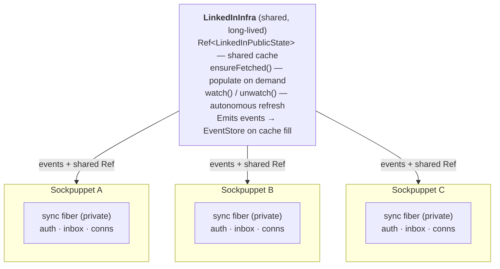

# LinkedIn Testing Strategy

This document is the **specification** for the LinkedIn plugin. It defines the
ideal shape of the plugin — events, state, views, sync fiber, and actions — and
describes the tests we will implement against. The plugin implementation is
built to make these tests pass.

---

## Table of Contents

- [Core Principle: Pure Cookie Injection](#core-principle-pure-cookie-injection)
- [Plugin Shape](#plugin-shape)
  - [Events](#events)
  - [Plugin State](#plugin-state)
  - [Views](#views)
  - [Observation Architecture](#observation-architecture)
  - [Sync Fiber (Per-Account)](#sync-fiber-per-account)
  - [Actions](#actions)
- [Phase 1: Auth Acquisition Script](#phase-1-auth-acquisition-script)
- [Phase 2: Test Harness](#phase-2-test-harness)
- [Cookie Transport](#cookie-transport)
- [Environment Variables](#environment-variables)
- [File Layout](#file-layout)
- [CI Considerations](#ci-considerations)

---

## Core Principle: Pure Cookie Injection

Every test run starts from a **fresh browser profile**. No persistent
`--user-data-dir`, no Browserbase contexts, no stale state carried between runs.

LinkedIn auth state is two cookies (per
[WAALAXY_INTERNALS.md](extensions/waalaxy/WAALAXY_INTERNALS.md)):

| Cookie       | Purpose                                                      |
| ------------ | ------------------------------------------------------------ |
| `li_at`      | Primary auth token. Presence = logged in.                    |
| `JSESSIONID` | Session ID. Value (stripped of quotes) = CSRF token.         |

These are injected into a fresh browser at the start of every test run. No
localStorage, IndexedDB, or service worker state is required.

---

## Plugin Shape

The ideal LinkedIn plugin, derived from the Waalaxy internals and our
architecture. This is what we implement against.

### Events

Events are observations — things that happened on LinkedIn, recorded in the
event store. They are emitted by the sync fiber (passive observation) or by
actions (consequences of intentional acts).

#### Auth Events

| Event | Emitted By | Fields | Purpose |
|-------|-----------|--------|---------|
| `AuthObserved` | Sync fiber | `configId`, `participantId`, `status` (`authenticated` / `expired` / `challenged` / `unknown`), `challengeType?`, `previousLiAt?` | Periodic auth health check. Sync fiber reads `li_at` cookie and page state. `challenged` means LinkedIn is showing a `/checkpoint/challenge/` page — all API calls are blocked until resolved. If `previousLiAt` differs from current, the account may have switched. |
| `TwoFactorChallengeObserved` | Auth script / sync fiber | `configId`, `challengeType` (`sms` / `authenticator` / `email` / `phone_call` / `mobile_app` / `captcha` / `unknown`), `deliveryHint?`, `challengeId?` | Detected when LinkedIn redirects to `/checkpoint/challenge/` or `/checkpoint/challengesV2/`. Challenge types from Waalaxy's DOM marker detection: `email` (pin submit button), `phone` (phone verification pin), `mobile_app` (LinkedIn app push), `authenticator` (auth app div), `captcha` (captchaV2Challenge). Note: `captcha` is not 2FA — it's an anti-bot challenge that can appear mid-session, not just during sign-in. |
| `TwoFactorResultObserved` | Auth script | `configId`, `success`, `errorCode?` (`wrong_credentials` / `challenge_failed` / `rate_limited` / `account_restricted` / `captcha_rejected` / `unknown`) | Result of challenge submission. `errorCode` enables programmatic branching (retry on `rate_limited`, abort on `account_restricted`). |

#### Message Events

| Event | Emitted By | Fields | Purpose |
|-------|-----------|--------|---------|
| `AnchorMessageObserved` | Sync fiber | `anchor` (`conversationId`, `participants`), `threadId`, `canonicalId`, `senderId`, `content`, `timestamp` | First message observed in a conversation. Establishes the thread anchor. |
| `MessageObserved` | Sync fiber | `threadId`, `canonicalId`, `senderId`, `content`, `timestamp` | Subsequent message in an existing thread. |
| `MessageSent` | `sendMessage` action | `threadId`, `canonicalId`, `content` | Consequence of the sockpuppet sending a message. |
| `MessageMutated` | Sync fiber | `canonicalId`, `threadId`, `mutation` (`deleted` / `edited`), `editedContent?` | Detected when a message changes or disappears. |

#### Connection Events

| Event | Emitted By | Fields | Purpose |
|-------|-----------|--------|---------|
| `ConnectionRequestSent` | `sendConnectionRequest` action | `targetUserId`, `note?` | Consequence of sending an invitation. |
| `InvitationWithdrawn` | `withdrawInvitation` action | `invitationId`, `targetUserId` | Consequence of withdrawing an invitation. |
| `ConnectionAccepted` | Sync fiber | `invitationId`, `userId` | Detected when a pending invitation is accepted. |
| `ConnectionRejected` | Sync fiber | `invitationId`, `userId` | Detected when a pending invitation is rejected / expires. |
| `ConnectionStatusUnknown` | Sync fiber | `invitationId`, `userId`, `sentAt` | Invitation can't be resolved after repeated checks. LinkedIn's invitation APIs are unreliable — some invitations silently disappear. Prevents `pendingInvitations` from inflating indefinitely. |

#### Profile Events

| Event | Emitted By | Fields | Purpose |
|-------|-----------|--------|---------|
| `ProfileViewed` | `viewProfile` action | `targetUserId`, `profileUrl?`, `viewedAt`, `viewerPrivacySetting` (`full` / `anonymous` / `hidden`) | Consequence of viewing a profile. Records the privacy mode used. |
| `UserFollowed` | `followUser` action | `targetUserId` | Consequence of following a profile without connecting. |

#### Message Request Events

| Event | Emitted By | Fields | Purpose |
|-------|-----------|--------|---------|
| `MessageRequestSent` | `sendMessageRequest` action | `targetUserId`, `content`, `contextUrn` | Consequence of sending a message to a non-connection using a shared group/event context. |

#### Restriction Events

| Event | Emitted By | Fields | Purpose |
|-------|-----------|--------|---------|
| `RestrictionObserved` | Sync fiber or actions | `configId`, `restrictionType` (`desktop_connect_restricted` / `weekly_invites_exhausted` / `connect_note_restricted` / `message_request_restricted` / `daily_messages_exhausted` / `searches_exhausted` / `account_blocked`), `retryAfter?` | Detected from HTTP 429, known error codes (`MAX_INVITATION_SENT`, `WEEKLY_CONNECTIONS_LIMIT_REACHED`, etc.), or restriction patterns. Multiple restriction types can be active simultaneously — they are independent axes, not a single "rate limited" flag. See LinkedInBrowser restriction table. |
| `RestrictionCleared` | Sync fiber | `configId`, `restrictionType` | Detected when a previously-observed restriction is no longer active (e.g., 1h cooldown expired, weekly limit reset). |

#### Conversation Sync Events

| Event | Emitted By | Fields | Purpose |
|-------|-----------|--------|---------|
| `ConversationsSynced` | Sync fiber | `participantId`, `threadCount`, `syncedAt` | Emitted after a full inbox scrape completes. Informational / audit trail. |

#### Public Observation Events (future, shared infra)

These events are emitted by the shared `LinkedInInfra` observer when
multi-account observation deduplication is active. Not needed for single-account
mode or the initial test harness.

| Event | Emitted By | Fields | Purpose |
|-------|-----------|--------|---------|
| `FeedPostObserved` | Shared observer | `postUrn`, `authorId`, `content`, `timestamp`, `reactions`, `comments` | Public feed post visible to all accounts. |
| `GroupPostObserved` | Shared observer | `groupId`, `postUrn`, `authorId`, `content`, `timestamp` | Post in a LinkedIn Group. |
| `CompanyPageObserved` | Shared observer | `companyId`, `name`, `followers`, `recentPosts` | Company page snapshot. |

### Plugin State

The state that the projection fiber folds events into. All views are derived
from this state via pure materialization functions.

```typescript
interface LinkedInPluginState {
  // Thread graph — shared infra, handles anchor/reply/mutation
  graph: GraphState;

  // Connection tracking
  pendingInvitations: Map<string, {  // targetId → invitation state
    invitationId?: string;
    sentAt: string;
    status: "pending" | "accepted" | "rejected" | "withdrawn" | "unknown";
  }>;
  weeklyInviteTimestamps: string[];  // for rolling 7-day window count

  // Per-browser status (materialized into LinkedInBrowser discriminated union)
  browserStatus: Map<string, {
    authStatus: "authenticated" | "expired" | "challenged" | "unknown";
    challengeType?: string;          // set when authStatus === "challenged"
    profileViewingMode?: string;     // set when authStatus === "authenticated"
    lastLiAt?: string;               // for account switch detection
    restrictions: Map<string, string>;  // restrictionType → retryAfter ISO
  }>;

  // Contact directory — built from observations
  // Public fields + per-account relationship fields
  contacts: Map<string, {
    publicIdentifier?: string;
    memberId?: string;
    firstName?: string;
    lastName?: string;
    headline?: string;
    occupation?: string;
    company?: { name: string; logoUrl?: string };
    profilePictureUrl?: string;
    profileUrl?: string;
    isOpenProfile?: boolean;
    isPremium?: boolean;
    isJobSeeker?: boolean;
    connectionDegree?: "self" | "1st" | "2nd" | "3rd" | "out";
    sharedGroups?: string[];
    sharedEvents?: string[];
    lastInteraction?: string;
    hasReplied?: boolean;
    lastReplyAt?: string;
  }>;

  // Last successful sync timestamp
  lastSyncedAt?: string;
}
```

### Views

Pure derivations from `LinkedInPluginState`. The sockpuppet reads these — it
never touches state directly.

#### LinkedInInbox

```typescript
interface LinkedInInbox extends BaseInboxView<LinkedInIndexMeta> {
  readonly pendingInvitations: number;
  readonly weeklyInvitesRemaining: number;
  readonly syncedAt: string;
}

interface LinkedInIndexMeta {
  readonly lastActivity: string;
  readonly unreadCount: number;
  readonly isSponsored: boolean;
}
```

#### LinkedInThread

```typescript
interface LinkedInThread extends BaseThreadView<LinkedInAnchor> {
  readonly isSponsored: boolean;
  readonly unreadCount: number;
  readonly lastActivity: string;
}
```

#### LinkedInBrowser

Discriminated union on `authStatus`. `challengeType` only exists when the
browser is in `challenged` state. `profileViewingMode` only exists when
authenticated (we can only read settings with a live session).

```typescript
interface LinkedInBrowserBase extends BaseBoundBrowser {
  readonly restrictions: Readonly<Record<string, string>>;  // type → retryAfter
  readonly weeklyInvitesRemaining: number | undefined;
}

type LinkedInBrowser =
  | LinkedInBrowserBase & {
      readonly authStatus: "authenticated";
      readonly profileViewingMode: "full" | "anonymous" | "hidden";
    }
  | LinkedInBrowserBase & {
      readonly authStatus: "challenged";
      readonly challengeType: "sms" | "authenticator" | "email" | "phone_call"
        | "mobile_app" | "captcha" | "unknown";
    }
  | LinkedInBrowserBase & { readonly authStatus: "expired" }
  | LinkedInBrowserBase & { readonly authStatus: "unknown" };
```

Restriction types (from Waalaxy's error handling):

| Restriction | Trigger | Duration | Blocks |
|-------------|---------|----------|--------|
| `desktop_connect_restricted` | HTTP 429 or `MAX_INVITATION_SENT` on connect | 1 hour | `sendConnectionRequest` |
| `weekly_invites_exhausted` | `WEEKLY_CONNECTIONS_LIMIT_REACHED` | Until weekly reset | `sendConnectionRequest` |
| `connect_note_restricted` | LinkedIn strips notes from invitations | Indefinite | Notes on `sendConnectionRequest` |
| `message_request_restricted` | Can't message non-connections | Indefinite | `sendMessageRequest` |
| `daily_messages_exhausted` | Daily message limit hit | Until daily reset | `sendMessage` |
| `searches_exhausted` | Search rate limit | Until reset | Search actions |
| `account_blocked` | Account-level restriction | Indefinite | All actions |

Actions must check relevant restrictions before attempting. `sendConnectionRequest`
checks `desktop_connect_restricted` and `weekly_invites_exhausted`.
`sendMessageRequest` checks `message_request_restricted`. This is a pre-flight
guard — fail fast with a typed error rather than wasting an API call.

#### LinkedInContact

Fields are split into **public** (same for all accounts, observable once by
shared infra) and **per-account** (depends on the relationship between this
account and the contact).

```typescript
interface LinkedInContact extends BaseContact<"linkedin"> {
  // ── Public fields (shared across accounts) ──────────────────────
  readonly publicIdentifier?: string;   // LinkedIn URL slug
  readonly memberId?: string;           // numeric URN ID (for Voyager API calls)
  readonly firstName?: string;
  readonly lastName?: string;
  readonly headline?: string;
  readonly occupation?: string;
  readonly company?: { readonly name: string; readonly logoUrl?: string };
  readonly profilePictureUrl?: string;
  readonly profileUrl?: string;
  readonly isOpenProfile?: boolean;     // can receive InMail without connection
  readonly isPremium?: boolean;
  readonly isJobSeeker?: boolean;

  // ── Per-account fields (relationship-specific) ──────────────────
  readonly connectionDegree?: "self" | "1st" | "2nd" | "3rd" | "out";
  readonly sharedGroups?: readonly string[];
  readonly sharedEvents?: readonly string[];
  readonly lastInteraction?: string;
  readonly hasReplied?: boolean;        // did they reply to us in any thread?
  readonly lastReplyAt?: string;
}
```

The `memberId` is critical — Voyager API calls use `urn:li:fsd_profile:<memberId>`,
not the public identifier. `sharedGroups` and `sharedEvents` are required for
`sendMessageRequest` (messaging non-connections requires a shared context URN).

In single-account mode, all fields are populated by the per-sockpuppet sync
fiber. In multi-account mode, public fields can come from the shared observer
and per-account fields are populated by each sockpuppet's sync fiber.

### Observation Architecture

LinkedIn has two kinds of observable state:

- **Private state** — inbox, DMs, notifications, pending invitations,
  connection status. Each account sees different data. Must be observed
  per-account.
- **Public state** — feed posts, company pages, group threads, public profile
  data. Visible to every account. Should be observed once.

When running multiple sockpuppets against LinkedIn, observing public state
independently per-account wastes browser sessions, hits rate limits faster, and
produces duplicate events. The solution is **observation deduplication**: a
shared infra layer observes public state once, and each sockpuppet's sync fiber
handles only its private state.

This uses `RExtra` on `makePlatformLayer` — the per-sockpuppet sync fiber
depends on the shared infra layer and can read from its shared `Ref` or
coordinate with its observer.

#### Two-Layer Observation



Events from both layers land in the same EventStore. Each sockpuppet's
projection fiber folds all of them — public and private — into its local
`Ref<LinkedInPluginState>`. The sockpuppet sees a unified view.

#### LinkedInInfra Service

The infra is a **shared cache** of public LinkedIn state. Two operations:

1. **`ensureFetched`** — guarantees a resource is in the cache and fresh.
   If missing or stale, scrapes via CDP, emits events to the EventStore,
   and updates the `Ref`. If already fresh, no-op. Idempotent — multiple
   sockpuppets calling it for the same resource result in one fetch.
2. **`Ref.get` on `publicState`** — read the cached data. Always the same
   path regardless of who triggered the fetch.

This separation means reading is never blocked on a scrape. A sockpuppet
calls `ensureFetched`, then reads from the `Ref`. If another sockpuppet
already ensured the same resource, the read is immediate.

```typescript
interface LinkedInPublicState {
  readonly feedPosts: Map<string, FeedPost>;
  readonly companyPages: Map<string, CompanyPage>;
  readonly groupPosts: Map<string, GroupPost>;
  readonly publicProfiles: Map<string, PublicProfile>;
}

type EnsureTarget =
  | { readonly kind: "feedPost"; readonly postUrn: string }
  | { readonly kind: "companyPage"; readonly companyId: string }
  | { readonly kind: "groupPost"; readonly groupId: string; readonly postUrn: string }
  | { readonly kind: "publicProfile"; readonly memberId: string };

type WatchTopic =
  | { readonly kind: "feed"; readonly query?: string }
  | { readonly kind: "company"; readonly companyId: string }
  | { readonly kind: "group"; readonly groupId: string };

/** Per-resource-kind cache control.
 *  - ttl: when ensureFetched considers a cached entry stale and re-scrapes.
 *    Only costs a request when someone asks.
 *  - evictAfter: how long after the last access before an entry is evicted
 *    from the cache entirely. Prevents the cache from growing unbounded with
 *    resources nobody cares about anymore. Tracked per-entry by last
 *    ensureFetched or Ref.get access time.
 *  - watchInterval: how often the background fiber re-scrapes watched topics.
 *    Longer than TTL — autonomous polling is speculative. ±20% jitter applied
 *    at runtime. Watching a topic also counts as an access, so watched entries
 *    won't be evicted. */
interface CacheResourceSettings {
  readonly ttl: Duration;
  readonly evictAfter: Duration;
  readonly watchInterval: Duration;
}

interface LinkedInCacheSettings {
  readonly feedPost:      CacheResourceSettings;
  readonly companyPage:   CacheResourceSettings;
  readonly groupPost:     CacheResourceSettings;
  readonly publicProfile: CacheResourceSettings;
}

const defaultCacheSettings: LinkedInCacheSettings = {
  feedPost:      { ttl: Duration.hours(1),  evictAfter: Duration.hours(24),  watchInterval: Duration.hours(4) },
  companyPage:   { ttl: Duration.hours(6),  evictAfter: Duration.hours(72),  watchInterval: Duration.hours(24) },
  groupPost:     { ttl: Duration.hours(1),  evictAfter: Duration.hours(24),  watchInterval: Duration.hours(4) },
  publicProfile: { ttl: Duration.hours(12), evictAfter: Duration.hours(168), watchInterval: Duration.hours(48) },
};

interface LinkedInInfraService {
  /** Shared public state. Read after calling ensureFetched. */
  readonly publicState: Ref.Ref<LinkedInPublicState>;

  /** Ensure a resource is in the cache and fresh (per cache settings TTL).
   *  No-op if already current. Scrapes via CDP and emits events on cache fill. */
  readonly ensureFetched: (target: EnsureTarget) => Effect.Effect<void>;

  /** Subscribe to autonomous refresh for a topic. The cache will re-scrape
   *  on the watchInterval from cache settings. */
  readonly watch: (topic: WatchTopic) => Effect.Effect<void>;

  /** Unsubscribe from autonomous refresh. */
  readonly unwatch: (topic: WatchTopic) => Effect.Effect<void>;
}

class LinkedInInfra extends Context.Tag("linkedin/Infra")<
  LinkedInInfra,
  LinkedInInfraService
>() {}

/** Construct the infra layer. Cache settings are optional — defaults are
 *  tuned to LinkedIn's typical rate limit tolerance. */
const makeLinkedInInfraLayer = (
  settings?: Partial<LinkedInCacheSettings>,
): Layer.Layer<LinkedInInfra, never, BrowserPool | EventStoreTag> => { ... };
```

Usage from a sockpuppet or sync fiber:

```typescript
const infra = yield* LinkedInInfra;

// Ensure the company page is cached, then read it
yield* infra.ensureFetched({ kind: "companyPage", companyId: "12345" });
const state = yield* Ref.get(infra.publicState);
const page = state.companyPages.get("12345");

// Subscribe to ongoing refresh (optional)
yield* infra.watch({ kind: "company", companyId: "12345" });
```

`watch`/`unwatch` are opt-in autonomous scraping. A sockpuppet that cares
about a company page can watch it for periodic refresh. But the default mode
is demand-driven — no scraping happens until someone calls `ensureFetched`.

Cache settings can be overridden at construction time, e.g., for tests:

```typescript
// Aggressive caching for tests (short TTL, fast watch)
const testInfra = makeLinkedInInfraLayer({
  companyPage: { ttl: Duration.seconds(10), watchInterval: Duration.seconds(10) },
});

// Conservative for production (longer TTL, less scraping)
const prodInfra = makeLinkedInInfraLayer({
  feedPost: { ttl: Duration.minutes(15), watchInterval: Duration.minutes(15) },
});
```

#### Voyager Endpoints

| Resource | Voyager API | Default TTL | Default Watch |
|----------|-------------|-------------|---------------|
| Feed posts | `GET /voyager/api/feed/dash/feedDashUpdates` | 1 hour | 4 hours |
| Company pages | `GET /voyager/api/organization/companies/<id>` | 6 hours | 24 hours |
| Group threads | `GET /voyager/api/groups/<id>/posts` | 1 hour | 4 hours |
| Public profiles | `GET /voyager/api/identity/dash/profiles` | 12 hours | 48 hours |

TTL governs `ensureFetched` freshness (demand-driven, only costs a request when
asked). Watch interval governs autonomous polling (speculative, always longer
than TTL). ±20% jitter on all watch intervals. Both overridable via
`LinkedInCacheSettings`. The infra does **not** touch private state. It never reads any
account's inbox, notifications, or pending invitations.

#### When to Skip Shared Infra

For single-account deployments (the common case today), the shared infra layer
is optional. The per-sockpuppet sync fiber can handle both public and private
observation — there's nothing to deduplicate with one account. The plugin
should work either way:

- **With infra**: Sync fiber handles private observation, reads public state
  from shared `Ref`. `RExtra = LinkedInInfra`.
- **Without infra**: Sync fiber handles everything. `RExtra = never`.

The test harness (Phase 2) starts without shared infra — single account, sync
fiber does everything. Shared infra is added when multi-account support is
needed.

### Sync Fiber (Per-Account)

The sync fiber is background observation logic defined by the LinkedIn plugin
and forked by `makePlatformLayer`. It periodically observes **private** LinkedIn
state via CDP and emits events through injection. The sockpuppet never calls or
sees the sync fiber — it just reads the views that the fiber keeps current.

If `LinkedInInfra` is provided (via `RExtra`), the sync fiber can read from the
shared `Ref` to avoid re-observing public state. If not, it observes everything.

#### Observation Tasks

Different tasks run at different frequencies — informed by Waalaxy's worker
periods. Running everything at the same interval either checks auth too
slowly or checks connections too aggressively.

| Task | Frequency | Waalaxy Equiv. | Purpose |
|------|-----------|----------------|---------|
| Auth check | Every cycle (2 min) | `checkLinkedInState` (1 min) | Read `li_at` cookie + check for `/checkpoint/challenge/`. Detect auth expiry, challenges, and account switches. |
| Inbox sync | Every cycle (2 min) | `fetchAllConversations` (2 min) | Scrape conversations via Voyager API. Emit message events. |
| Profile viewing mode | Once on startup | — | Read `/mysettings-api/settingsApiSettingCards/profileViewingOptions`. Store in browser state for `viewProfile` action. |
| Connection status | Every 30th cycle (~60 min) | `checkForNewConnections` (120 min) | Check pending invitations. Emit `ConnectionAccepted` / `ConnectionRejected` / `ConnectionStatusUnknown`. |
| Hot invitation check | Every cycle for 30 min after send | `unknownStatusProspectsWorker` (30s) | Recently-sent invitations get accelerated checking. |

##### Auth Check

Reads the `li_at` cookie from the browser via CDP (`Network.getCookies`). Also
checks the current page URL for `/checkpoint/challenge/` or
`/checkpoint/challengesV2/` redirects.

Emits `AuthObserved` with:
- `status: "authenticated"` — `li_at` present, no challenge page
- `status: "challenged"` — redirected to checkpoint page. Also emits
  `TwoFactorChallengeObserved` with the detected challenge type (sniffed from
  DOM markers per Waalaxy's detection logic). All API calls are blocked until
  the challenge is resolved.
- `status: "expired"` — `li_at` cookie absent
- `status: "unknown"` — can't determine (e.g., CDP error)

**Account switch detection**: The auth check stores the last-seen `li_at` value.
If it changes between checks (without an expiry), the session now belongs to a
different account. The sync fiber emits `AuthObserved` with `status: "expired"`
and `previousLiAt` set, signaling that the binding is stale.

##### Inbox Sync

Uses the Voyager API via CDP fetch to read conversations and messages. Emits
`AnchorMessageObserved` / `MessageObserved` events for anything new.

Voyager endpoints (from Waalaxy internals):
- Conversation list: `GET /voyager/api/voyagerMessagingDashMessengerConversations`
- Conversation events: per-conversation message fetch
- Connection summary: `GET /voyager/api/relationships/connectionsSummary`

Also detects:
- Message deletions/edits → `MessageMutated`
- Restriction signals (HTTP 429, error codes) → `RestrictionObserved`

Reply directionality is tracked by comparing `senderId` to the account's own
`participantId`. When a contact sends a message to us (inbound), the contact's
`hasReplied` and `lastReplyAt` are updated.

After a full sync, emits `ConversationsSynced`.

##### Connection Status Check

Checks pending invitations against LinkedIn's connections API. Runs on a slow
cycle (every ~60 min) for general checks, but recently-sent invitations
(within 30 min of `ConnectionRequestSent`) are checked on every sync cycle.

Emits:
- `ConnectionAccepted` — invitation accepted
- `ConnectionRejected` — invitation rejected or expired
- `ConnectionStatusUnknown` — can't resolve after repeated attempts (prevents
  `pendingInvitations` from inflating indefinitely)

#### Schedule

```typescript
// Per-sockpuppet sync fiber, passed to makePlatformLayer as config.sync
const makeLinkedInSync = (pool, account) =>
  Effect.gen(function* () {
    const injection = yield* LinkedInInjection;
    let cycle = 0;
    let lastLiAt: string | undefined;
    const hotInvitations = new Map<string, number>(); // targetId → sentAtCycle

    yield* Effect.repeat(
      Effect.gen(function* () {
        const session = yield* pool.getSession(account.browserBindings[0].configId);
        cycle++;

        // 1. Auth check (every cycle)
        // ... read li_at, compare to lastLiAt, check for /checkpoint/...

        // 2. Inbox sync (every cycle)
        // ... fetch conversations via Voyager API, emit message events ...
        // ... track inbound replies (senderId !== account.id) ...

        // 3. Connection status (every 30 cycles, or hot invitations every cycle)
        if (cycle % 30 === 0 || hotInvitations.size > 0) {
          // ... check pending invitations ...
          // ... expire hot invitations older than 15 cycles ...
        }
      }).pipe(Effect.catchAll((err) => Effect.log(`sync: ${err}`))),
      Schedule.spaced("2 minutes").pipe(Schedule.jittered),
    );
  });
```

#### Future: Realtime SSE

LinkedIn exposes a Server-Sent Events stream at `/realtime/connect?rc=1` with
GraphQL subscriptions for `conversationsTopic`, `conversationDeletesTopic`, and
`inAppAlertsTopic` (per Waalaxy internals). Connecting to this via CDP fetch
would provide sub-second message notification — far better than 2-minute
polling. This is the highest-value future improvement for responsiveness, but
requires understanding LinkedIn's SSE protocol and GraphQL subscription format.
Polling is sufficient for MVP.

#### Composition

```typescript
// Single account (no shared infra) — sync fiber handles everything
const sync = makeLinkedInSync(pool, account);
const platformLayer = makePlatformLayer(
  LinkedInPlatform, LinkedInInjection, LinkedInProjection,
  { platform: linkedInPlatform, account, actions, sync },
);

// Multi-account (with shared infra) — sync fiber handles private only
const sync = makeLinkedInSync(pool, account);  // same fiber, reads infra if available
const platformLayer = makePlatformLayer<..., LinkedInInfra>(
  LinkedInPlatform, LinkedInInjection, LinkedInProjection,
  { platform: linkedInPlatform, account, actions, sync },
);
// Provide the shared infra layer
const layer = platformLayer.pipe(Layer.provide(LinkedInInfraLive));
```

### Actions

Actions are intentional acts the sockpuppet performs. Each action automates the
browser via CDP, performs the act on LinkedIn, observes the result, and emits
events recording the consequences.

**Timing**: All actions should include ±20% jitter on any delays (matching
Waalaxy's `KEe()` helper). Fixed timing between actions is a detectable
automation fingerprint. The sockpuppet should space actions by 3-7 seconds
minimum (with jitter), not fire them back-to-back.

**Pre-flight checks**: Actions that can be blocked by restrictions must check
the relevant restriction state before attempting. Fail fast with a typed error
rather than burning an API call against a known restriction.

#### sendMessage

Sends a message to a 1st-degree connection in an existing thread.

- **Input**: `threadId: ThreadId`, `content: string`
- **CDP**: Sends via Voyager API
- **Pre-flight**: Check `daily_messages_exhausted` restriction
- **Events emitted**: `MessageSent`
- **Errors**: Thread not found, not connected, rate limited, auth expired
- **Voyager endpoint**: `POST /voyager/api/voyagerMessagingDashMessengerMessages?action=createMessage`

#### sendMessageRequest

Sends a message to a non-connection using a shared group or event as context.
This is LinkedIn's "message request" feature — requires a `contextEntityUrn`.

- **Input**: `targetId: string`, `content: string`, `contextUrn?: string`
- **CDP**: If `contextUrn` not provided, auto-lookup via `GET /voyager/api/identity/profiles/<publicIdentifier>/highlights` to find `sharedGroupsHighlightUrn` or `sharedProfessionalEventUrn`. Then send via Voyager messaging API with `messageRequestContextByRecipient` field.
- **Pre-flight**: Check `message_request_restricted` restriction. Check that contact has `sharedGroups` or `sharedEvents` (or `isOpenProfile`).
- **Events emitted**: `MessageRequestSent`. On restriction: `RestrictionObserved`.
- **Errors**: No shared context found, message request restricted, profile inaccessible
- **Voyager endpoint**: `POST /voyager/api/voyagerMessagingDashMessengerMessages?action=createMessage` (same endpoint, different body shape with `messageRequestContextByRecipient`)

#### sendConnectionRequest

Sends a connection invitation with optional note.

- **Input**: `targetId: string`, `note?: string`
- **CDP**: Sends invitation via Voyager API
- **Pre-flight**: Check `desktop_connect_restricted` and `weekly_invites_exhausted` restrictions. If `connect_note_restricted` is active and `note` is provided, either strip the note or fail with a typed error.
- **Events emitted**: `ConnectionRequestSent`. On restriction: `RestrictionObserved`.
- **Errors**: Already connected, weekly limit reached, profile inaccessible, note restricted
- **Voyager endpoint**: `POST /voyager/api/voyagerRelationshipsDashMemberRelationships?action=verifyQuotaAndCreateV2&decorationId=com.linkedin.voyager.dash.deco.relationships.InvitationCreationResultWithInvitee-2`
- **Error mapping** (from Waalaxy's connect error handler):

  | HTTP Status | Body Code | Restriction Type |
  |-------------|-----------|-----------------|
  | 400 | `MAX_INVITATION_SENT` | `desktop_connect_restricted` (1h) |
  | 400 | `CANT_INVITE_CONNECTION_LIMIT_REACHED` | `weekly_invites_exhausted` |
  | 400 | `CANT_RESEND_YET` | Per-contact 3-week cooldown |
  | 403 | — | `profile_inaccessible` (per-contact) |
  | 406 | — | `invalid_invitation_state` |
  | 429 | — | `desktop_connect_restricted` (1h) |

#### withdrawInvitation

Withdraws a pending connection invitation.

- **Input**: `invitationId: string`
- **CDP**: Withdraws via Voyager API
- **Events emitted**: `InvitationWithdrawn`
- **Voyager endpoint**: `POST /voyager/api/voyagerRelationshipsDashInvitations/urn:li:fsd_invitation:<invitationId>?action=withdraw`
- **Body**: `{ "invitationType": "CONNECTION" }`

#### followUser

Follows a profile without connecting. Lower-commitment than a connection
request — useful for warming up before sending an invitation.

- **Input**: `targetId: string`
- **CDP**: Sends via Voyager API
- **Events emitted**: `UserFollowed`
- **Voyager endpoint**: `POST /voyager/api/feed/dash/followingStates/urn:li:fsd_followingState:urn:li:fsd_profile:<memberId>`
- **Body**: `{ "patch": { "$set": { "following": true } } }`

#### viewProfile

Views a profile (fires the tracking beacon that LinkedIn counts as a profile
view).

- **Input**: `targetId: string`
- **CDP**: Fires tracking beacon via `POST /li/track`. Reads the account's
  `profileViewingMode` from browser state and passes it as
  `viewerPrivacySetting` (`"F"` / `"A"` / `"H"`). Incorrect mode leaks the
  sockpuppet's identity or creates a suspicious mismatch.
- **Events emitted**: `ProfileViewed` (with `viewerPrivacySetting`)
- **Privacy setting lookup**: The sync fiber reads the account's setting on
  startup via `GET /mysettings-api/settingsApiSettingCards/profileViewingOptions`
  and stores it in browser state. The action reads it from there.
- **Tracking payload** (from Waalaxy internals):
  ```json
  {
    "eventBody": {
      "viewerPrivacySetting": "F",
      "networkDistance": 2,
      "vieweeMemberUrn": "urn:li:member:<targetId>",
      "entityView": { "viewType": "profile-view" }
    }
  }
  ```

#### beginSignIn

Begins the sign-in process. Used by the auth acquisition script.

- **Input**: `email: string`, `password: string`
- **CDP**: Navigates to login page, fills credentials, submits form
- **Returns**: `{ status: "authenticated" }`, `{ status: "challenged", challengeType }`, or `{ status: "failed", errorCode, error }`
- **Error codes**: `wrong_credentials`, `challenge_failed`, `rate_limited`, `account_restricted`, `proxy_error`, `unknown` (from Waalaxy's `Xt` enum, simplified)
- **Events emitted**: `AuthObserved` (on success), `TwoFactorChallengeObserved` (on challenge redirect)
- **Not tested in the automated harness** — tested by the interactive auth script.
- **Login flow** (from Waalaxy internals):
  1. `GET /login?fromSignIn=true` → extract form inputs + `JSESSIONID`
  2. `POST /checkpoint/lg/login-submit` → submit credentials
  3. 200 + `li_at` in Set-Cookie → `authenticated`
  4. 303 redirect to `/checkpoint/challenge/` → `challenged` (detect type from DOM)
  5. 429 → `rate_limited`
  6. 400 + `error-for-password` → `wrong_credentials`

#### submitTwoFactorCode

Submits a 2FA / challenge code during sign-in. Used by the auth acquisition
script.

- **Input**: `code: string`, `rememberDevice?: boolean`
- **CDP**: Fills code into challenge form, submits via `POST /checkpoint/challenge/verify` or `/verifyV2`
- **Returns**: `{ status: "authenticated" }` or `{ status: "failed", errorCode }`
- **Events emitted**: `TwoFactorResultObserved`, `AuthObserved` (on success)
- **Not tested in the automated harness** — tested by the interactive auth script.

---

## Phase 1: Auth Acquisition Script

A standalone interactive script — **not** a `Deno.test`. Lives at
`tests/scripts/linkedin-auth.ts`. Run manually by a developer when cookies
expire.

### Flow

```
1. Read LINKEDIN_TEST_EMAIL / LINKEDIN_TEST_PASSWORD from env (optional)
2. Launch headed Chromium (fresh profile, no --user-data-dir)
3. Navigate to https://www.linkedin.com/login
4. If credentials are in env, pre-fill email and password fields
5. Human completes login + 2FA challenge
6. Script polls for li_at cookie (check every 2s, timeout after 5 min)
7. Once li_at is present:
   a. Extract li_at and JSESSIONID via context.cookies()
   b. Navigate to /feed to confirm auth works
   c. Write cookies to output file
   d. Print success message with cookie expiry info
8. Close browser, exit
```

### Output Format

The script writes a JSON file (default: `.linkedin-cookies.json` in project
root, gitignored):

```json
{
  "li_at": "AQEDAQx...",
  "JSESSIONID": "ajax:123456789",
  "extracted_at": "2026-02-27T12:00:00.000Z",
  "email": "test@example.com"
}
```

### Running It

```bash
# With credentials pre-filled (still requires manual 2FA)
LINKEDIN_TEST_EMAIL=you@example.com LINKEDIN_TEST_PASSWORD=secret \
  deno run -A tests/scripts/linkedin-auth.ts

# Without credentials (type everything manually)
deno run -A tests/scripts/linkedin-auth.ts

# Custom output path
deno run -A tests/scripts/linkedin-auth.ts --output /path/to/cookies.json
```

### What This Script Also Tests

The auth script doubles as a test of `beginSignIn` and `submitTwoFactorCode`.
Once implemented, it should exercise them via CDP actions rather than raw
Playwright calls, emitting `AuthObserved`, `TwoFactorChallengeObserved`, and
`TwoFactorResultObserved` events through injection.

The primary output is always the cookie file. Even if the auth actions fail to
emit events correctly, the script should still capture cookies so that action
testing can proceed independently.

---

## Phase 2: Test Harness

Standard `Deno.test` suite. Lives at `tests/e2e/linkedin_test.ts`. Specifies
and exercises the ideal LinkedIn plugin behavior.

### Structure

```typescript
Deno.test({
  name: "linkedin: e2e plugin tests",
  sanitizeResources: false,
  sanitizeOps: false,
  fn: async (t) => {
    // ── Setup ──────────────────────────────────────────────────────
    // 1. Load cookies from file or env
    // 2. Launch headless Chromium (fresh profile)
    // 3. Inject li_at + JSESSIONID cookies
    // 4. Navigate to linkedin.com/feed
    // 5. Assert no redirect to /login — skip entire suite if stale
    // 6. Wire up platform layer with in-memory event store

    await t.step("auth: cookies are valid", async () => {
      // Navigate to /feed, assert final URL is not /login or /checkpoint
      // This gates the entire suite — if cookies are stale, skip everything
    });

    // ── Sync Fiber: Auth Observation ───────────────────────────────

    await t.step("sync: emits AuthObserved on startup", async () => {
      // Let sync fiber run one cycle
      // Assert: AuthObserved event in store with status: "authenticated"
      // Assert: platform.browsers shows authStatus: "authenticated"
      // Assert: platform.browsers shows profileViewingMode populated
    });

    // ── Sync Fiber: Inbox Observation ──────────────────────────────

    await t.step("sync: discovers conversations", async () => {
      // Let sync fiber run (it scrapes inbox via Voyager API)
      // Assert: AnchorMessageObserved events in store
      // Assert: platform.inbox has threads with messages
      // Assert: ConversationsSynced event in store
    });

    await t.step("sync: populates thread views", async () => {
      // Pick a thread from the inbox
      // Assert: platform.thread(threadId) returns messages
      // Assert: messages have senderId, content, timestamp
      // Assert: unreadCount is computed correctly
    });

    await t.step("sync: builds contact directory", async () => {
      // Pick a participant from a thread
      // Assert: platform.contact(participantId) returns contact info
      // Assert: contact has memberId and publicIdentifier populated
      // Assert: contact has connectionDegree ("1st" for DM participants)
      // Assert: contact has firstName, lastName, headline from profile data
    });

    await t.step("sync: tracks reply directionality", async () => {
      // Find a thread where the contact sent us a message
      // Assert: platform.contact(contactId).hasReplied === true
      // Assert: platform.contact(contactId).lastReplyAt is set
    });

    // ── Actions: sendMessage ───────────────────────────────────────

    await t.step("action: sendMessage emits MessageSent", async () => {
      // Requires LINKEDIN_TEST_THREAD_ID in env
      // Call platform.actions.sendMessage()(threadId, "test message")
      // Assert: MessageSent event in store with correct threadId and content
      // Assert: message appears in platform.thread(threadId).messages
    });

    // ── Actions: viewProfile ───────────────────────────────────────

    await t.step("action: viewProfile emits ProfileViewed", async () => {
      // Call platform.actions.viewProfile()(targetId)
      // Assert: ProfileViewed event in store with targetUserId and viewedAt
      // Assert: ProfileViewed event has viewerPrivacySetting matching browser state
      // Assert: platform.contact(targetId) has profileUrl populated
    });

    // ── Actions: followUser ────────────────────────────────────────

    await t.step("action: followUser emits UserFollowed", async () => {
      // Call platform.actions.followUser()(targetId)
      // Assert: UserFollowed event in store
    });

    // ── Actions: sendConnectionRequest ─────────────────────────────

    await t.step("action: sendConnectionRequest emits event", async () => {
      // Requires a 2nd/3rd-degree connection target
      // Call platform.actions.sendConnectionRequest()(targetId, "note")
      // Assert: ConnectionRequestSent event in store
      // Assert: platform.inbox shows pendingInvitations incremented
      // Assert: platform.inbox shows weeklyInvitesRemaining decremented
    });

    // ── Actions: withdrawInvitation ────────────────────────────────

    await t.step("action: withdrawInvitation emits event", async () => {
      // Withdraw the invitation sent in the previous step
      // Call platform.actions.withdrawInvitation()(invitationId)
      // Assert: InvitationWithdrawn event in store
      // Assert: platform.inbox shows pendingInvitations decremented
    });

    // ── State Derivation ───────────────────────────────────────────

    await t.step("state: weekly invite tracking", async () => {
      // Assert: weeklyInvitesRemaining reflects ConnectionRequestSent
      //         events from the last 7 days
      // Assert: old timestamps (>7 days) are excluded from the count
    });

    await t.step("state: restriction tracking", async () => {
      // Manually inject a RestrictionObserved event (desktop_connect_restricted)
      // Assert: platform.browsers shows restriction with retryAfter
      // Manually inject a RestrictionCleared event
      // Assert: restriction is removed from platform.browsers
    });

    await t.step("state: challenged auth blocks actions", async () => {
      // Manually inject AuthObserved with status: "challenged"
      // Assert: platform.browsers shows authStatus: "challenged"
      // Assert: platform.browsers shows challengeType
    });

    // ── Teardown ───────────────────────────────────────────────────

    await t.step("cleanup", async () => {
      // Close browser, release resources
    });
  },
});
```

### Layer Stack

```typescript
// Fresh in-memory event store — no persistent state
const baseLayers = BrowserPoolLive(stubPool).pipe(
  Layer.provideMerge(EventStoreInMemory),
);

// Sync fiber + actions get a real Playwright page with injected cookies
const sync = makeLinkedInSync(pool, account);
const actions = makeLinkedInActions(pool, account);
const platformLayer = makePlatformLayer(
  LinkedInPlatform, LinkedInInjection, LinkedInProjection,
  { platform: linkedInPlatform, account, actions, sync },
);
const journalLayer = makeJournalLayer(account.id);
```

### Auth Verification

The first test step:

1. Reads cookies (see [Cookie Transport](#cookie-transport) below).
2. Creates a fresh browser context.
3. Injects cookies:
   ```typescript
   await context.addCookies([
     { name: "li_at", value: cookies.li_at, domain: ".www.linkedin.com", path: "/" },
     { name: "JSESSIONID", value: cookies.JSESSIONID, domain: ".www.linkedin.com", path: "/" },
   ]);
   ```
4. Navigates to `https://www.linkedin.com/feed/`.
5. Checks the final URL — if it redirects to `/login` or `/checkpoint`, the
   cookies are stale. The entire suite skips with:
   ```
   LinkedIn cookies expired. Re-run: deno run -A tests/scripts/linkedin-auth.ts
   ```

---

## Cookie Transport

Two mechanisms, checked in order. The harness uses whichever is available first.

### 1. Environment Variables (preferred for CI)

```bash
LINKEDIN_LI_AT=AQEDAQx...
LINKEDIN_JSESSIONID=ajax:123456789
```

Direct, no file dependency. Paste into CI secrets.

### 2. Cookie File (preferred for local dev)

```bash
LINKEDIN_COOKIES_FILE=.linkedin-cookies.json  # default if env vars not set
```

The harness reads the file, parses the JSON, extracts `li_at` and `JSESSIONID`.

### Resolution Logic

```typescript
function loadLinkedInCookies(): { li_at: string; JSESSIONID: string } {
  // 1. Check env vars directly
  const li_at = Deno.env.get("LINKEDIN_LI_AT");
  const jsessionid = Deno.env.get("LINKEDIN_JSESSIONID");
  if (li_at && jsessionid) return { li_at, JSESSIONID: jsessionid };

  // 2. Fall back to cookie file
  const filePath = Deno.env.get("LINKEDIN_COOKIES_FILE") ?? ".linkedin-cookies.json";
  const content = JSON.parse(Deno.readTextFileSync(filePath));
  return { li_at: content.li_at, JSESSIONID: content.JSESSIONID };
}
```

---

## Environment Variables

| Variable                  | Required | Default                    | Used By        |
| ------------------------- | -------- | -------------------------- | -------------- |
| `LINKEDIN_LI_AT`         | No*      | —                          | Test harness   |
| `LINKEDIN_JSESSIONID`    | No*      | —                          | Test harness   |
| `LINKEDIN_COOKIES_FILE`  | No       | `.linkedin-cookies.json`   | Test harness   |
| `LINKEDIN_TEST_EMAIL`    | No       | —                          | Auth script    |
| `LINKEDIN_TEST_PASSWORD` | No       | —                          | Auth script    |
| `LINKEDIN_TEST_THREAD_ID`| No       | —                          | sendMessage test |
| `LINKEDIN_TEST_PROFILE_URL` | No    | —                          | viewProfile test |
| `LINKEDIN_TEST_CONNECT_TARGET` | No | —                          | sendConnectionRequest test |
| `HEADLESS`               | No       | `true`                     | Test harness   |

\* One of `LINKEDIN_LI_AT`+`LINKEDIN_JSESSIONID` or a valid cookie file must be
present for the test harness to run.

---

## File Layout

```
plugins/linkedin/
├── mod.ts                   # Platform definition, injection/projection tags
├── schemas.ts               # Event schemas (Zod)
├── state.ts                 # LinkedInPluginState, emptyState
├── behavior.ts              # applyEvent, materialize* functions
├── views.ts                 # LinkedInInbox, LinkedInThread, etc.
├── browser.ts               # LinkedInBrowser, LinkedInAuthStatus
├── contact.ts               # LinkedInContact
├── account.ts               # LinkedInAccount, account store
├── service.ts               # LinkedInActions, LinkedInPlatform tag, makeLinkedInActions
├── sync.ts                  # makeLinkedInSync — per-account observation fiber
└── infra.ts                 # LinkedInInfra — shared observation deduplication (optional)

tests/
├── scripts/
│   └── linkedin-auth.ts     # Phase 1: interactive auth acquisition
├── e2e/
│   ├── messageboard_test.ts # Existing
│   ├── browserbase_test.ts  # Existing
│   └── linkedin_test.ts     # Phase 2: LinkedIn plugin tests
└── lib/
    ├── config.ts            # Test config schemas
    └── linkedin-cookies.ts  # Cookie loading/injection helper

.linkedin-cookies.json       # Auth script output (gitignored)
```

---

## CI Considerations

### Cookie Rotation

LinkedIn `li_at` tokens typically last weeks to months, but can be invalidated
by password change, LinkedIn security review, manual sign-out, or extended
inactivity.

The CI pipeline should:

1. Store `LINKEDIN_LI_AT` and `LINKEDIN_JSESSIONID` as repository secrets.
2. Run the LinkedIn test suite.
3. If the auth verification step fails (cookies stale), skip the LinkedIn tests
   gracefully rather than failing the build.

### Rate Limiting

LinkedIn rate-limits aggressively. The test suite should:

- Run at most once per CI pipeline (not per-commit).
- Include delays between actions (±20% jitter, per WAALAXY_INTERNALS.md).
- Be gated behind a CI label or manual trigger, not run on every push.
- Skip destructive tests (sendConnectionRequest, withdrawInvitation) unless
  explicitly enabled via env flag, to avoid burning weekly invite quota.
